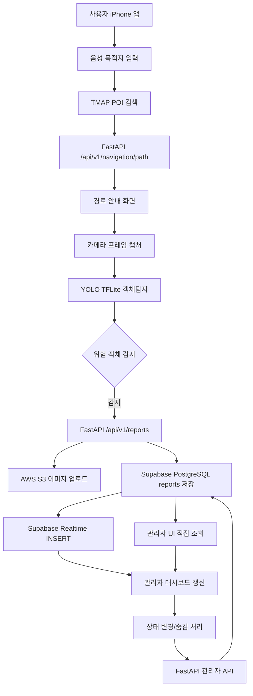
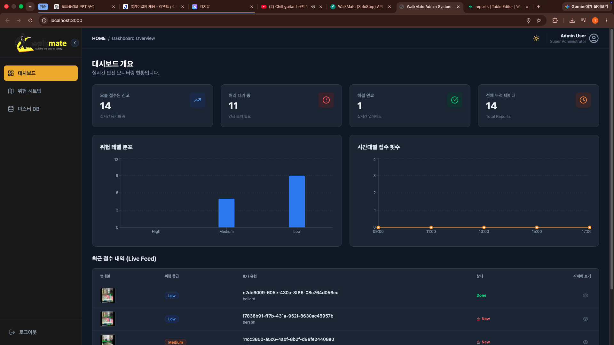
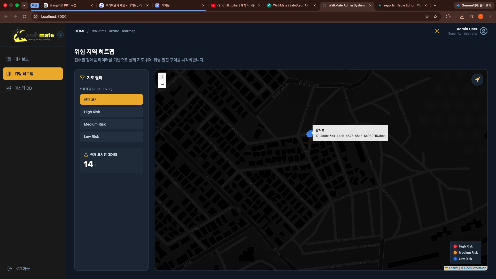
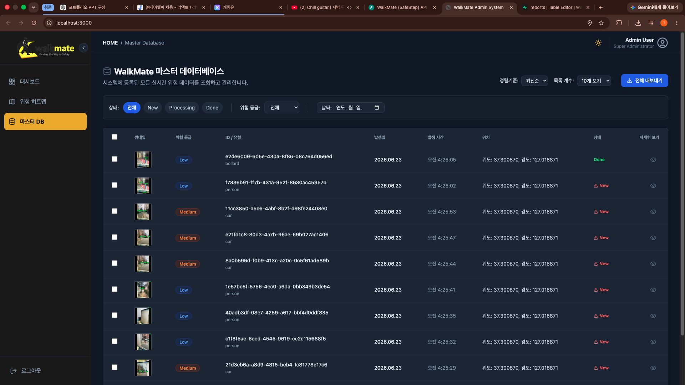
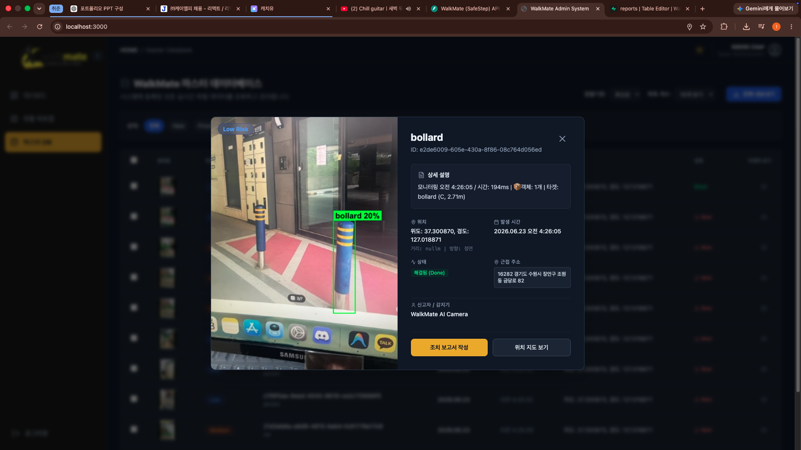

# WalkMate

시각장애인을 위한 음성 기반 길안내와 보행 위험 요소 자동 신고 서비스입니다. 사용자는 음성으로 목적지를 말하고, 앱은 현재 위치와 보행 경로를 안내합니다. 안내 중 카메라 화면에서 위험 객체를 탐지하면 위치, 이미지, 위험 정보를 백엔드로 전송하고, 관리자는 웹 대시보드에서 신고 내역을 확인합니다.

이 저장소는 사용자용 하이브리드 앱, 관리자 웹 대시보드, FastAPI 백엔드, YOLO 기반 객체탐지 모델 개발 자료를 함께 포함합니다.

## 프로젝트 목표

WalkMate의 목표는 보행 중 시각 정보 접근이 어려운 사용자를 위해 다음 흐름을 하나로 연결하는 것입니다.

1. 현재 위치를 확보한다.
2. 음성으로 목적지를 입력한다.
3. TMAP 기반 장소 검색과 보행 경로 요청을 수행한다.
4. iPhone WebView 앱에서 경로 안내, TTS/STT, 지도, 카메라를 함께 실행한다.
5. 카메라 프레임에서 보행 위험 요소를 탐지한다.
6. 위험 객체가 감지되면 이미지와 위치를 백엔드로 신고한다.
7. 관리자는 Supabase 기반 신고 데이터를 대시보드, 지도, 테이블, 상세 모달로 확인한다.

## 주요 개발 결과

| 영역 | 구현 내용 |
|---|---|
| 사용자 앱 | React + Vite + Capacitor 기반 iOS WebView 앱, 음성 입력/출력, GPS, 지도, 카메라 객체탐지 |
| 관리자 UI | React + Vite 기반 신고 관리 대시보드, 통계/히트맵/마스터 DB/상세 모달 |
| 백엔드 | FastAPI 기반 신고 생성, 관리자 목록/상태변경/숨김 처리, TMAP 경로 프록시 |
| 데이터베이스 | Supabase PostgreSQL `reports` 테이블, PostGIS 좌표 저장, Realtime INSERT 구독 |
| 이미지 저장 | AWS S3에 신고 이미지 저장 후 DB에는 URL 저장 |
| AI 모델 | YOLO11n 파인튜닝, 12개 클래스 객체탐지, baseline float32 TFLite 앱 탑재 |

## 전체 구조

```text
cvProjectTeam3/
├── UI/
│   ├── userUI/              # 사용자용 React + Vite + Capacitor 앱
│   └── adminUI/             # 관리자용 React + Vite 대시보드
├── backend/                 # FastAPI 서버
├── model/                   # YOLO 학습/평가/변환 자료
├── portfolio/               # 상세 보고서와 개발 캡처 자료
│   ├── capture/
│   ├── ai_model_report.md
│   ├── userui_report.md
│   ├── adminui_report.md
│   ├── table_report.md
│   └── project structure.md
└── README.md
```

## 시스템 흐름



## 사용자 앱 개발 과정

사용자 앱은 작은 버튼을 누르는 일반 앱보다 음성, 위치, 카메라, 안내 흐름이 끊기지 않는 것이 더 중요했습니다. 그래서 `App.tsx`는 `IDLE -> LISTENING -> CONFIRMATION -> GUIDING` 상태 머신으로 구성했고, 안내 화면에서는 지도, GPS watch, 나침반 방향 보정, TTS 큐, STT 종료 명령, 카메라 객체탐지를 동시에 처리합니다.

실제 앱 테스트에서는 음성으로 목적지를 입력하고, 수원역 검색 결과를 확인한 뒤, 경로 안내 화면에서 지도와 카메라 객체탐지가 함께 동작하는 흐름을 확인했습니다. 테스트 중 GPS timeout, WebView 추론 속도, TTS/STT 전환 문제처럼 실기기에서만 드러나는 문제도 함께 확인했습니다.


Xcode에서는 iPhone 12 mini 실기기 로그를 보면서 객체탐지 추론 시간, 감지 객체 수, Geolocation 요청, `CapacitorHttp` 신고 전송 응답을 확인했습니다. 이 과정에서 단순히 화면이 렌더링되는지보다 실제 네이티브 권한, WebView 런타임, 백엔드 통신이 함께 동작하는지를 검증했습니다.


## AI 모델 개발 과정

모델은 `yolo11n.pt`를 기반으로 한국 보행 환경의 위험 요소를 탐지하도록 파인튜닝했습니다. 탐지 클래스는 COCO에서 가져온 보행 관련 객체 10개와 Roboflow 기반 `bollard`, `kickboard` 2개를 합쳐 총 12개로 구성했습니다.

| ID | class | 의미 |
|---:|---|---|
| 0 | person | 보행자 |
| 1 | bicycle | 자전거 |
| 2 | car | 승용차 |
| 3 | motorcycle | 오토바이 |
| 4 | bus | 버스 |
| 5 | truck | 트럭 |
| 6 | traffic light | 신호등 |
| 7 | stop sign | 정지 표지판 |
| 8 | bench | 벤치 |
| 9 | dog | 반려견 |
| 10 | bollard | 볼라드 |
| 11 | kickboard | 전동 킥보드 |

학습은 COCO 2017 일부 클래스, Roboflow kickboard dataset, Roboflow bollard dataset을 통합하는 방향으로 진행했습니다. 처음에는 순차 학습도 고려했지만, 기존 COCO 사전학습 특징을 유지하면서 도로 객체와 보행 위험 객체를 함께 학습시키기 위해 단일 통합 학습을 선택했습니다.

모델 실험은 `baseline`, `adamw_cos`, `heavy_aug` 세 가지로 비교했습니다.

| 실험 | best epoch | precision | recall | mAP50 | mAP50-95 |
|---|---:|---:|---:|---:|---:|
| baseline | 20 | 0.7551 | 0.6053 | 0.6772 | 0.4768 |
| adamw_cos | 20 | 0.7408 | 0.6036 | 0.6654 | 0.4638 |
| heavy_aug | 20 | 0.7492 | 0.5920 | 0.6638 | 0.4621 |

최종 앱에는 baseline 모델의 `best_float32.tflite`를 탑재했습니다. 로컬 macOS 환경에서는 TensorFlow/TFLite 변환 호환성 문제가 있었기 때문에 Google Colab을 함께 사용했고, Colab에서 Google Drive mount, 통합 데이터셋 압축 해제, 학습/변환 작업을 이어갔습니다.


현재 앱 런타임 모델은 다음 파일입니다.

```text
UI/userUI/public/wasm/best_float32.tflite
```

모델 산출물과 앱 public/iOS bundle의 `best_float32.tflite`는 같은 SHA-256으로 확인되어, 앱에 복사된 모델 파일은 학습 산출물과 동일합니다.

## 백엔드와 API 개발 과정

백엔드는 FastAPI로 구성했습니다. 사용자 앱은 Supabase에 직접 접근하지 않고, 신고 이미지를 multipart FormData로 백엔드에 보냅니다. 백엔드는 S3에 이미지를 업로드하고, Supabase PostgreSQL의 `reports` 테이블에 신고 메타데이터와 이미지 URL을 저장합니다.

FastAPI의 `/docs` Swagger UI로 실제 endpoint 목록을 확인했습니다. 여기에는 health check, 신고 생성, 보행 경로 요청, 관리자 목록 조회, 상태 변경, 삭제/숨김 처리 API가 포함됩니다.


주요 API는 다음과 같습니다.

| 기능 | Method | Path |
|---|---|---|
| 서버 상태 확인 | GET | `/health` |
| 위험 신고 생성 | POST | `/api/v1/reports/` |
| 보행 경로 요청 | POST | `/api/v1/navigation/path` |
| 관리자 신고 목록 | GET | `/api/v1/reports/` |
| 신고 상태 변경 | PATCH | `/api/v1/reports/{item_id}` |
| 신고 숨김 처리 | DELETE | `/api/v1/reports/{item_id}` |

## Supabase와 S3 연동

Supabase는 인증이나 Storage가 아니라 PostgreSQL DB와 Realtime 구독 용도로 사용했습니다. 핵심 테이블은 `public.reports`이며, 신고 ID, 위험 객체 종류, 위험도, 이미지 URL, 설명, 상태, 위치 geometry를 저장합니다.

Supabase Table Editor에서 실제 신고 행이 쌓이는 것을 확인했습니다. 캡처에는 `hazard_type`, `risk_level`, `image_url`, `description` 컬럼과 신고 데이터가 표시됩니다.


신고 이미지는 Supabase Storage가 아니라 AWS S3에 저장합니다. 백엔드가 S3에 jpg 객체를 업로드한 뒤, 생성된 URL을 `reports.image_url`에 저장합니다.


## 관리자 UI 개발 과정

관리자 UI는 사용자 앱에서 들어온 신고를 운영자가 확인하기 위한 대시보드입니다. Supabase `reports` 테이블을 직접 조회하고, Realtime INSERT 이벤트를 구독해 새 신고를 화면에 반영합니다. 상태 변경과 삭제/숨김 처리는 FastAPI 관리자 API를 호출합니다.

관리자 화면은 세 가지 주요 뷰로 구성됩니다.

| 화면 | 역할 |
|---|---|
| 대시보드 | 전체 신고 수, 위험도 분포, 시간대별 신고량, 최근 신고 확인 |
| 위험 히트맵 | 신고 좌표를 지도 위에 표시하고 위험 위치를 공간적으로 확인 |
| 마스터 DB | 전체 신고 목록 검색, 필터, 정렬, CSV 내보내기, 삭제 처리 |

대시보드에서는 신고 통계와 최근 신고 목록을 한 번에 확인할 수 있습니다.



위험 히트맵은 Leaflet 기반 지도에 신고 위치를 표시해 위험이 반복되는 지점을 파악할 수 있게 합니다.



마스터 DB 화면은 신고 데이터를 테이블 형태로 관리하고 운영 자료로 추출하는 화면입니다.



상세 모달에서는 신고 이미지, 위험도, 상태, 위치, 설명을 확인하고 처리 상태를 변경할 수 있습니다.



## 실행 방법

### 1. Backend

```bash
cd backend
python -m venv .venv
source .venv/bin/activate
pip install -r requirements.txt
cp .env.example .env
uvicorn app.main:app --reload --host 0.0.0.0 --port 8000
```

필요한 환경 변수는 `backend/.env.example`을 기준으로 설정합니다.

```env
DATABASE_URL=postgresql://[USER]:[PASSWORD]@[HOST]:[PORT]/[DB_NAME]
AWS_ACCESS_KEY_ID=[YOUR_AWS_ACCESS_KEY_ID_HERE]
AWS_SECRET_ACCESS_KEY=[YOUR_AWS_SECRET_ACCESS_KEY_HERE]
AWS_REGION=ap-northeast-2
S3_BUCKET_NAME=[YOUR_S3_BUCKET_NAME_HERE]
S3_PUBLIC_BASE_URL=https://[YOUR_S3_BUCKET_NAME_HERE].s3.ap-northeast-2.amazonaws.com
TMAP_API_KEY=[YOUR_TMAP_API_KEY_HERE]
CORS_ORIGINS=http://localhost:5173,http://127.0.0.1:5173,http://localhost:3000,http://127.0.0.1:3000
```

### 2. User UI

```bash
cd UI/userUI
npm install
cp .env.example .env
npm run dev
```

실제 iPhone 앱으로 반영할 때는 Vite build 결과를 Capacitor iOS 프로젝트에 복사해야 합니다.

```bash
npm run build
npx cap sync ios
npx cap open ios
```

필요한 환경 변수는 다음과 같습니다.

```env
VITE_BACKEND_URL=http://localhost:8000
VITE_TMAP_API_KEY=[YOUR_TMAP_API_KEY_HERE]
```

### 3. Admin UI

```bash
cd UI/adminUI
npm install
cp .env.example .env
npm run dev
```

필요한 환경 변수는 다음과 같습니다.

```env
VITE_SUPABASE_URL=https://[YOUR_SUPABASE_PROJECT_ID].supabase.co/
VITE_SUPABASE_ANON_KEY=[YOUR_SUPABASE_ANON_KEY_HERE]
VITE_BACKEND_URL=http://localhost:8000
```

### 4. Supabase 테이블

Supabase SQL Editor에서 다음 파일을 실행합니다.

```text
UI/adminUI/Supabase/tables.sql
```

이 SQL은 PostGIS 확장, `public.reports` 테이블, Realtime publication 등록을 포함합니다.

## 기술 스택

| 영역 | 기술 |
|---|---|
| 사용자 앱 | React 19, Vite 6, TypeScript, Capacitor 8, Leaflet, TTS/STT, Geolocation |
| 객체탐지 | YOLO11n, Ultralytics, TFLite, `@tensorflow/tfjs-tflite`, WebAssembly |
| 관리자 UI | React 19, Vite 6, TypeScript, Supabase JS, Recharts, Leaflet, Tailwind/PostCSS |
| 백엔드 | FastAPI, Uvicorn, SQLAlchemy, PostgreSQL/PostGIS, boto3, requests |
| DB/Realtime | Supabase PostgreSQL, Supabase Realtime |
| 이미지 저장 | AWS S3 |
| 외부 API | TMAP POI/보행자 경로 API |

## 현재 한계와 개선 방향

이 프로젝트는 핵심 동작 흐름을 실제 앱, API, DB, S3, 관리자 UI까지 연결했지만, 운영 수준으로 가려면 다음 개선이 필요합니다.

- Supabase RLS가 꺼져 있으므로 운영 환경에서는 인증과 권한 정책을 설계해야 합니다.
- 관리자 UI는 조회는 Supabase 직접 접근, 상태 변경은 백엔드 API를 사용하므로 데이터 접근 책임을 정리해야 합니다.
- `location` geometry와 `latitude/longitude` 컬럼의 좌표 반환 방식은 실제 Supabase REST 응답 기준으로 더 검증해야 합니다.
- iPhone WebView의 `tfjs-tflite` 추론은 발열, 배터리, 지연이 생길 수 있어 네이티브 추론 또는 서버 추론도 비교할 필요가 있습니다.
- 실제 보행 환경은 라벨링이 어려운 위험 요소가 많아, 고정 class 객체탐지만으로는 한계가 있습니다. 이후에는 실사용자 프레임 수집, 흔들림/야간/저조도 augmentation, VLM 기반 장면 이해를 함께 검토해야 합니다.
- VoiceOver, 이어폰 사용, 야외 소음, 화면 잠금, GPS 약한 환경 등 접근성 중심의 현장 테스트가 더 필요합니다.

## 상세 문서

더 자세한 분석은 `portfolio/` 아래 문서에 정리되어 있습니다.

| 문서 | 내용 |
|---|---|
| `portfolio/project structure.md` | 현재 파일 구조와 각 모듈 역할 |
| `portfolio/userui_report.md` | 사용자 앱 구조, 상태 머신, iOS/Capacitor, 실기기 테스트 |
| `portfolio/adminui_report.md` | 관리자 UI 구조, Supabase 조회, 대시보드/히트맵/DB 화면 |
| `portfolio/table_report.md` | Supabase 연결 방식, `reports` 테이블, S3/API 흐름 |
| `portfolio/ai_model_report.md` | 데이터셋, 실험 비교, TFLite 변환, 앱 모델 연동 |
