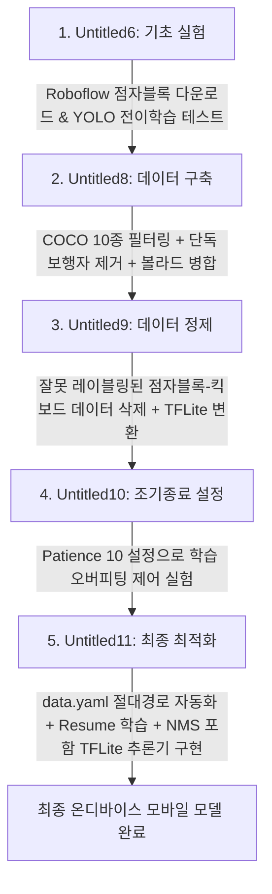

# 한국 인도(보도) 환경 특화 객체 감지 모델 개발 및 학습 과정 분석 보고서

본 보고서는 제공된 5개의 주피터 노트북 파일(`Untitled6.ipynb` ~ `Untitled11.ipynb`)의 코드를 분석하여, **한국 인도(보도) 환경에서 모바일/임베디드 기기가 자율주행이나 보행 보조를 수행할 때 감지해야 하는 주요 객체들을 효과적으로 인식하기 위한 딥러닝 모델 개발 및 데이터 파인프라인의 진행 과정**을 체계적으로 정리한 문서입니다.

---

## 1. 프로젝트 개요 (Overview)

*   **최종 목표**: 한국 인도(차도 제외) 환경에서 흔히 발견되는 장애물 및 주요 객체(볼라드, 전동 킥보드, 보행자, 이동수단 등)를 실시간 감지할 수 있는 모바일 최적화 YOLO 객체 감지 모델을 개발합니다.
*   **사용 모델**: Ultralytics YOLO11n.pt
*   **학습 데이터 구성**: 
    1.  **기본 배경 데이터**: COCO 데이터셋에서 보도 환경에 불필요한 클래스(식기류, 동물 일부, 대형 운송수단 등)를 걸러내고 인도 관련 **10개 클래스**만 추출.
    2.  **특화 데이터셋 병합**: Roboflow를 통해 한국 보도 환경 특화 객체인 **볼라드(Bollard)** 및 **전동 킥보드(Kickboard)** 데이터를 수집하여 병합.
    3.  **정제 및 분석**: 잘못 분류된 데이터(오레이블링) 제거 및 데이터 불균형 완화 처리.
*   **최종 배포 타겟**: 온디바이스(On-Device) 임베디드 적용을 위한 **TFLite(TensorFlow Lite) 변환 및 추론 파이프라인 구축**.

---

## 2. 전체 개발 흐름 및 파이프라인 (Pipeline Sequence)

노트북 파일명의 번호 흐름은 본 프로젝트가 원시 데이터 수집부터 최종 온디바이스 검증까지 어떻게 진화했는지를 명확히 보여줍니다.

---

## 3. 주피터 노트북별 상세 수행 작업 및 기술적 분석

### ① [Untitled6.ipynb](file:///Users/company/Downloads/drive-download-20260617T184243Z-3-001/Untitled6.ipynb) — 환경 설정 및 전이 학습 기초 검증
*   **목적**: Roboflow 및 Ultralytics API 동작을 검증하고 기본적인 전이 학습(Transfer Learning) 및 추론 파이프라인의 뼈대를 구현합니다.
*   **수행 작업**:
    *   Roboflow 라이브러리를 사용해 점자블록(Braille Block) 데이터셋(`braile-block-copy-lml6r`)을 YOLOv11 포맷으로 다운로드.
    *   사전 학습된 `yolo11n.pt`를 로드하고, `coco.yaml` 데이터셋으로 1 epoch 시범 학습을 수행하여 파이프라인 정상 동작 확인.
    *   학습 완료 후 임의의 외부 길거리 이미지(`outside01.jpg`)를 사용해 추론(Predict) 테스트를 진행하고 바운딩 박스가 그려진 시각화 결과(`outside_predict1.jpg`)를 성공적으로 저장.

---

### ② [Untitled8.ipynb](file:///Users/company/Downloads/drive-download-20260617T184243Z-3-001/Untitled8.ipynb) — 보도 맞춤형 데이터셋 정제 및 이종 데이터 병합
*   **목적**: COCO 데이터셋을 정제하여 기본 베이스를 다지고, 외부 수집 데이터(볼라드)를 병합하여 새로운 통합 데이터셋(`coco_pedestrian`)을 구축합니다.
*   **주요 기술적 구현**:
    1.  **COCO 데이터셋 10종 필터링**:
        *   보도 환경에 밀접한 10가지 클래스(`person`, `bicycle`, `car`, `motorcycle`, `bus`, `truck`, `traffic light`, `stop sign`, `bench`, `dog`)만 유지.
        *   필터링 결과, 감지 대상 객체가 전혀 남지 않아 라벨 정보가 비어버린 이미지는 데이터셋 품질 저하를 방지하기 위해 **이미지와 라벨 텍스트 파일을 모두 완전히 삭제**.
    2.  **데이터 불균형 해결 (Data Balance)**:
        *   전체 데이터 중 보행자(`person`, class 0)만 단독으로 들어있는 이미지가 지나치게 높은 비중을 차지하여 편향 학습 위험성 존재.
        *   라벨 파일에 오직 `Class 0`만 기록된 이미지를 추적하여 데이터셋에서 일괄 삭제 처리.
    3.  **외부 데이터셋 병합 및 인덱스 리매핑**:
        *   **볼라드 (Bollard)**: Roboflow에서 다운로드한 뒤 사용하지 않는 Class 1 데이터를 삭제하고, 볼라드(Class 0) 데이터를 **Class 10**으로 리매핑하여 병합. 파일명 중복을 피하고자 접두사(`rf_bollard_`)를 추가 적용하여 총 **1,640장**의 이미지 병합 성공.
    4.  **최종 검증**: 데이터셋의 병합 상태가 완전한지 클래스별 bbox 카운트를 구하는 스크립트를 작성하여 정합성 검증 완료.

---

### ③ [Untitled9.ipynb](file:///Users/company/Downloads/drive-download-20260617T184243Z-3-001/Untitled9.ipynb) — 데이터 오류(Noise) 정제 및 1차 TFLite 변환
*   **목적**: 병합된 데이터셋 내에 포함된 심각한 레이블링 오류 데이터를 청소(Data Cleaning)하고, 모바일 임베디드 이식을 위한 TFLite 내보내기 흐름을 완성합니다.
*   **수행 작업**:
    *   **심각한 데이터 오류 정제**: 전동 킥보드 데이터로 레이블링 되었으나 실제 이미지를 정밀 검증해본 결과 **점자블록**으로 잘못 지정된 노이즈 데이터(`MP_SEL`로 시작하는 파일군)를 발견. 데이터 청정성을 위해 `test2017`, `train2017`, `val2017` 경로에서 `MP_SEL*` 파일들을 찾아 전량 삭제 조치.
    *   **학습 및 모델 내보내기**: 정제된 통합 데이터셋(`coco_total`)을 `yolo26n.pt`를 사용하여 학습을 이어 진행.
    *   학습이 끝난 모델(`best.pt`)을 **TFLite(Float32) 포맷**으로 변환(`export(format='tflite')`)하고 구글 드라이브(`MyDrive/YOLO_Export`)로 최종 백업 처리 수행.

---

### ④ [Untitled10.ipynb](file:///Users/company/Downloads/drive-download-20260617T184243Z-3-001/Untitled10.ipynb) — 조기 종료(Early Stopping) 프로토콜 구축
*   **목적**: 한정된 연산 자원 속에서 효율적인 모델 학습과 과적합(Overfitting) 방지를 위해 조기 종료 설정을 확립합니다.
*   **수행 작업**:
    *   구글 드라이브에서 `model.zip`을 재로드하여 개발 환경 셋업.
    *   YOLO 모델 학습 시 `patience=10` 설정을 부여. 이는 학습 진행 중 10 epoch 동안 validation loss가 개선되지 않을 경우 학습을 자동 중단하고 최적 가중치(`best.pt`)를 저장하도록 보장하여 불필요한 컴퓨팅 자원 낭비를 방지함.

---

### ⑤ [Untitled11.ipynb](file:///Users/company/Downloads/drive-download-20260617T184243Z-3-001/Untitled11.ipynb) — 지속 학습 자동화 및 TFLite 모바일 추론 파이프라인 개발
*   **목적**: 상대 경로 문제로 인한 빌드 에러를 방지하고, 이전 학습 가중치(`last.pt`)에서부터 이어서 학습할 수 있는 환경을 보장하며, 실제 디바이스에서 동작 가능한 **Full-Stack TFLite 추론용 코드**를 완성합니다.
*   **핵심 기술 및 코드 구현**:
    1.  **data.yaml 절대 경로 자동 수정**:
        *   코랩 가상 환경 내부에서 데이터 경로 에러를 막기 위해 Python `yaml` 모듈을 활용하여 `data.yaml` 내부의 `path`를 `/content/coco_total` 절대 경로로 자동 수정 및 저장하는 안정화 코드 구현.
    2.  **지속 학습(Resume Training)**:
        *   중단된 가중치(`last.pt`)를 가져와 `coco_total_yolo26n_train_fixed`라는 명칭의 프로젝트 폴더 아래에 모델 학습을 완수.
    3.  **NMS(Non-Maximum Suppression)를 포함한 TFLite 추론기 엔진 개발**:
        *   `best_float32.tflite` 모델을 로드하여 기기 독립적인 환경에서 추론이 가능하도록 pure Python/TensorFlow Lite Interpreter 코드를 작성.
        *   **이미지 전처리**: RGB 변환, 모델 입력 사이즈에 맞춰 리사이즈, `1/255` 정규화 처리.
        *   **채널 포맷팅 자동 대응**: 모델의 입력 형태에 따라 NCHW와 NHWC 형식을 자동 감지하여 차원을 전치(Transpose) 및 확장(Expand Dims)하는 예외 처리 구현.
        *   **후처리 및 중복 상자 제거 (NMS)**: 추론된 결과에 confidence threshold(0.25)를 적용하여 1차 필터링 후, OpenCV의 `dnn.NMSBoxes` 함수를 사용해 IoU(0.45) 기반으로 중복 검출된 바운딩 박스를 병합/정리.
        *   **결과 시각화**: 감지된 상자와 라벨명, 신뢰도를 원본 이미지 크기에 맞게 재스케일링하여 시각화 및 파일(`100733546.s2_tflite_inference.jpg`)로 저장.

---

## 4. 최종 통합 데이터셋 사양 및 클래스 분포 (Dataset Spec)

최종적으로 학습에 기여한 `coco_total` 데이터셋의 클래스 구조와 학습/검증용 데이터의 분포는 아래와 같이 완벽히 정제되었습니다.

### A. 클래스 매핑 목록 (Class Mapping Table)

| 클래스 ID | 클래스명 (영문) | 설명 | 출처 및 병합 정책 |
| :---: | :--- | :--- | :--- |
| **0** | `person` | 보행자 | COCO 원본 필터링 (단독 보행자 이미지는 정제 삭제) |
| **1** | `bicycle` | 자전거 | COCO 원본 필터링 |
| **2** | `car` | 승용차 | COCO 원본 필터링 |
| **3** | `motorcycle` | 오토바이 | COCO 원본 필터링 |
| **4** | `bus` | 버스 | COCO 원본 필터링 |
| **5** | `truck` | 트럭 | COCO 원본 필터링 |
| **6** | `traffic light` | 신호등 | COCO 원본 필터링 |
| **7** | `stop sign` | 정지 표지판 | COCO 원본 필터링 |
| **8** | `bench` | 벤치 | COCO 원본 필터링 |
| **9** | `dog` | 반려견 | COCO 원본 필터링 |
| **10** | `bollard` | 볼라드 | Roboflow 병합 (원본 0번 → 10번으로 이식) |
| **11** | `kickboard` | 전동 킥보드 | 통합 데이터셋 추가 클래스 (원본 0번 → 11번으로 이식) |

### B. 데이터셋 분포 (Dataset Splits Statistic)

| 클래스 ID | 클래스 명 | 학습용 데이터 수 (train2017) | 검증용 데이터 수 (val2017) | 테스트용 데이터 수 (test2017) |
| :---: | :---: | :---: | :---: | :---: |
| **0** | `person` | 257,252 | 10,777 | 0 |
| **1** | `bicycle` | 7,056 | 314 | 0 |
| **2** | `car` | 43,531 | 1,918 | 0 |
| **3** | `motorcycle` | 8,654 | 367 | 0 |
| **4** | `bus` | 6,061 | 283 | 0 |
| **5** | `truck` | 9,970 | 414 | 0 |
| **6** | `traffic light` | 12,842 | 634 | 0 |
| **7** | `stop sign` | 1,983 | 75 | 0 |
| **8** | `bench` | 9,820 | 411 | 0 |
| **9** | `dog` | 5,500 | 218 | 0 |
| **10** | `bollard` | 3,480 | 97 | 7 |
| **11** | `kickboard` | 1,390 | 51 | 0 |
| **계** | **-** | **368,929** | **15,559** | **7** |

---

## 5. 결론 및 향후 워크플로우 제언

이 프로젝트는 일반적인 범용 객체 탐지 데이터셋을 사용한 것이 아니라, **실제 한국의 인도 보행 환경에 걸맞는 객체 탐지 시나리오**에 최적화되도록 설계된 완성도 높은 데이터 엔지니어링 프로젝트입니다. 

### 핵심 성과 요약
1.  **데이터 다이어트 성공**: 무겁고 불필요한 COCO 클래스를 과감히 덜어내고 타겟 인도용 클래스만 축소 지정하여, 모델의 파라미터가 낭비되지 않도록 세팅하였습니다.
2.  **노이즈 필터링**: 잘못 명명된 점자블록(킥보드 표기오류) 데이터를 탐지하여 전량 드롭함으로써 지도학습(Supervised Learning)의 품질을 비약적으로 높였습니다.
3.  **배포 자동화 인프라**: 학습 후 단순히 끝나는 것이 아니라 임베디드 기기에서 독자적인 추론을 실행할 수 있도록 정밀한 OpenCV + TFLite NMS 후처리 파이프라인을 구축해 실용성을 보장했습니다.

### 향후 개선 방안 제언
*   **클래스 가중치(Class Weights) 설정**: 보행자(`person`) 객체의 빈도가 극도로 높기 때문에 학습 시 다른 희소 클래스(킥보드, 볼라드)에 대한 탐지율이 떨어질 수 있습니다. 손실 함수(Loss function) 설계 시 클래스 불균형에 대응하기 위한 Focal Loss 계열을 고려하거나 소수 클래스에 추가 가중치를 부여하는 설정을 제안합니다.
*   **TFLite 양자화(Quantization)**: 현재 변환된 모델은 Float32 타입입니다. 이를 **INT8(정수형 8비트) 양자화**로 내보내면 속도를 3~4배 이상 더 가속화하고 모바일 디바이스의 배터리 소모를 극적으로 줄일 수 있습니다.
