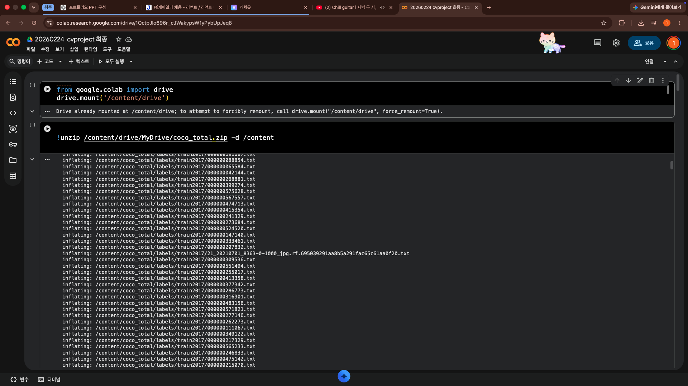
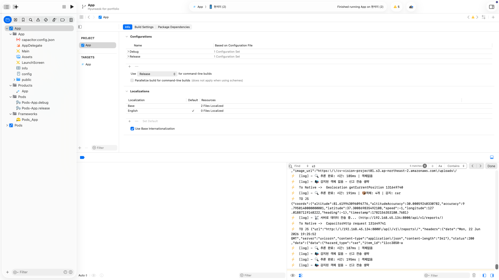

# WalkMate AI Engineer Portfolio

## 1. 프로젝트 개요

WalkMate는 시각장애인과 보행 약자가 이동 중 마주칠 수 있는 보행 위험 요소를 감지하고, 사용자의 현재 위치와 함께 신고 데이터로 연결하는 보행 보조 프로젝트다. AI Engineer 관점에서 핵심 목표는 단순히 모델을 학습하는 것이 아니라, 실제 모바일 앱에서 사용할 수 있는 객체 탐지 모델을 만들고, 추론 결과를 사용자 안내와 신고 흐름으로 연결하는 것이었다.

AI 모델은 YOLO11n 기반 객체 탐지 모델이며, 최종 선택된 학습 산출물은 `model/exp_comparison/baseline/weights/best.pt`다. 앱에는 이 모델을 TensorFlow Lite float32 형식으로 변환한 `best_float32.tflite`가 탑재되어 있다.

| 항목 | 내용 |
|---|---|
| 프로젝트명 | WalkMate |
| AI 기능 | 보행 환경 위험 요소 객체 탐지 |
| 모델 계열 | YOLO11n object detection |
| 최종 PyTorch 모델 | `model/exp_comparison/baseline/weights/best.pt` |
| 앱 탑재 모델 | `best_float32.tflite` |
| 앱 추론 방식 | `@tensorflow/tfjs-tflite` 기반 WebAssembly 추론 |
| 입력 | 모바일 카메라 프레임을 640x640 RGB 이미지로 전처리 |
| 출력 | 객체 bounding box, class, confidence |
| 주요 기술 | Python, Ultralytics YOLO, PyTorch, TensorFlow Lite, TensorFlow.js TFLite, React, Capacitor iOS WebView |

## 2. 문제 정의

WalkMate의 AI 모델은 길거리 이미지에서 보행자에게 위험하거나 주의가 필요한 객체를 찾아내는 역할을 맡는다. 서비스 관점에서는 객체 탐지 결과가 두 가지 흐름으로 사용된다.

1. 사용자에게 현재 주변에 위험 요소가 있음을 음성으로 안내한다.
2. 감지 결과와 위치 정보를 함께 서버로 전송해 관리자 대시보드에서 신고 데이터로 확인할 수 있게 한다.

이 문제는 규칙 기반으로 처리하기 어렵다. 같은 보행로라도 촬영 각도, 거리, 조명, 흔들림, 가림, 배경 복잡도에 따라 객체의 형태가 크게 달라진다. 특히 볼라드, 전동 킥보드, 벤치, 정지 표지판처럼 거리 환경에 놓인 객체는 단순 색상이나 위치 규칙으로 안정적으로 구분하기 어렵다. 따라서 이미지 안에서 객체의 위치와 종류를 동시에 추정하는 object detection 모델이 필요했다.

## 3. 라벨 설계

초기 목표는 보도블록 중 시각장애인을 위한 점자블록과 파손된 점자블록을 탐지하는 것이었다. 그러나 실제 길거리에는 모든 구간에 점자블록이 존재하지 않고, 파손이 심한 경우에는 오히려 탐지 대상의 형태 자체가 사라져 모델이 인식하기 어려운 역설이 있었다. 이 경험을 바탕으로 모델의 탐지 대상을 더 일반적인 보행 위험 요소 중심으로 재정의했다.

최종 클래스는 COCO 기반 10개 클래스에 Roboflow 기반 볼라드와 전동 킥보드를 추가한 12개 클래스 구조다.

| class id | class | 한국어 의미 | 라벨 출처와 정리 방식 |
|---:|---|---|---|
| 0 | person | 보행자 | COCO 원본 0번을 0번으로 리매핑 |
| 1 | bicycle | 자전거 | COCO 원본 1번을 1번으로 리매핑 |
| 2 | car | 승용차 | COCO 원본 2번을 2번으로 리매핑 |
| 3 | motorcycle | 오토바이 | COCO 원본 3번을 3번으로 리매핑 |
| 4 | bus | 버스 | COCO 원본 5번을 4번으로 리매핑 |
| 5 | truck | 트럭 | COCO 원본 7번을 5번으로 리매핑 |
| 6 | traffic light | 신호등 | COCO 원본 9번을 6번으로 리매핑 |
| 7 | stop sign | 정지 표지판 | COCO 원본 11번을 7번으로 리매핑 |
| 8 | bench | 벤치 | COCO 원본 13번을 8번으로 리매핑 |
| 9 | dog | 반려견 | COCO 원본 16번을 9번으로 리매핑 |
| 10 | bollard | 볼라드 | Roboflow bollard 데이터셋 0번을 10번으로 리매핑 |
| 11 | kickboard | 전동 킥보드 | Roboflow kickboard 데이터셋 1번을 11번으로 리매핑 |

## 4. 데이터 구성

학습 데이터는 하나의 출처만 사용하지 않고, 보행 환경에서 의미 있는 객체를 만들기 위해 여러 데이터를 통합했다.

| 데이터 | 역할 | 수량 |
|---|---:|---:|
| COCO train2017 정제본 | 사람, 차량, 자전거, 신호등 등 일반 보행 환경 객체 | 29,419 |
| COCO val2017 정제본 | COCO 계열 검증 이미지 정제 | 1,265 |
| Roboflow bollard train | 볼라드 보강 | 1,610 |
| Roboflow bollard valid | 볼라드 검증 데이터 | 81 |
| Roboflow bollard test | 볼라드 테스트 데이터 | 1 |
| Roboflow kickboard train | 전동 킥보드 보강 | 2,185 |
| Roboflow kickboard valid | 전동 킥보드 검증 데이터 | 215 |
| Roboflow kickboard test | 전동 킥보드 테스트 데이터 | 107 |
| 전체 통합 데이터 | COCO 정제 + bollard + kickboard | 34,883 |

통합 후에는 `random_state=42`를 기준으로 train, validation, test를 다시 분할했다.

| split | 수량 |
|---|---:|
| train | 27,906 |
| validation | 3,488 |
| test | 3,489 |

현재 checkout에는 전체 원본 이미지 데이터셋인 `model/datasets/coco_total/`이 포함되어 있지 않다. 따라서 저장소만으로 학습 전체를 즉시 재현할 수는 없고, COCO 2017과 Roboflow 데이터셋을 다시 준비해야 한다. 이 문서는 현재 저장소에 남아 있는 노트북, 학습 결과, 모델 산출물, 앱 코드 기준으로 작성했다.

## 5. 데이터 전처리와 통합 전략

전처리의 핵심은 클래스 체계를 하나로 맞추는 것이었다. COCO는 80개 클래스를 갖고 있지만 WalkMate에서는 보행 환경과 관련 있는 10개 클래스만 남겼다. 이후 Roboflow의 bollard와 kickboard 데이터를 10번, 11번 클래스로 추가해 전체 라벨 번호가 충돌하지 않도록 정리했다.

Roboflow 데이터에는 특정 객체 라벨만 있는 경우가 많기 때문에, 원본 YOLO11n 모델을 사용해 COCO 계열 객체를 자동 라벨링하고 기존 라벨에 append하는 방식도 사용했다. 이는 킥보드나 볼라드만 학습하는 데이터 안에서도 주변 차량, 사람, 신호등 같은 일반 객체 정보를 함께 유지하기 위한 선택이었다.

다만 이 방식에는 한계도 있다. 자동 라벨링은 잘못된 박스를 만들 수 있고, COCO 이미지 안에 실제 볼라드나 전동 킥보드가 있어도 정답 라벨이 없으면 평가에서는 false positive처럼 계산될 수 있다. 이 때문에 최종 지표는 모델 간 상대 비교에는 유용하지만, 실제 서비스 성능을 완전히 대표한다고 보기는 어렵다.

## 6. 모델 선택과 학습 전략

모델은 `yolo11n.pt`를 시작점으로 사용했다. YOLO11n은 비교적 작은 모델이어서 모바일 앱 탑재를 고려한 실시간 객체 탐지에 적합하고, COCO 기반 사전학습 가중치를 활용할 수 있어 제한된 프로젝트 기간 안에서 현실적인 선택이었다.

순차 학습 방식도 검토했다.

```text
COCO 10개 클래스 학습
  -> kickboard 추가 학습
  -> bollard 추가 학습
```

하지만 최종적으로는 COCO, kickboard, bollard 데이터를 모두 통합한 뒤 한 번에 학습하는 방향을 선택했다. 순차 학습은 뒤쪽 데이터에 모델이 치우치면서 앞에서 학습한 클래스를 잊는 catastrophic forgetting 위험이 있고, 작은 커스텀 데이터셋의 라벨 노이즈가 뒤쪽 학습에 집중될 수 있기 때문이다.

기본 학습 환경과 모델 조건은 다음과 같다.

| 항목 | 내용 |
|---|---|
| base model | `yolo11n.pt` |
| task | detect |
| image size | 640 |
| batch | 16 |
| epochs | 20 |
| class count | 12 |
| training device | Apple M4 Mac mini MPS |
| Ultralytics 로그 기준 | 8.4.70 |
| 시작 모델 구조 | 182 layers, 2,592,180 parameters, 6.5 GFLOPs |
| fused 모델 구조 | 101 layers, 2,584,492 parameters, 6.3 GFLOPs |

## 7. 실험 설계와 결과 비교

실험은 크게 `baseline`, `adamw_cos`, `heavy_aug` 세 가지로 진행했다. 실험의 목적은 복잡한 튜닝보다 앱 탑재용으로 안정적인 모델을 고르는 것이었다.

| 실험 | optimizer | lr0 | cos_lr | mixup | hsv_v | patience | batch | epochs | cache | workers |
|---|---|---:|---|---:|---:|---:|---:|---:|---|---:|
| baseline | auto | 0.01 | False | 0.00 | 0.4 | 0 | 16 | 20 | False | 4 |
| adamw_cos | AdamW | 0.001 | True | 0.00 | 0.4 | 0 | 16 | 20 | False | 4 |
| heavy_aug | AdamW | 0.001 | True | 0.15 | 0.4 | 0 | 16 | 20 | False | 4 |

최종 비교 결과는 다음과 같다.

| 실험 | best epoch | precision | recall | mAP50 | mAP50-95 | train box loss | val box loss |
|---|---:|---:|---:|---:|---:|---:|---:|
| baseline | 20 | 0.7551 | 0.6053 | 0.6772 | 0.4768 | 1.1652 | 1.1662 |
| adamw_cos | 20 | 0.7408 | 0.6036 | 0.6654 | 0.4638 | 1.1904 | 1.1892 |
| heavy_aug | 20 | 0.7492 | 0.5920 | 0.6638 | 0.4621 | 1.1914 | 1.1934 |

`baseline`은 세 실험 중 `mAP50`, `mAP50-95`, train box loss, validation box loss가 모두 가장 좋았다. 따라서 최종 모델로 `baseline/weights/best.pt`를 선택했다. `adamw_cos`와 `heavy_aug`는 fine-tuning 안정성이나 일반화 가능성을 확인하는 의미가 있었지만, 20 epoch 기준에서는 baseline을 넘지 못했다.

## 8. 테스트 이미지 검증

노트북에는 iPhone 12 mini로 직접 촬영한 집 앞 사진을 기반으로 구성한 `testphoto` 데이터도 포함되어 있다. 이 데이터는 실제 서비스 환경과 가까운 이미지를 확인하기 위한 현장 검증용 데이터다.

| 경로 | 내용 |
|---|---|
| `model/testphoto/images/` | 실제 촬영 이미지 7장 |
| `model/testphoto/labels/` | 수동 검수 라벨 7개 |
| `model/testphoto/comparison_results/` | 예측/정답 대조 이미지 7장 |
| `model/testphoto/data.yaml` | 12개 클래스 정의 |

현재 `testphoto`는 정량 평가셋으로 사용되지는 않았다. 별도 mAP, precision, recall 계산 결과가 없기 때문에 포트폴리오에서는 정량 성능으로 과장하지 않고, 모델이 실제 촬영 이미지에서 어떤 박스를 내는지 시각적으로 확인한 산출물로 보는 것이 정확하다.

## 9. TFLite 변환과 앱 탑재

학습된 PyTorch 모델을 앱에서 사용하기 위해 TensorFlow Lite 형식으로 변환했다. 로컬 macOS 환경에서는 노트북 실행 위치 문제와 Python 3.13 이상 환경의 TensorFlow/TFLite export 호환성 문제로 변환이 매끄럽지 않았고, 최종 변환은 Google Colab 환경에서 진행했다.



Colab 변환 흐름은 다음과 같다.

```text
baseline best.pt
  -> ONNX export
  -> TensorFlow SavedModel export
  -> TensorFlow Lite float32 export
  -> best_float32.tflite
```

현재 앱과 모델 산출물의 연결 상태는 다음과 같이 정리되어 있다.

| 파일 | 역할 |
|---|---|
| `model/exp_comparison/baseline/weights/best.pt` | 최종 선택 PyTorch 모델 |
| `model/exp_comparison/baseline/weights/best_float32.tflite` | 앱 탑재용 변환 원본 |
| `UI/userUI/public/wasm/best_float32.tflite` | userUI 개발 서버/WebView에서 로드하는 모델 |
| `UI/userUI/ios/App/App/public/wasm/best_float32.tflite` | Capacitor iOS 빌드 산출물에 포함되는 모델 |

세 위치의 `best_float32.tflite`는 SHA-256 기준 동일 파일로 확인되어, 학습 산출물이 userUI와 iOS 앱 번들에 같은 형태로 복사되어 있다.

## 10. 앱 추론 파이프라인

현재 userUI의 객체 탐지는 `UI/userUI/components/VisionCamera.tsx`와 `UI/userUI/src/utils/YoloParser.ts`를 중심으로 동작한다. 런타임 모델 파일은 `MODEL_FILE = "best_float32.tflite"`로 지정되어 있다.

```text
Camera Preview
  -> screenshot capture
  -> hidden image load
  -> 640x640 canvas letterbox
  -> RGB tensor conversion
  -> normalize to 0.0 - 1.0
  -> expand dims: [1, 640, 640, 3]
  -> TFLite predict
  -> YoloParser post-processing
  -> detected objects
  -> TTS 안내 및 신고 업로드
```

TFLite export 로그의 출력 shape은 `(1, 16, 8400)`이다. 이는 `4 bbox + 12 class score` 구조로 해석하는 것이 자연스럽고, 현재 `YoloParser`는 YOLO11 TFLite raw output을 이 기준으로 처리한다.

후처리 설정은 다음과 같다.

| 항목 | 값 |
|---|---:|
| confidence threshold | 0.30 |
| NMS IoU threshold | 0.50 |
| class count | 12 |
| input shape | `[1, 640, 640, 3]` |
| output shape | `[1, 16, 8400]` |

## 11. 위험도 매핑과 서비스 연결

AI 모델은 단순히 객체 이름만 반환하지 않고, 앱 안에서 위험도와 한국어 안내 문구로 변환된다. 이 매핑을 통해 감지 결과가 사용자 경험과 신고 데이터로 이어진다.

| 위험도 | 클래스 | 의미 |
|---:|---|---|
| 3 | car, bus, truck, motorcycle, bicycle, kickboard | 이동 중 충돌 위험이 큰 객체 |
| 2 | person, dog | 회피가 필요한 동적 객체 |
| 1 | traffic light, bollard, stop sign, bench | 보행 경로에서 주의가 필요한 고정/환경 객체 |

객체가 감지되면 userUI는 TTS로 사용자에게 안내하고, 위치 정보와 함께 FastAPI 백엔드로 신고 데이터를 전송한다. 이 신고 데이터는 Supabase PostgreSQL의 `reports` 테이블과 S3 이미지 URL로 연결되며, adminUI에서 운영자가 확인하고 상태를 변경할 수 있다.


## 12. 실기기 테스트와 디버깅

모델은 브라우저 데스크톱 환경이 아니라 iPhone 12 mini의 Capacitor iOS WebView에서 실제로 테스트했다. 이 과정에서 Xcode 로그를 보며 모델 로드, 카메라 캡처, TFLite predict, output shape, 파싱 박스 수를 확인했다.



실기기 테스트 중 확인한 주요 이슈는 다음과 같다.

| 이슈 | 원인 또는 판단 | 처리 방향 |
|---|---|---|
| INT8 모델이 float32보다 느림 | tfjs-tflite WebAssembly 런타임에서 INT8이 항상 빠르지는 않음 | 앱 런타임을 float32 모델로 되돌림 |
| 객체가 감지되지 않음 | 모델은 로드됐지만 후처리에서 박스가 0개로 나오는 상황 발생 | output shape과 class score 구조를 재점검 |
| 정확도 저하 | 모델 자체, TFLite 변환, 앱 전처리/후처리 중 원인 분리가 필요 | 같은 iPhone 프레임으로 PyTorch와 TFLite 결과 비교 필요 |
| 추론 지연 | iPhone WebView CPU/WASM 환경의 한계 가능성 | 네이티브 추론 또는 경량화 검토 필요 |
| GPS timeout | 위치 요청이 제한 시간 안에 끝나지 않는 상황 | 위치 옵션과 fallback 흐름 개선 |

## 13. 에러 분석

모델 개발 과정에서 가장 어려웠던 부분은 정답 라벨을 정의하는 일이었다. 실제 길거리에는 쓰레기 더미, 나무 기둥, 전봇대, 공사 흔적, 파손된 보도 구조물처럼 이름을 붙이기 애매한 요소가 많다. 보행자에게는 위험하지만, 객체 탐지 모델 입장에서는 명확한 클래스 이름과 일관된 bbox 기준이 필요하다. 이 차이가 데이터셋 제작의 가장 큰 어려움이었다.

또한 점자블록 파손 탐지 아이디어는 문제 정의 자체가 쉽지 않았다. 파손이 약하면 라벨링 기준이 모호하고, 파손이 심하면 점자블록이라는 형태가 사라져 탐지 자체가 어려워진다. 이 경험을 통해 객체 탐지만으로 모든 보행 위험을 해결하기 어렵고, 장면 전체의 문맥을 이해하는 VLM 계열 접근이 필요할 수 있다는 점을 깨달았다.

정확도 저하를 분석하기 위해서는 다음 비교가 필요하다.

| 비교 | 확인하려는 원인 |
|---|---|
| PyTorch `best.pt` vs TFLite `best_float32.tflite` | 변환 과정에서 성능이 떨어졌는지 확인 |
| 노트북 이미지 전처리 vs 앱 canvas 전처리 | resize, letterbox, normalize 차이 확인 |
| 같은 이미지의 Python 후처리 vs `YoloParser` 후처리 | output shape 해석과 NMS 차이 확인 |
| 정지 이미지 vs 흔들리는 실기기 프레임 | 실제 보행 상황에서 blur와 motion 영향 확인 |

## 14. 현재 한계

현재 모델과 앱 연동에는 다음 한계가 남아 있다.

1. 전체 원본 학습 데이터셋이 저장소에 포함되어 있지 않아, 현재 checkout만으로 학습을 완전히 재현할 수 없다.
2. `testphoto`는 시각 검증용으로는 의미가 있지만, 정량 mAP 평가 결과가 아직 없다.
3. COCO와 Roboflow 데이터를 통합하는 과정에서 라벨 누락과 자동 라벨링 노이즈가 지표에 영향을 줄 수 있다.
4. 실제 앱 추론은 iPhone WebView의 JavaScript/WebAssembly 환경에서 수행되므로 네이티브 추론보다 느릴 수 있다.
5. 보행 중 휴대폰이 흔들리는 상황, 야간, 역광, 비 오는 날, 가림이 심한 상황에 대한 별도 검증이 부족하다.
6. 라벨로 정의되지 않은 위험 요소는 모델이 감지할 수 없다.
7. 노트북에 Roboflow API key가 평문으로 남아 있다면 폐기와 재발급이 필요하고, 이후에는 환경 변수 방식으로 관리해야 한다.

## 15. 개선 방향

다음 단계에서는 모델 성능 자체보다 실제 앱 사용 조건에서의 신뢰성을 먼저 검증하는 것이 중요하다.

| 개선 항목 | 구체적 작업 |
|---|---|
| 동일 프레임 비교 | iPhone에서 캡처한 동일 이미지를 PyTorch, TFLite, 앱 후처리로 각각 비교 |
| `testphoto` 정량 평가 | 7장 검증 이미지를 기준으로 precision, recall, mAP 계산 |
| 전처리 재현성 강화 | 학습/검증/앱 전처리의 letterbox, normalize, 좌표 복원을 같은 기준으로 정리 |
| 데이터셋 버전 관리 | COCO 정제, Roboflow 다운로드, class remap, split 과정을 스크립트화 |
| 실사용 데이터 보강 | 흔들림, blur, 저조도, 역광, 하네스 장착 각도 데이터를 추가 |
| 성능 최적화 | 네이티브 TFLite, Core ML, WebGPU, 더 작은 입력 크기 등을 비교 |
| VLM 검토 | 라벨로 정의하기 어려운 위험 장면을 문맥 기반으로 설명하는 모델 검토 |

## 16. AI Engineer 관점 정리

WalkMate의 AI 개발은 모델 학습보다 문제 정의와 데이터 설계의 중요성을 더 크게 체감한 작업이었다. 처음에는 점자블록처럼 명확해 보이는 대상을 탐지하면 된다고 생각했지만, 실제 보행 환경은 훨씬 더 복잡했다. 길거리의 위험은 항상 정해진 이름을 가진 객체로 나타나지 않았고, 같은 물체도 사람에게는 위험하지만 모델에게는 애매한 배경처럼 보일 수 있었다.

그럼에도 이번 작업에서 의미 있었던 부분은 모델 개발 흐름을 서비스까지 연결했다는 점이다. COCO와 Roboflow 데이터를 통합해 12개 클래스를 설계했고, YOLO11n 실험을 비교해 baseline 모델을 선택했으며, PyTorch 모델을 TFLite로 변환해 실제 iPhone 앱에서 로드했다. 이후 output shape, threshold, parser, TTS 안내, 신고 업로드까지 이어지는 전체 경로를 점검했다.

결론적으로 이 프로젝트의 AI Engineer 역할은 “모델을 학습했다”에서 끝나지 않는다. 어떤 객체를 위험으로 볼지 정하고, 그 기준에 맞는 데이터를 만들고, 실험 결과로 모델을 선택하고, 모바일 런타임에서 실제로 동작하도록 변환과 후처리를 맞추는 작업까지 포함한다. 남은 과제는 더 엄밀한 정량 평가와 실사용 조건 데이터 보강이지만, 현재 산출물은 WalkMate가 객체 탐지 기반 보행 보조 기능을 앱 안에서 검증할 수 있는 수준까지 연결되었음을 보여준다.
