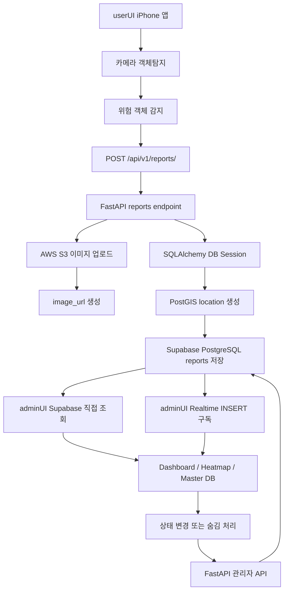
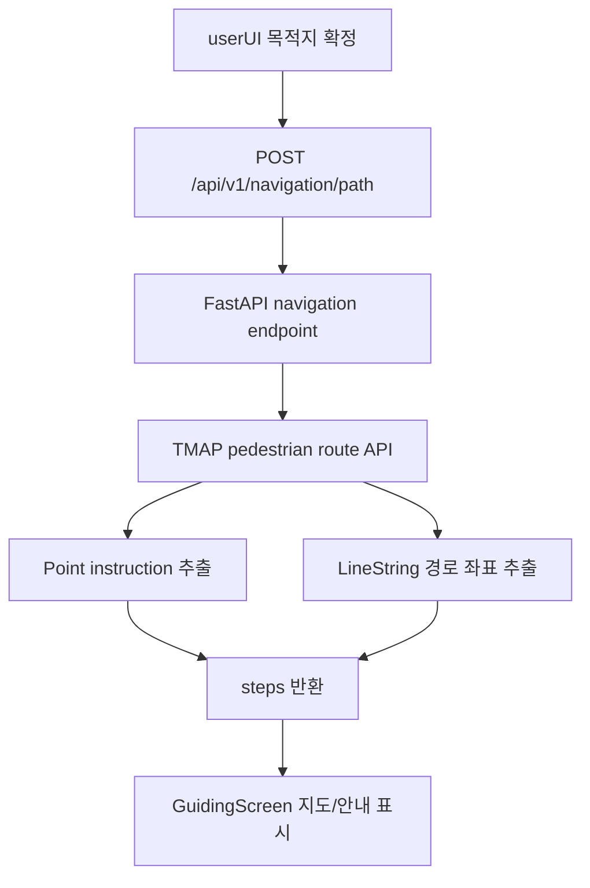

# WalkMate Backend Portfolio

## 1. 프로젝트 개요

WalkMate는 시각장애인을 위한 음성 기반 길안내와 보행 위험 요소 자동 신고 서비스다. 사용자는 iPhone 앱에서 음성으로 목적지를 입력하고, 길안내 중 카메라가 위험 객체를 감지하면 앱이 현재 위치, 위험 유형, 위험도, 이미지 파일을 백엔드로 전송한다.

이 백엔드는 사용자 앱과 관리자 화면 사이에서 다음 역할을 담당한다.

- 사용자 앱의 위험 신고 요청 수신
- 신고 이미지 AWS S3 업로드
- Supabase PostgreSQL `public.reports` 테이블에 신고 데이터 저장
- 관리자 화면의 신고 목록 조회, 처리 상태 변경, 숨김 처리
- TMAP 보행자 경로 API 프록시
- 프론트엔드와 DB 사이의 보안 경계 역할

| 항목 | 내용 |
|---|---|
| 프로젝트명 | WalkMate |
| 백엔드 성격 | 위험 신고 저장, 이미지 업로드, 관리자 API, 길안내 경로 프록시 |
| 주요 기술 | FastAPI, Uvicorn, SQLAlchemy, PostgreSQL/PostGIS, Supabase PostgreSQL, AWS S3, boto3, TMAP API |
| 핵심 경로 | `backend/` |
| API 문서 | FastAPI `/docs` Swagger UI |
| 데이터 저장 | Supabase PostgreSQL `public.reports` |
| 이미지 저장 | AWS S3 URL 저장 방식 |

## 2. 백엔드가 해결한 문제

WalkMate의 사용자 앱은 WebView 기반 모바일 앱이므로 DB 비밀번호, AWS 키, TMAP 키 같은 민감한 값을 직접 들고 있으면 안 된다. 또한 신고 이미지는 바이너리 파일이고, 신고 데이터는 위치 좌표와 함께 저장되어야 하므로 프론트엔드만으로 처리하기 어렵다.

백엔드는 이 문제를 다음 방식으로 해결했다.

| 문제 | 백엔드 해결 방식 |
|---|---|
| 사용자 앱이 DB에 직접 접근하면 보안 위험이 생김 | 사용자 앱은 FastAPI에만 신고를 전송하고, DB 연결은 백엔드가 담당 |
| 신고 이미지를 DB에 직접 넣으면 관리와 비용이 비효율적 | 이미지는 S3에 저장하고 DB에는 URL만 저장 |
| 위치 데이터를 지도와 공간 검색에 활용해야 함 | PostGIS `geometry(Point, 4326)` 타입에 좌표 저장 |
| 관리자 화면에서 처리 상태를 바꿔야 함 | `PATCH /api/v1/reports/{item_id}`로 상태 변경 |
| 사용자가 요청한 목적지까지 보행 경로가 필요함 | TMAP 보행자 경로 API를 백엔드에서 호출해 앱에 반환 |

중요한 점은 객체탐지 자체는 userUI의 WebView에서 `best_float32.tflite`로 수행하고, 백엔드는 탐지 결과를 받아 저장하는 역할에 집중한다는 것이다.

## 3. 전체 데이터 흐름



길안내 흐름은 별도로 다음과 같이 동작한다.



## 4. API 설계

아래 캡처는 로컬 FastAPI 서버의 `/docs` Swagger UI에서 실제 endpoint 목록을 확인한 화면이다.


### 4.1 `GET /health`

서버가 실행 중인지 확인하는 health check API다.

| 항목 | 내용 |
|---|---|
| Method | `GET` |
| Path | `/health` |
| Response | `{"ok": true}` |
| 목적 | 백엔드 프로세스 기동 여부 확인 |

### 4.2 `POST /api/v1/reports/`

사용자 앱에서 위험 신고를 생성하는 API다. JSON이 아니라 `multipart/form-data` 형식으로 메타데이터와 이미지 파일을 함께 받는다.

| 입력 필드 | 타입 | 필수 여부 | 설명 |
|---|---|---|---|
| `item_id` | string UUID | 필수 | 사용자 앱이 생성한 신고 ID |
| `user_id` | string UUID | 필수 | 기기 또는 사용자 식별값, DB에는 `device_id`로 저장 |
| `latitude` | float | 필수 | 신고 위치 위도 |
| `longitude` | float | 필수 | 신고 위치 경도 |
| `hazard_type` | string | 필수 | 감지된 위험 객체 종류 |
| `risk_level` | int | 필수 | 위험도 |
| `description` | string | 선택 | 신고 설명 |
| `label` | string | 필수 | 모델 감지 label |
| `file` | UploadFile | 필수 | 신고 이미지 |

성공 응답 구조는 다음과 같다.

```json
{
  "status": "success",
  "message": "Report created successfully",
  "data": {
    "item_id": "uuid",
    "hazard_type": "car",
    "risk_level": 3,
    "image_url": "https://...",
    "status": "new",
    "created_at": "timestamp",
    "label": "car"
  }
}
```

주요 실패 상황은 다음과 같다.

| 상황 | 처리 |
|---|---|
| `S3_BUCKET_NAME` 누락 | `500` 응답 |
| S3 업로드 실패 | `500` 응답 |
| UUID 변환 실패 또는 DB INSERT 실패 | `500` 응답 |
| 필수 FormData 누락 | FastAPI validation 오류 |

### 4.3 `POST /api/v1/navigation/path`

사용자 앱이 요청한 출발지와 도착지를 받아 TMAP 보행자 경로 API를 호출하는 프록시 API다.

Request body:

```json
{
  "start_lat": 37.30088,
  "start_lon": 127.01881,
  "end_lat": 37.26572,
  "end_lon": 126.99943
}
```

성공 응답:

```json
{
  "status": "success",
  "data": [
    {
      "instruction": "금당로를 따라 이동",
      "latitude": 37.3009,
      "longitude": 127.0188
    }
  ],
  "path": [
    {
      "latitude": 37.3009,
      "longitude": 127.0188
    }
  ]
}
```

TMAP 응답이 실패하면 현재 코드는 HTTP error code를 직접 넘기기보다 다음 형태의 JSON을 반환한다.

```json
{
  "status": "error",
  "message": "TMAP API Error"
}
```

### 4.4 `GET /api/v1/reports/`

관리자 화면에서 신고 목록을 조회하는 API다.

| Query | 기본값 | 제한 | 설명 |
|---|---:|---|---|
| `skip` | 0 | 0 이상 | pagination offset |
| `limit` | 20 | 1 이상 200 이하 | 조회 개수 |

응답:

```json
{
  "total": 14,
  "data": [
    {
      "item_id": "uuid",
      "hazard_type": "car",
      "image_url": "https://...",
      "description": "모니터링 로그",
      "status": "new",
      "created_at": "timestamp",
      "risk_level": 3,
      "device_id": "uuid",
      "latitude": 37.30088,
      "longitude": 127.01881
    }
  ]
}
```

### 4.5 `PATCH /api/v1/reports/{item_id}`

관리자가 신고 처리 상태를 변경하는 API다.

| 항목 | 내용 |
|---|---|
| Path parameter | `item_id: UUID` |
| Query parameter | `status=new`, `status=processing`, `status=done` |
| 성공 응답 | `{"success": true, "data": {"item_id": "...", "status": "done"}}` |
| 잘못된 status | `400` |
| 없는 신고 ID | `404` |

### 4.6 `DELETE /api/v1/reports/{item_id}`

신고를 실제 삭제하지 않고 숨김 처리하는 API다. DB에서는 `status = 'Hidden'`으로 업데이트한다.

```json
{
  "success": true,
  "message": "Report {item_id} deleted successfully",
  "data": {
    "item_id": "uuid"
  }
}
```

## 5. 데이터 저장 구조

현재 저장소에서 확인되는 핵심 테이블은 `public.reports`다. 테이블 생성 SQL은 `UI/adminUI/Supabase/tables.sql`에 있다.

Supabase 콘솔에서는 신고 행이 `reports` 테이블에 저장되는 것을 확인했다.


주요 컬럼은 다음과 같다.

| 컬럼 | 역할 |
|---|---|
| `item_id` | 신고 고유 ID, primary key |
| `created_at` | DB 기본값으로 생성되는 신고 시각 |
| `device_id` | 앱에서 보낸 `user_id` 저장 |
| `hazard_type` | 위험 객체 종류 |
| `risk_level` | 위험도 |
| `image_url` | S3에 저장된 이미지 URL |
| `description` | 신고 설명 |
| `label` | 모델 감지 label |
| `status` | `new`, `processing`, `done`, `Hidden` 등 상태 |
| `location` | PostGIS `geometry(Point, 4326)` 좌표 |
| `latitude`, `longitude` | 테이블에는 있지만 현재 INSERT 로직은 직접 채우지 않음 |

좌표 저장은 `crud/report.py`에서 다음 방식으로 처리한다.

```sql
ST_SetSRID(ST_MakePoint(:longitude, :latitude), 4326)
```

PostGIS에서는 `Point(x, y)`의 `x`가 경도, `y`가 위도이므로 `longitude`, `latitude` 순서로 넣는 현재 방식은 공간 좌표 저장 관점에서 타당하다. 관리자 API 목록 조회에서는 다시 다음처럼 꺼낸다.

```sql
ST_Y(location) as latitude,
ST_X(location) as longitude
```

## 6. 서버 아키텍처

백엔드는 기능별로 HTTP endpoint, 설정/DB 연결, DB 작업, 외부 저장소 업로드를 나눠 구성되어 있다.

```text
backend/
├── requirements.txt
├── .env.example
└── app/
    ├── main.py
    ├── core/
    │   ├── config.py
    │   └── database.py
    ├── api/
    │   └── v1/
    │       └── endpoints/
    │           ├── reports.py
    │           ├── admin.py
    │           └── navigation.py
    ├── crud/
    │   └── report.py
    └── services/
        └── s3_uploader.py
```

| 계층 | 파일 | 역할 |
|---|---|---|
| App bootstrap | `app/main.py` | FastAPI 앱 생성, CORS 설정, `/health`, 라우터 등록 |
| Config | `app/core/config.py` | `.env` 로드, DB/AWS/TMAP/CORS 환경 변수 읽기 |
| Database | `app/core/database.py` | SQLAlchemy engine, sessionmaker, `get_db()` 의존성 |
| Endpoint | `app/api/v1/endpoints/reports.py` | 사용자 신고 생성 |
| Endpoint | `app/api/v1/endpoints/admin.py` | 관리자 목록, 상태 변경, 숨김 처리 |
| Endpoint | `app/api/v1/endpoints/navigation.py` | TMAP 보행자 경로 프록시 |
| CRUD | `app/crud/report.py` | raw SQL, PostGIS 함수, commit/rollback |
| Service | `app/services/s3_uploader.py` | boto3 S3 `put_object()` 업로드 |

이 구조의 장점은 HTTP 요청 처리와 DB 작업, S3 업로드 책임이 어느 정도 분리되어 있다는 점이다. 특히 신고 생성 API는 이미지 저장과 DB 저장이라는 두 단계를 갖는데, S3 업로드는 service, DB INSERT는 crud 계층으로 분리되어 있어 문제 지점을 추적하기 쉽다.

## 7. 핵심 구현

### 7.1 신고 생성

`reports.py`의 `create_report()`는 multipart FormData를 받는다. 처리 순서는 다음과 같다.

1. 앱이 보낸 이미지 파일명을 기반으로 확장자를 추출한다.
2. 현재 시각과 UUID 일부를 조합해 중복 가능성이 낮은 파일명을 만든다.
3. `uploads/{filename}` 형태의 S3 key를 만든다.
4. 파일 bytes를 읽고 S3에 업로드한다.
5. 업로드 URL을 `image_url`로 사용한다.
6. `crud_report.create_report()`를 호출해 DB에 저장한다.
7. 저장된 신고 요약 정보를 반환한다.

### 7.2 S3 이미지 업로드

`s3_uploader.py`는 boto3 client를 만들고 `put_object()`로 이미지를 업로드한다. 업로드 후에는 `S3_PUBLIC_BASE_URL`이 있으면 그 값을 사용하고, 없으면 bucket name과 region을 조합해 URL을 만든다.

AWS S3 콘솔에서는 `cv-vision-project01` 버킷의 `uploads/` 경로에 신고 이미지 jpg 객체가 저장된 것을 확인했다.


### 7.3 DB 저장과 조회

`crud/report.py`는 ORM 모델 클래스를 두지 않고 `sqlalchemy.text()` 기반 SQL을 직접 실행한다. 이 방식은 PostGIS 함수 사용이 명확하다는 장점이 있다.

신고 생성 시에는 다음 데이터를 저장한다.

- `item_id`
- `device_id`
- `hazard_type`
- `risk_level`
- `image_url`
- `description`
- `label`
- `location`

관리자 목록 조회에서는 `ST_Y(location)`, `ST_X(location)`으로 위도/경도를 계산해 반환한다.

### 7.4 관리자 상태 변경과 숨김 처리

관리자 상태 변경은 `new`, `processing`, `done`만 허용한다. 허용되지 않은 값이 들어오면 `400`을 반환한다.

숨김 처리는 물리 삭제가 아니라 `status = 'Hidden'` 업데이트다. 이 방식은 신고 데이터를 바로 지우지 않고 운영 화면에서 제외할 수 있다는 장점이 있다.

### 7.5 TMAP 보행자 경로 프록시

`navigation.py`는 앱에서 받은 출발지/도착지 좌표를 TMAP 보행자 경로 API 형식으로 바꿔 요청한다.

TMAP 응답의 geometry는 두 종류로 나눠 처리한다.

| geometry type | 처리 |
|---|---|
| `Point` | 안내 문구와 해당 지점 좌표를 `steps`에 추가 |
| `LineString` | 전체 경로 좌표를 `path` 배열로 변환 |

프론트엔드는 `steps`를 음성/텍스트 안내에 사용하고, `path`를 지도 polyline에 사용한다.

## 8. 예외 처리와 안정성

현재 코드에서 확인되는 안정성 장치는 다음과 같다.

| 상황 | 처리 방식 |
|---|---|
| DB URL 누락 | 앱 시작 단계에서 `RuntimeError("DATABASE_URL is missing")` |
| DB 연결 끊김 | SQLAlchemy `pool_pre_ping=True` |
| DB INSERT/UPDATE 실패 | `rollback()` 후 예외 재발생 |
| S3 bucket 설정 누락 | 신고 생성 시 `500` 응답 |
| S3 업로드 실패 | `500` 응답과 실패 detail 반환 |
| 잘못된 관리자 status | `400` 응답 |
| 없는 신고 ID 상태 변경 | `404` 응답 |
| TMAP API non-200 응답 | `{"status": "error", "message": "TMAP API Error"}` 반환 |

다만 모든 오류가 완전히 정교하게 분류되어 있지는 않다. 예를 들어 신고 생성 API의 바깥 `except`는 대부분 `500`으로 반환하므로, UUID 형식 오류와 실제 서버 장애가 같은 형태로 보일 수 있다. 운영 환경에서는 오류 유형별 응답을 더 나누는 것이 좋다.

## 9. 보안과 환경 변수

백엔드는 민감한 연결 정보를 `.env`에서 읽는다.

```env
DATABASE_URL=postgresql://[USER]:[PASSWORD]@[HOST]:[PORT]/[DB_NAME]
AWS_ACCESS_KEY_ID=[YOUR_AWS_ACCESS_KEY_ID_HERE]
AWS_SECRET_ACCESS_KEY=[YOUR_AWS_SECRET_ACCESS_KEY_HERE]
AWS_REGION=ap-northeast-2
S3_BUCKET_NAME=[YOUR_S3_BUCKET_NAME_HERE]
S3_PUBLIC_BASE_URL=https://[YOUR_S3_BUCKET_NAME_HERE].s3.ap-northeast-2.amazonaws.com
TMAP_API_KEY=[YOUR_TMAP_API_KEY_HERE]
CORS_ORIGINS=http://localhost:5173,http://127.0.0.1:5173,http://localhost:3000,http://127.0.0.1:3000
```

보안 관점에서 중요한 점은 다음과 같다.

- `DATABASE_URL`과 AWS secret은 프론트엔드에 노출하지 않는다.
- 사용자 앱은 DB에 직접 연결하지 않고 FastAPI만 호출한다.
- CORS 허용 origin은 `.env`에서 관리한다.
- Supabase service role key는 브라우저 환경 변수에 넣으면 안 된다.
- 현재 관리자 계정 검증 로직은 별도로 확인되지 않으므로 운영 환경에서는 관리자 접근 제어가 필요하다.
- Supabase RLS가 꺼진 SQL을 사용하므로 운영 전 권한 정책을 다시 설계해야 한다.

## 10. 트러블슈팅

### 10.1 S3 업로드와 이미지 URL

문제는 신고 이미지 파일을 백엔드 서버 디스크에 저장하면 실기기 테스트나 배포 환경에서 파일 접근 경로가 불안정해진다는 점이었다. 그래서 파일은 S3에 저장하고 DB에는 URL만 남기는 방식으로 정리했다.

이 방식에서 확인해야 할 지점은 두 가지다.

- S3 bucket과 `S3_PUBLIC_BASE_URL`이 정확히 설정되어야 한다.
- S3 객체 접근 권한이 맞지 않으면 DB에 URL이 있어도 관리자 UI에서 이미지가 깨질 수 있다.

### 10.2 PostGIS 좌표 저장

위도/경도를 단순 숫자 컬럼으로만 저장하면 지도 표시는 쉽지만 공간 검색에는 약하다. 현재 백엔드는 PostGIS `location` 컬럼에 `ST_MakePoint(longitude, latitude)`로 좌표를 저장한다.

반대로 관리자 응답에서는 `ST_Y`, `ST_X`로 위도/경도를 계산해 반환한다. 이 흐름은 DB 원본을 geometry로 유지하면서 프론트엔드에는 사용하기 쉬운 숫자 좌표를 제공한다는 장점이 있다.

### 10.3 status 대소문자

현재 상태 변경 API는 `new`, `processing`, `done`을 사용하지만 숨김 처리는 `Hidden`을 저장한다. 반면 관리자 UI의 Supabase 직접 조회 쪽에서는 소문자 `hidden`을 제외하는 코드가 있어, 접근 경로에 따라 숨김 처리된 데이터가 다시 보일 가능성이 있다.

개선 방향은 status 값을 소문자 enum으로 통일하거나, 관리자 UI의 목록 조회를 백엔드 API로 통일하는 것이다.

### 10.4 실기기 백엔드 연결

iPhone에서 userUI를 테스트할 때는 Mac과 iPhone이 같은 네트워크에 있어야 하고, `VITE_BACKEND_URL`이 실제 접근 가능한 주소여야 한다. `localhost`는 iPhone 자기 자신을 의미하므로 실기기에서는 Mac의 LAN IP나 터널 URL을 사용해야 한다.

## 11. 현재 한계와 개선 방향

현재 백엔드는 핵심 기능을 연결하는 데 필요한 구조는 갖췄지만, 운영 수준으로 가려면 다음 보완이 필요하다.

| 한계 | 개선 방향 |
|---|---|
| 관리자 접근 제어가 없음 | 관리자 로그인, 권한 확인, 세션 또는 토큰 기반 보호 추가 |
| Supabase RLS가 꺼져 있음 | 관리자/서비스 권한 기준으로 RLS 정책 재설계 |
| 마이그레이션 도구가 없음 | DB 변경 이력을 관리하는 migration 체계 추가 |
| status 값이 `Hidden`과 소문자 값으로 섞임 | 상태 enum을 하나로 통일 |
| `latitude`, `longitude` 컬럼과 `location` 저장 방식이 혼재 | PostGIS 원본 유지 또는 숫자 컬럼 동시 저장 중 하나로 정책 결정 |
| TMAP 호출이 동기 `requests` 기반 | 비동기 HTTP client 또는 timeout/retry 정책 추가 |
| 오류 응답 분류가 단순함 | 입력 오류, 외부 API 오류, 저장소 오류, DB 오류를 구분 |
| 구조화된 로깅이 부족함 | request id, endpoint, 처리 시간, 실패 원인 중심 로그 추가 |
| 자동 테스트가 확인되지 않음 | endpoint 단위 테스트와 DB/S3 mock 테스트 추가 |

## 12. 정리

WalkMate 백엔드는 단순 CRUD 서버가 아니라 사용자 앱, AI 탐지 결과, 이미지 저장소, 공간 DB, 관리자 UI를 연결하는 중심 계층이다. 사용자 앱은 민감한 DB/AWS 정보를 직접 알지 않고 신고만 전송하며, 백엔드는 이미지 저장, 위치 저장, 관리자 처리, 경로 API 프록시를 담당한다.

포트폴리오 관점에서 이 백엔드의 핵심 기여는 다음과 같다.

- WebView 앱에서 발생한 위험 신고를 서버 API로 안정적으로 받는 구조 설계
- S3와 PostgreSQL을 분리해 이미지와 메타데이터를 각각 적절한 저장소에 저장
- PostGIS를 사용해 위치 데이터를 공간 좌표로 저장
- 관리자 UI가 사용할 수 있는 목록 조회, 상태 변경, 숨김 처리 API 구현
- TMAP 보행자 경로 API를 백엔드에서 중계해 userUI의 길안내 흐름과 연결
- 실제 FastAPI Docs, Supabase Table Editor, S3 콘솔 캡처로 구현 흐름을 검증

따라서 이 백엔드는 WalkMate의 "감지 → 신고 → 저장 → 운영자 확인" 흐름을 실제로 이어 주는 핵심 서버 구현이라고 볼 수 있다.
