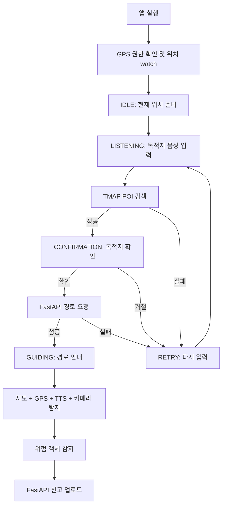

# WalkMate Frontend Portfolio

## 1. 프로젝트 개요

WalkMate는 시각장애인을 위한 음성 기반 길안내와 보행 위험 요소 자동 신고 서비스다. 프론트엔드는 두 개의 앱으로 나뉜다.

| 앱 | 위치 | 사용자 | 역할 |
|---|---|---|---|
| 사용자 앱 | `UI/userUI` | 보행자, 시각장애인 사용자 | 음성 목적지 입력, 경로 안내, 카메라 객체탐지, 위험 신고 전송 |
| 관리자 앱 | `UI/adminUI` | 운영자, 관리자 | 신고 목록 조회, 실시간 모니터링, 위험 위치 확인, 상태 변경, 숨김 처리 |

사용자 앱은 React + Vite + Capacitor 기반의 iOS WebView 앱으로 구성되어 있고, 관리자 앱은 React + Vite 기반의 웹 대시보드로 구성되어 있다. 두 앱은 같은 문제를 서로 다른 관점에서 다룬다. userUI는 현장에서 위험을 감지하고 신고하는 화면이며, adminUI는 쌓인 신고를 운영자가 확인하고 처리하는 화면이다.

| 영역 | 주요 기술 |
|---|---|
| 공통 | React 19, Vite 6, TypeScript |
| userUI | Capacitor 8, Geolocation, TTS/STT, Leaflet, `react-webcam`, `@tensorflow/tfjs-tflite` |
| adminUI | Supabase JS, Recharts, Leaflet, Tailwind/PostCSS, lucide-react |
| API 연동 | FastAPI, TMAP API, Supabase Realtime |

## 2. 사용자 문제와 화면 목표

### 2.1 userUI의 문제

시각장애인 보행 보조 앱은 작은 버튼을 정확히 누르는 방식만으로는 사용하기 어렵다. 사용자는 걷는 중에도 목적지를 입력하고, 경로 안내를 듣고, 주변 위험을 파악해야 한다. 따라서 userUI의 화면 목표는 버튼 중심 조작보다 음성, 큰 텍스트, 고대비, 자동 흐름에 맞춰져 있다.

userUI가 해결하려 한 문제는 다음과 같다.

- 사용자가 화면을 자세히 보지 않아도 목적지를 입력할 수 있어야 한다.
- 목적지 확인과 재입력을 음성과 큰 터치 영역으로 처리해야 한다.
- 안내 중 지도, 카메라, TTS, GPS가 동시에 동작해야 한다.
- 위험 객체가 감지되면 사용자가 별도 입력을 많이 하지 않아도 신고가 전송되어야 한다.
- 실기기에서 GPS 지연, STT partial result, TTS 중복, WebView 추론 속도 같은 변수를 견뎌야 한다.

### 2.2 adminUI의 문제

관리자는 사용자 앱에서 들어온 신고를 빠르게 확인하고 처리해야 한다. 단순히 DB row를 나열하는 것만으로는 신고 상황을 파악하기 어렵기 때문에, 통계, 지도, 테이블, 상세 이미지가 함께 필요했다.

adminUI의 화면 목표는 다음과 같다.

- 신규 신고를 실시간에 가깝게 확인한다.
- 위험도와 시간대별 신고량을 대시보드에서 빠르게 파악한다.
- 지도에서 위험 위치를 공간적으로 확인한다.
- 신고 이미지를 크게 보고 처리 상태를 변경한다.
- 전체 신고 데이터를 검색, 필터링, 정렬, CSV 내보내기할 수 있게 한다.

## 3. 전체 프론트엔드 구조

```text
UI/
├── userUI/
│   ├── App.tsx
│   ├── index.tsx
│   ├── types.ts
│   ├── capacitor.config.ts
│   ├── components/
│   │   ├── IdleScreen.tsx
│   │   ├── ListeningScreen.tsx
│   │   ├── RetryScreen.tsx
│   │   ├── ConfirmationScreen.tsx
│   │   ├── GuidingScreen.tsx
│   │   ├── DebugMap.tsx
│   │   ├── VisionCamera.tsx
│   │   └── Waveform.tsx
│   ├── src/
│   │   ├── api/
│   │   │   ├── backend.ts
│   │   │   ├── report.ts
│   │   │   └── tmap.ts
│   │   └── utils/
│   │       ├── audio.ts
│   │       ├── josa.ts
│   │       └── YoloParser.ts
│   ├── public/wasm/
│   │   ├── best_float32.tflite
│   │   └── tflite_web_api_*.js, *.wasm, *.worker.js
│   └── ios/App/
│
└── adminUI/
    ├── App.tsx
    ├── index.tsx
    ├── types.ts
    ├── components/
    │   ├── Sidebar.tsx
    │   ├── HazardTable.tsx
    │   ├── HazardModal.tsx
    │   └── ActionReportModal.tsx
    ├── views/
    │   ├── Dashboard.tsx
    │   ├── Heatmap.tsx
    │   └── Database.tsx
    ├── src/api/adminApi.ts
    └── Supabase/tables.sql
```

두 앱을 분리한 이유는 사용자 목표가 다르기 때문이다. userUI는 음성 중심의 현장 앱이고, adminUI는 데이터 확인과 운영 처리를 위한 대시보드다. 따라서 상태 관리, 화면 밀도, API 사용 방식도 다르게 설계되어 있다.

현재 checkout에는 `UI/userUI/ios/` 플랫폼 프로젝트가 포함되어 있지만, `UI/userUI/android/` 플랫폼 디렉토리는 없다. 따라서 프론트엔드 포트폴리오에서는 iOS WebView 테스트를 중심으로 설명하는 것이 현재 파일 구조와 맞다.

렌더링 진입점은 두 앱 모두 `ReactDOM.createRoot()`를 사용한다. 차이는 개발 중 부작용 처리 방식이다. adminUI는 일반 웹 대시보드라 `React.StrictMode`를 유지하지만, userUI는 TTS/STT 같은 네이티브 부작용이 개발 환경에서 중복 실행되는 문제를 줄이기 위해 `React.StrictMode`를 제거한 상태다.

## 4. userUI 사용자 플로우

userUI의 상위 흐름은 `types.ts`의 `AppScreen` enum으로 관리된다.

```text
IDLE -> LISTENING -> RETRY -> CONFIRMATION -> GUIDING
```

전체 사용자 흐름은 다음과 같다.



실제 앱 테스트 GIF에서는 목적지 음성 입력, 목적지 확인, 경로 안내, 지도 표시, 카메라 객체탐지가 같은 세션 안에서 이어지는 것을 확인할 수 있다.


Xcode에서는 iPhone 12 mini 실기기 로그를 보며 객체탐지 추론 시간, 감지 객체 수, Geolocation 요청, `CapacitorHttp` 신고 전송 응답을 확인했다. 이 캡처는 userUI가 단순 브라우저 화면이 아니라 iOS WebView 앱으로 실제 기기에서 실행되었음을 보여준다.


## 5. userUI 핵심 구현

### 5.1 상태 머신 기반 화면 전환

`App.tsx`는 `currentScreen` 상태를 기준으로 화면을 렌더링한다. 라우터를 쓰지 않고 앱 내부 상태로 전환하는 이유는 음성 안내, 권한 요청, 위치 감시, 경로 요청이 하나의 흐름으로 이어지기 때문이다.

| 상태 | 화면 | 역할 |
|---|---|---|
| `IDLE` | `IdleScreen` | 현재 위치 준비, 시작 안내 |
| `LISTENING` | `ListeningScreen` | 목적지 음성 입력 |
| `RETRY` | `RetryScreen` | 검색 실패나 오류 후 재입력 |
| `CONFIRMATION` | `ConfirmationScreen` | 검색된 목적지 확인/거절 |
| `GUIDING` | `GuidingScreen` | 경로 안내, 지도, GPS, 카메라 객체탐지 |

### 5.2 TTS/STT 흐름

음성 출력은 `@capacitor-community/text-to-speech`, 음성 입력은 `@capacitor-community/speech-recognition`을 중심으로 구성되어 있다. 웹 환경 fallback도 있지만, 실제 목적은 iOS 앱 실행이다.

핵심 처리는 다음과 같다.

- TTS 안내 후 바로 STT를 시작하지 않고 짧은 대기 시간을 둔다.
- iOS에서 최종 결과가 즉시 비어 있을 수 있어 partial result listener를 활용한다.
- 목적지 입력 문장에서 `"으로 안내해줘"`, `"안내"` 같은 표현을 제거해 검색어를 만든다.
- 확인 화면에서는 `"응"`, `"네"`, `"맞아"` 등을 확인으로 처리하고 `"아니"`, `"틀려"` 등을 거절로 처리한다.

### 5.3 위치와 경로 안내

앱 시작 시 `Geolocation.watchPosition()`으로 현재 위치를 갱신한다. 현재 옵션은 높은 정확도와 timeout 완화를 고려한다.

```ts
enableHighAccuracy: true
timeout: 30000
maximumAge: 10000
```

목적지가 확정되면 `src/api/backend.ts`의 `requestNavigation()`이 FastAPI `/api/v1/navigation/path/`로 출발지와 도착지 좌표를 보낸다. 응답의 `data`는 안내 step으로, `path`는 지도 polyline으로 사용한다.

### 5.4 지도와 방향 표시

`DebugMap.tsx`는 Leaflet 기반으로 다음 정보를 표시한다.

- 현재 위치
- 목적지
- 경로 polyline
- 체크포인트
- 사용자 heading을 반영한 현재 위치 화살표

`GuidingScreen.tsx`는 `deviceorientationabsolute`, `deviceorientation`, GPS 이동 방향을 함께 사용해 방향 표시를 보정한다.

### 5.5 카메라 객체탐지와 신고 업로드

`VisionCamera.tsx`는 `react-webcam`으로 프레임을 캡처하고, `@tensorflow/tfjs-tflite`로 TFLite 모델을 로드한다.

현재 모델 파일은 다음이다.

```ts
const MODEL_FILE = "best_float32.tflite";
```

추론 결과는 `src/utils/YoloParser.ts`에서 YOLO 출력 구조에 맞춰 파싱하고, confidence threshold는 현재 `0.30`으로 설정되어 있다. 위험 객체가 감지되면 `src/api/report.ts`가 이미지와 위치 정보를 `multipart/form-data`로 FastAPI `/api/v1/reports/`에 전송한다.

## 6. adminUI 화면 구성

adminUI는 신고 데이터를 운영자가 확인하기 위한 React + Vite 대시보드다. 메인 화면 전환은 라우터가 아니라 `App.tsx`의 `activePage` 상태로 관리된다.

```text
dashboard | heatmap | database
```

### 6.1 Dashboard

대시보드는 신고 현황을 요약하는 첫 화면이다. 전체 신고 수, 위험도 분포, 시간대별 신고량, 최근 신고 목록을 보여준다.


### 6.2 Heatmap

위험 히트맵은 Leaflet 지도 위에 신고 위치를 표시한다. 상세 모달에서 특정 신고의 지도 보기로 이동하면 해당 좌표를 중심으로 지도를 볼 수 있다.


### 6.3 Database

마스터 DB 화면은 전체 신고 목록을 테이블로 보여준다. 검색, 위험도/상태 필터, 정렬, 페이지네이션, CSV 내보내기, 선택 삭제 기능을 제공한다.


### 6.4 HazardModal과 ActionReportModal

상세 모달에서는 신고 이미지, 위치, 위험도, 상태, 설명을 확인한다. 처리 상태 변경은 `ActionReportModal`을 통해 수행하며, FastAPI PATCH API를 호출한다.


## 7. adminUI 핵심 구현

### 7.1 Supabase 직접 조회

`App.tsx`는 환경 변수에서 Supabase URL과 anon key를 읽고 client를 생성한다.

```ts
const supabaseUrl = import.meta.env.VITE_SUPABASE_URL || '';
const supabaseAnonKey = import.meta.env.VITE_SUPABASE_ANON_KEY || '';
const supabase = createClient(supabaseUrl, supabaseAnonKey);
```

초기 데이터는 `reports` 테이블에서 직접 조회한다.

```ts
supabase
  .from('reports')
  .select('*')
  .neq('status', 'hidden')
  .order('created_at', { ascending: false });
```

### 7.2 Realtime INSERT 구독

adminUI는 Supabase Realtime channel을 열어 `reports` 테이블의 INSERT 이벤트를 구독한다. 새 신고가 들어오면 기존 목록 앞에 추가해 대시보드와 테이블에 반영한다.

현재 구독은 INSERT 중심이다. UPDATE나 DELETE/hidden 변경까지 모든 세션에 실시간 반영하려면 구독 범위와 상태 동기화 정책을 추가로 정리해야 한다.

### 7.3 데이터 매핑

Supabase 원본 row는 UI용 `HazardData`로 변환된다.

| 원본 | UI 사용 |
|---|---|
| `risk_level` number | `low`, `medium`, `high` 등 위험도 표시 |
| `created_at` | 날짜/시간 표시, 시간대 차트 |
| `image_url` | 테이블 thumbnail, 상세 모달 이미지 |
| `location` 또는 좌표 컬럼 | 지도 위치 표시 |
| `status` | 신고 처리 상태 badge |

### 7.4 관리자 API 연동

조회와 Realtime은 Supabase JS로 처리하지만, 상태 변경과 숨김 처리는 FastAPI 백엔드 API를 호출한다.

| 기능 | 호출 |
|---|---|
| 상태 변경 | `PATCH {VITE_BACKEND_URL}/api/v1/reports/{itemId}?status={status}` |
| 숨김 처리 | `DELETE {VITE_BACKEND_URL}/api/v1/reports/{itemId}` |

이 구조는 빠르게 구현하기에는 편하지만, 장기적으로는 읽기/쓰기 책임이 분리되어 데이터 일관성 문제가 생길 수 있다.

## 8. 상태 관리와 컴포넌트 설계

### 8.1 userUI 상태 관리

userUI는 상위 `App.tsx`가 화면 상태, 현재 위치, 목적지, route step, path를 관리한다. 각 화면 컴포넌트는 해당 단계에서 필요한 입력과 이벤트만 받는다.

| 상태 | 역할 |
|---|---|
| `currentScreen` | 현재 사용자 플로우 단계 |
| `currentLocation` | Geolocation watch 결과 |
| `destination` | TMAP 검색으로 확정된 목적지 |
| `navigationData` | 백엔드가 반환한 route step |
| `pathCoordinates` | 지도에 표시할 경로 좌표 |

이 방식은 음성 입력부터 안내 화면까지 흐름이 명확하다는 장점이 있다. 반면 `GuidingScreen.tsx`는 GPS, TTS, STT, heading, 카메라를 함께 다루므로 복잡도가 높다.

### 8.2 adminUI 상태 관리

adminUI는 `App.tsx`가 대시보드 컨테이너 역할을 한다.

| 상태 | 역할 |
|---|---|
| `activePage` | `dashboard`, `heatmap`, `database` 화면 전환 |
| `reports` | Supabase에서 가져온 신고 목록 |
| `selectedHazard` | 상세 모달에 표시할 신고 |
| `heatmapFocus` | 상세 모달에서 지도 보기로 이동할 좌표 |
| `isDarkMode` | 다크모드 여부 |
| `isSidebarOpen` | 사이드바 열림/닫힘 |

adminUI는 사용자가 반복적으로 데이터를 스캔해야 하므로, userUI보다 정보 밀도가 높고 테이블/차트/지도 중심으로 설계되어 있다.

## 9. API와 외부 서비스 연동

| 앱 | 연동 대상 | 역할 |
|---|---|---|
| userUI | TMAP POI API | 목적지 검색 |
| userUI | FastAPI `/api/v1/navigation/path/` | 보행 경로 요청 |
| userUI | FastAPI `/api/v1/reports/` | 위험 신고 이미지/메타데이터 업로드 |
| userUI | Capacitor Geolocation | 현재 위치와 안내 중 위치 추적 |
| userUI | Capacitor TTS/STT | 음성 안내와 음성 입력 |
| userUI | tfjs-tflite WebAssembly | 앱 내 객체탐지 추론 |
| adminUI | Supabase JS | 신고 목록 직접 조회 |
| adminUI | Supabase Realtime | 신규 신고 INSERT 구독 |
| adminUI | FastAPI admin API | 상태 변경, 숨김 처리 |
| adminUI | Leaflet tile | 지도 표시 |

환경 변수는 앱별로 분리되어 있다.

userUI:

```env
VITE_BACKEND_URL=http://localhost:8000
VITE_TMAP_API_KEY=[YOUR_TMAP_API_KEY_HERE]
```

adminUI:

```env
VITE_SUPABASE_URL=https://[YOUR_SUPABASE_PROJECT_ID].supabase.co/
VITE_SUPABASE_ANON_KEY=[YOUR_SUPABASE_ANON_KEY_HERE]
VITE_BACKEND_URL=http://localhost:8000
```

실기기 테스트에서는 `localhost`가 iPhone 자기 자신을 의미하므로, `VITE_BACKEND_URL`에는 Mac의 실제 로컬 IP나 접근 가능한 터널 주소를 넣어야 한다.

## 10. UI/UX와 접근성

### 10.1 userUI

userUI는 시각장애인 보행 보조 상황을 고려해 다음 방향으로 설계되어 있다.

- 버튼보다 음성 입력과 자동 전환 중심
- 검정/노랑 계열의 강한 대비
- 큰 문구와 단순한 화면 상태
- 상단/하단 터치 영역으로 확인/거절 가능
- 경로 안내 중 TTS를 통해 다음 행동을 전달
- 객체탐지 상태를 시각적으로도 표시해 개발/테스트 중 확인 가능

### 10.2 adminUI

adminUI는 운영자가 많은 신고를 반복적으로 확인하는 화면이므로 정보 밀도와 탐색성을 우선한다.

- 사이드바 기반 3개 화면 전환
- 통계 카드와 차트로 현황 요약
- 지도 기반 위험 위치 확인
- 테이블 검색/필터/정렬/페이지네이션
- 상세 모달에서 이미지와 위치, 상태 변경을 한 번에 처리
- 다크모드와 responsive grid 기반 대시보드 구성

## 11. 트러블슈팅

### 11.1 iOS STT partial result

iOS에서는 SpeechRecognition이 최종 결과 없이 resolve될 수 있다. 이를 보완하기 위해 partial result listener를 사용해 실제 인식 문장을 수집하고, 침묵 시간이나 화면 터치로 확정하는 흐름을 둔다.

### 11.2 GPS timeout

실기기 테스트 중 `Could not obtain location in time` 계열 오류가 발생할 수 있다. 현재 userUI는 timeout을 늘리고, 위치 확보 실패 시 앱 전체를 즉시 중단하지 않도록 완충 처리한다. 다만 실외/실내 수신 상태에 따라 GPS 안정성은 계속 검증해야 한다.

### 11.3 WebView TFLite 추론 성능

현재 객체탐지는 iPhone WebView 안에서 `tfjs-tflite`와 WebAssembly로 수행된다. 실기기 로그에서 추론 시간과 객체 수를 확인하며 디버깅했고, 성능이 부족하면 네이티브 추론이나 서버 추론과 비교할 필요가 있다.

### 11.4 백엔드 URL 문제

프론트엔드 코드에는 `VITE_BACKEND_URL` fallback으로 특정 로컬 IP가 들어 있다. 다른 네트워크나 실기기 환경에서는 `.env`를 정확히 설정해야 한다. 특히 iPhone에서는 `localhost`를 사용할 수 없다.

### 11.5 Supabase hidden/status 불일치

adminUI의 직접 Supabase 조회는 소문자 `hidden`을 제외하고, 백엔드 숨김 처리는 `Hidden` 값을 저장한다. 이 대소문자 차이 때문에 숨김 처리된 신고가 새로고침 후 다시 보일 가능성이 있다. status 값을 하나로 통일하거나 adminUI 조회를 백엔드 API로 통일하는 것이 좋다.

## 12. 한계와 개선 방향

| 한계 | 개선 방향 |
|---|---|
| userUI의 Tailwind가 CDN 기반 | npm/PostCSS 기반 빌드로 포함해 오프라인 안정성 향상 |
| userUI `GuidingScreen` 복잡도 높음 | 거리 계산, heading 보정, TTS 큐, 경로 이탈 감지를 순수 함수와 hook으로 분리 |
| WebView 객체탐지 성능 부담 | 네이티브 추론, 서버 추론, frame interval 최적화 비교 |
| 관리자 인증 없음 | 관리자 로그인과 권한 정책 추가 |
| Supabase RLS 비활성화 | 운영 환경용 RLS와 anon key 정책 재설계 |
| adminUI 읽기/쓰기 경로 분리 | Supabase 직접 접근과 FastAPI API 중 하나로 책임 정리 |
| UPDATE/DELETE Realtime 반영 제한 | Supabase Realtime 구독 범위 확장 또는 refresh 정책 정리 |
| 자동 테스트 부족 | userUI 상태 머신, API 함수, adminUI 데이터 매핑 테스트 추가 |
| 접근성 실사용 검증 부족 | VoiceOver, 이어폰, 야외 소음, 화면 잠금, 흔들림 환경 테스트 |

## 13. 정리

WalkMate 프론트엔드는 사용자 앱과 관리자 앱이 서로 다른 UX 문제를 해결하도록 분리되어 있다. userUI는 시각장애인 사용자가 음성으로 목적지를 입력하고, 경로 안내를 받으며, 카메라 객체탐지를 통해 위험 신고까지 이어지는 현장 앱이다. adminUI는 이 신고 데이터를 실시간에 가깝게 조회하고, 통계/지도/테이블/상세 모달로 운영자가 처리할 수 있게 만든 대시보드다.

포트폴리오 관점에서 프론트엔드의 핵심 기여는 다음과 같다.

- React + Vite 기반으로 사용자 앱과 관리자 앱을 분리 구현
- Capacitor를 통해 userUI를 iOS WebView 앱으로 실행하고 실기기 로그로 검증
- 음성 입력, TTS, GPS, 지도, 카메라 객체탐지를 하나의 안내 흐름으로 연결
- TFLite 모델을 WebView에서 로드해 위험 객체 탐지 결과를 신고 업로드와 연결
- Supabase Realtime 기반 관리자 대시보드로 신규 신고 모니터링 구현
- 대시보드, 히트맵, 마스터 DB, 상세 모달을 통해 운영자 업무 흐름 구성

따라서 WalkMate 프론트엔드는 단순 화면 구현이 아니라 "사용자 현장 경험"과 "운영자 관리 경험"을 동시에 설계한 프로젝트라고 볼 수 있다.
