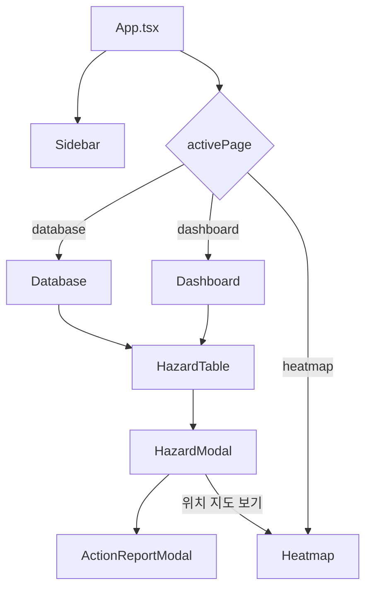
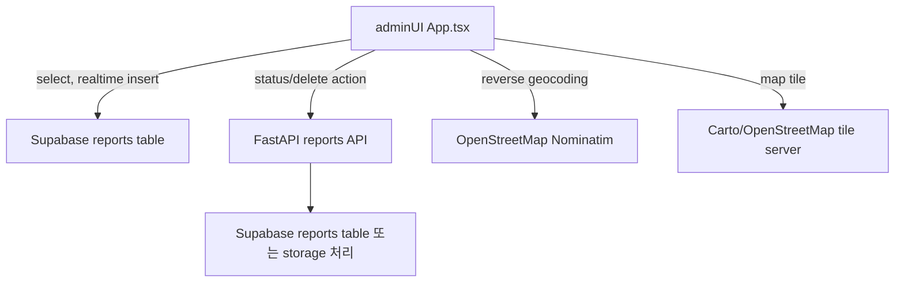

# WalkMate Admin UI Report

## 1. 결론 요약

WalkMate의 `adminUI`는 사용자 앱에서 수집된 위험 신고 데이터를 운영자가 확인하고 관리하기 위한 React + Vite 기반 관리자 대시보드다. 현재 checkout 기준 핵심 경로는 `UI/adminUI`이며, Supabase `reports` 테이블을 직접 조회하고 Realtime INSERT 이벤트를 구독해 신고 목록을 갱신한다.

관리자 UI의 핵심 역할은 다음과 같다.

- Supabase `reports` 테이블에서 위험 신고 데이터를 조회한다.
- 신규 신고 INSERT 이벤트를 Supabase Realtime으로 받아 대시보드에 반영한다.
- 신고 데이터를 대시보드 통계, 차트, 테이블, 지도 형태로 시각화한다.
- 신고 상세 이미지와 위치, 위험도, 상태, 설명을 모달로 확인한다.
- 신고 상태를 `new`, `processing`, `done`으로 변경한다.
- 선택 신고를 백엔드 DELETE API로 삭제 또는 숨김 처리한다.
- CSV 내보내기로 신고 데이터를 운영 자료로 추출한다.

현재 구현은 “실시간 신고 모니터링 관리자 화면”으로서 핵심 기능이 꽤 갖춰져 있다. 다만 인증/권한, RLS, 운영자 계정 관리, 상태 변경 사유 저장, README 최신화, 미사용 파일 정리 같은 운영 안정화 과제도 분명하다.

---

## 2. 프로젝트 위치와 주요 파일

`adminUI`의 주요 파일 구조는 다음과 같다.

```text
UI/adminUI/
├── App.tsx
├── index.tsx
├── index.html
├── index.css
├── types.ts
├── package.json
├── vite.config.ts
├── tsconfig.json
├── postcss.config.js
├── tailwind.config.js
├── .env.example
├── Supabase/
│   └── tables.sql
├── components/
│   ├── Sidebar.tsx
│   ├── HazardTable.tsx
│   ├── HazardModal.tsx
│   └── ActionReportModal.tsx
├── views/
│   ├── Dashboard.tsx
│   ├── Heatmap.tsx
│   └── Database.tsx
└── src/
    └── api/
        └── adminApi.ts
```

현재 실제 메인 앱 흐름은 `App.tsx -> views/* -> components/*` 중심이다.

---

## 3. 기술 스택

| 영역 | 사용 기술 | 현재 역할 |
|---|---|---|
| UI 프레임워크 | React 19 | 관리자 화면 컴포넌트 구성 |
| 빌드 도구 | Vite | 개발 서버, production build |
| 스타일 | Tailwind CSS 4, PostCSS, Autoprefixer | 대시보드 레이아웃과 다크모드 스타일 |
| 아이콘 | lucide-react | 사이드바, 상태, 버튼 아이콘 |
| 차트 | Recharts | 위험도 분포, 시간대별 신고량 차트 |
| 지도 | Leaflet, React Leaflet | 위험 신고 위치 히트맵 표시 |
| DB/Realtime | Supabase JS | `reports` 조회, INSERT 실시간 구독 |
| Backend API | `fetch` | 신고 상태 변경, 삭제/숨김 처리 |
| 지도 주소 변환 | OpenStreetMap Nominatim | 좌표 기반 근접 주소 표시 |

---

## 4. 실행과 환경 변수

### 4.1 npm scripts

`package.json` 기준 스크립트는 다음과 같다.

```json
{
  "dev": "vite",
  "build": "vite build",
  "preview": "vite preview"
}
```

개발 서버는 `vite.config.ts`에서 다음처럼 설정되어 있다.

```ts
server: {
  port: 3000,
  host: '0.0.0.0',
}
```

즉 개발 중에는 기본적으로 `http://localhost:3000` 또는 같은 네트워크의 기기에서 `http://<개발기기IP>:3000`으로 접근할 수 있다.

### 4.2 환경 변수

`.env.example` 기준 필요한 환경 변수는 다음과 같다.

```text
VITE_SUPABASE_URL=https://[YOUR_SUPABASE_PROJECT_ID].supabase.co/
VITE_SUPABASE_ANON_KEY=[YOUR_SUPABASE_ANON_KEY_HERE]
VITE_BACKEND_URL=http://localhost:8000
```

각 변수의 역할은 다음과 같다.

| 환경 변수 | 역할 |
|---|---|
| `VITE_SUPABASE_URL` | Supabase 프로젝트 URL |
| `VITE_SUPABASE_ANON_KEY` | 브라우저에서 사용하는 Supabase anon key |
| `VITE_BACKEND_URL` | FastAPI 백엔드 주소 |

`VITE_BACKEND_URL`이 없으면 코드상 fallback은 `http://172.30.1.80:8000`이다. 이 값은 특정 로컬 네트워크 IP에 묶여 있으므로 다른 환경에서는 `.env`에 명시적으로 값을 넣어야 한다.

---

## 5. 앱 진입점과 전체 구조

### 5.1 `index.tsx`

`index.tsx`는 `ReactDOM.createRoot()`로 `App`을 렌더링한다. userUI와 달리 adminUI는 `React.StrictMode`를 유지한다.

```tsx
const root = ReactDOM.createRoot(rootElement);
root.render(
  <React.StrictMode>
    <App />
  </React.StrictMode>
);
```

개발 중 effect 중복 실행이 발생할 수 있지만, 관리자 화면에서는 TTS/STT 같은 네이티브 부작용이 없기 때문에 Strict Mode를 유지하는 편이 더 자연스럽다.

### 5.2 `App.tsx`

`App.tsx`는 adminUI의 핵심 컨테이너다. 주요 상태는 다음과 같다.

| 상태 | 의미 |
|---|---|
| `activePage` | 현재 화면: `dashboard`, `heatmap`, `database` |
| `selectedHazard` | 상세 모달로 열 신고 데이터 |
| `reports` | Supabase에서 가져온 신고 목록 |
| `isDarkMode` | 다크모드 여부 |
| `heatmapFocus` | 상세 모달에서 지도 보기로 넘어갈 때 중심 좌표 |
| `isSidebarOpen` | 사이드바 확장/축소 상태 |

현재 화면 전환은 라우터가 아니라 `activePage` 값으로 직접 분기한다.



## 6. Supabase 연동 구조

### 6.1 클라이언트 생성

`App.tsx`는 환경 변수에서 Supabase 연결 정보를 읽고 브라우저에서 client를 생성한다.

```ts
const supabaseUrl = import.meta.env.VITE_SUPABASE_URL || '';
const supabaseAnonKey = import.meta.env.VITE_SUPABASE_ANON_KEY || '';
const supabase = createClient(supabaseUrl, supabaseAnonKey);
```

이 구조에서는 `VITE_SUPABASE_ANON_KEY`가 브라우저 번들에 포함된다. 따라서 실제 운영에서는 anon key와 RLS 정책을 전제로 설계해야 한다. 현재 SQL 파일은 로컬 테스트 편의를 위해 RLS를 비활성화하고 있으므로 운영 상태로 보기에는 위험하다.

### 6.2 초기 데이터 조회

`fetchInitialData()`는 `reports` 테이블에서 숨김 상태가 아닌 신고만 가져온다.

```ts
supabase
  .from('reports')
  .select('*')
  .neq('status', 'hidden')
  .order('created_at', { ascending: false });
```

이 조회 결과는 `mapToHazardData()`를 통해 UI 표시용 `HazardData`로 변환된다.

### 6.3 Realtime 구독

앱은 Supabase Realtime channel을 열고 `reports` 테이블의 INSERT 이벤트를 구독한다.

```ts
supabase
  .channel('app_realtime_reports')
  .on(
    'postgres_changes',
    { event: 'INSERT', schema: 'public', table: 'reports' },
    callback
  )
  .subscribe();
```

실시간으로 새 신고가 들어오면 기존 목록 앞에 추가한다. 단, 새 신고의 status가 `Hidden`이면 무시한다. 현재 구독 대상은 INSERT뿐이므로 UPDATE나 DELETE/hidden 변경은 실시간 자동 반영되지 않고, 상태 변경 또는 삭제 후에는 로컬 상태 갱신이나 수동 refresh에 의존한다.

---

## 7. 데이터 매핑 규칙

Supabase 원본 row는 `mapToHazardData()`에서 관리자 UI가 쓰는 `HazardData` 형태로 변환된다.

### 7.1 위험도 매핑

원본 `risk_level`은 숫자이고, UI에서는 문자열 등급으로 보여준다.

| 원본 `risk_level` | UI `riskLevel` |
|---:|---|
| `>= 4` | `High` |
| `3` | `Medium` |
| 그 외 | `Low` |

userUI의 현재 위험도는 주로 1~3을 사용하므로, adminUI 기준에서는 `risk_level = 3`이 `Medium`으로 표시된다. 만약 앱에서 `3`을 가장 높은 위험도로 쓰는 정책이라면 adminUI의 `High` 기준과 정책 불일치가 생길 수 있다.

### 7.2 상태 매핑

원본 status는 소문자 형태를 기대하고, UI는 대문자 label로 변환한다.

| DB status | UI status |
|---|---|
| `new` | `New` |
| `processing` | `Processing` |
| `done` | `Done` |
| `hidden` | `Hidden` |

초기 조회에서는 `hidden`을 제외하므로 일반 화면에는 숨김 항목이 나오지 않는다.

### 7.3 좌표 매핑

코드는 두 가지 좌표 구조를 모두 고려한다.

1. `latitude`, `longitude` 컬럼이 있는 경우
2. PostGIS `location` geometry의 `coordinates`가 있는 경우

`location.coordinates`가 있으면 `[longitude, latitude]` 순서로 읽어 `lat/lng`를 보정한다. UI에서는 문자열로 다음처럼 저장한다.

```text
위도: 37.xxxxxx, 경도: 127.xxxxxx
```

이 문자열은 Heatmap과 지도 이동 로직에서 다시 파싱된다. 동작은 가능하지만, 좌표를 문자열에서 재파싱하는 구조이므로 장기적으로는 `HazardData`에 `lat`, `lng` 숫자 필드를 명시하는 편이 더 안전하다.

### 7.4 이미지 URL 매핑

`image_url`이 `http`로 시작하면 그대로 사용하고, 그렇지 않으면 `VITE_BACKEND_URL`을 앞에 붙인다.

```ts
const finalThumbnail = rawImageUrl.startsWith('http')
  ? rawImageUrl
  : `${API_BASE_URL}/${rawImageUrl}`;
```

즉 Supabase에는 S3 전체 URL 또는 백엔드 상대 경로가 들어올 수 있다. 이미지 로딩 실패 시 테이블과 모달에서는 placeholder 이미지로 대체한다.

### 7.5 주소 매핑

초기 데이터 로드 후 각 신고의 좌표를 OpenStreetMap Nominatim reverse geocoding API로 주소 변환한다. 과도한 요청을 줄이기 위해 `index * 1000`ms 지연을 두고 순차 요청한다.

이 방식은 구현이 간단하지만 외부 API 상태와 rate limit에 영향을 받는다. 또한 신고 수가 많아지면 전체 주소 표시가 늦게 갱신될 수 있다.

---

## 8. Supabase 테이블 정의

`UI/adminUI/Supabase/tables.sql` 기준 `reports` 테이블은 다음과 같이 설계되어 있다.

```sql
create table public.reports (
    item_id uuid not null default gen_random_uuid(),
    created_at timestamp with time zone not null default now(),
    device_id uuid null,
    hazard_type text not null,
    risk_level integer not null,
    image_url text not null,
    description text null,
    label text null,
    status text not null default 'new',
    distance double precision null,
    direction text null,
    location geometry(Point, 4326) null,
    latitude double precision null,
    longitude double precision null,
    deleted_at timestamp with time zone null,
    constraint reports_pkey primary key (item_id)
);
```

테이블의 주요 컬럼 역할은 다음과 같다.

| 컬럼 | 역할 |
|---|---|
| `item_id` | 신고 고유 ID |
| `created_at` | 신고 생성 시각 |
| `device_id` | 신고 기기 ID |
| `hazard_type` | 위험 객체/상황 종류 |
| `risk_level` | 숫자 위험도 |
| `image_url` | 신고 이미지 경로 또는 URL |
| `description` | 신고 상세 설명 |
| `label` | AI 모델 감지 라벨 |
| `status` | 처리 상태 |
| `distance` | 감지 객체 거리 추정값 |
| `direction` | `L`, `R`, `C` 방향 코드 |
| `location` | PostGIS Point 좌표 |
| `latitude`, `longitude` | 별도 위도/경도 컬럼 |
| `deleted_at` | 삭제/숨김 시간 기록용 컬럼 |

SQL 파일은 PostGIS 확장과 Supabase Realtime publication 추가도 포함한다.

```sql
create extension if not exists postgis;
alter publication supabase_realtime add table public.reports;
```

주의할 점은 `alter table public.reports disable row level security;`가 포함되어 있다는 것이다. 이는 로컬 테스트에는 편하지만, 실제 운영에서는 관리자 인증과 RLS 정책을 반드시 다시 설계해야 한다.

---

## 9. 화면별 기능

### 9.1 Sidebar

`Sidebar.tsx`는 고정 좌측 네비게이션이다.

현재 메뉴는 다음 3개다.

| 메뉴 ID | 표시 이름 | 연결 화면 |
|---|---|---|
| `dashboard` | 대시보드 | `Dashboard.tsx` |
| `heatmap` | 위험 히트맵 | `Heatmap.tsx` |
| `database` | 마스터 DB | `Database.tsx` |

사이드바는 확장/축소가 가능하고, 로고 클릭 시 dashboard로 이동한다. 하단에는 로그아웃 버튼이 있지만 실제 인증/로그아웃 로직은 연결되어 있지 않다.

### 9.2 Dashboard

`Dashboard.tsx`는 전체 신고 데이터를 요약하는 화면이다.

표시 항목은 다음과 같다.

- 오늘 접수된 신고 수
- 처리 대기 중 신고 수
- 해결 완료 신고 수
- 전체 누적 데이터 수
- 위험 레벨 분포 bar chart
- 시간대별 접수 횟수 line chart
- 최근 접수 내역 5건

차트는 Recharts로 구현되어 있다. 시간대별 접수 횟수는 `rawTimestamp` 또는 `timestamp`를 `Date`로 변환해 09시, 11시, 13시, 15시, 17시 이후 구간으로 그룹화한다.

### 9.3 Database

`Database.tsx`는 전체 신고 목록 관리 화면이다.

주요 기능은 다음과 같다.

- 상태 필터: All, New, Processing, Done
- 위험도 필터: All, High, Medium, Low
- 날짜 필터
- 최신순/과거순 정렬
- 5/10/20개 단위 페이지네이션
- 개별/전체 선택 checkbox
- 선택 데이터 CSV 내보내기
- 전체 필터 결과 CSV 내보내기
- 선택 항목 삭제/숨김 처리

CSV는 Excel 호환성을 위해 UTF-8 BOM을 붙인다.

삭제 버튼은 UI상 `"삭제(숨김) 처리"`로 안내한다. 실제 호출은 `deleteReport(id)`이고, 백엔드의 `DELETE /api/v1/reports/{itemId}` 구현에 따라 hidden 처리 또는 삭제가 결정된다. adminUI 조회 쪽은 `status != hidden`을 기준으로 숨김 항목을 제외한다.

### 9.4 Heatmap

`Heatmap.tsx`는 신고 위치를 지도 위에 표시한다.

기능은 다음과 같다.

- 위험 등급별 필터
- 현재 표시 데이터 수 표시
- 브라우저 `navigator.geolocation`으로 현재 위치 이동
- 신고 위치 CircleMarker 표시
- 위험도별 색상 구분
- 모달에서 `"위치 지도 보기"`를 누르면 해당 신고 좌표로 지도 이동

지도 tile은 다크모드 여부에 따라 Carto light/dark tile을 사용한다. 지도 데이터 자체는 OpenStreetMap 기반이다.

### 9.5 HazardTable

`HazardTable.tsx`는 Dashboard와 Database에서 공통으로 쓰는 테이블이다.

compact 모드에서는 최근 신고 요약에 필요한 열만 보여주고, 일반 모드에서는 checkbox, 날짜, 시간, 위치까지 포함한다. 행 클릭 또는 눈 아이콘 클릭 시 `HazardModal`을 연다.

### 9.6 HazardModal

`HazardModal.tsx`는 신고 상세 모달이다.

표시 정보는 다음과 같다.

- 신고 이미지
- 위험도 badge
- 신고 ID
- 위험 유형
- 상세 설명
- 위치와 거리/방향
- 발생 시간
- 처리 상태
- 근접 주소
- 신고자/감지기

이미지를 클릭하면 전체 화면 확대 보기로 전환된다. 하단에는 `"조치 보고서 작성"`과 `"위치 지도 보기"` 버튼이 있다.

### 9.7 ActionReportModal

`ActionReportModal.tsx`는 신고 상태 변경용 모달이다. `New`, `Processing`, `Done` 중 하나를 선택하고 변경 사유를 입력해야 확인 버튼이 활성화된다.

현재 중요한 한계가 있다. UI에서는 변경 사유 입력을 필수로 받지만, 실제 API 호출은 `patchReportStatus(data.id, selectedStatus)`뿐이다. 즉 reason 값은 백엔드로 전송되지 않는다. 포트폴리오나 보고서에서는 “조치 사유를 저장한다”고 표현하면 안 되고, “상태 변경 시 사유 입력 UI는 있으나 현재 API에는 status만 전송된다”고 설명해야 정확하다.

---

## 10. 백엔드 API 연동

`src/api/adminApi.ts`는 Supabase가 아니라 FastAPI 백엔드로 요청을 보내는 함수들을 모아둔 파일이다.

기본 URL:

```ts
const RAW_URL = import.meta.env.VITE_BACKEND_URL ?? "http://172.30.1.80:8000";
const API_BASE = RAW_URL.replace(/\/$/, "");
```

제공 함수는 다음과 같다.

| 함수 | HTTP | URL | 역할 |
|---|---|---|---|
| `fetchReports(skip, limit)` | GET | `/api/v1/reports?skip=&limit=` | 신고 목록 조회 |
| `patchReportStatus(itemId, status)` | PATCH | `/api/v1/reports/{itemId}?status={status}` | 신고 상태 변경 |
| `deleteReport(itemId)` | DELETE | `/api/v1/reports/{itemId}` | 신고 삭제 또는 숨김 처리 |

현재 `App.tsx`의 초기 목록 조회는 `fetchReports()`가 아니라 Supabase 직접 조회를 사용한다. 반면 상태 변경과 삭제는 `adminApi.ts`를 통해 백엔드 API를 호출한다.

즉 adminUI 데이터 흐름은 다음처럼 혼합되어 있다.



이 구조는 빠르게 만들기에는 편하지만, 장기적으로는 데이터 읽기/쓰기 경로가 나뉘어 일관성 문제가 생길 수 있다. 운영 안정성을 높이려면 읽기와 쓰기를 모두 백엔드 API로 통일하거나, Supabase 직접 접근을 유지하되 RLS와 update/delete 정책을 명확히 해야 한다.

---

## 11. 스타일과 레이아웃

adminUI는 dashboard형 운영 도구에 맞게 밀도 있는 정보 구조를 사용한다.

주요 스타일 특징은 다음과 같다.

- 좌측 고정 사이드바
- 상단 header breadcrumb
- 카드형 통계 위젯
- 테이블 중심 데이터 탐색
- modal 기반 상세 확인
- 지도 기반 위치 확인
- light/dark mode 지원

`index.css`는 Tailwind 4를 import하고, `.dark` 클래스를 기준으로 다크모드를 적용한다.

```css
@import "tailwindcss";
@custom-variant dark (&:is(.dark *));
```

다만 `index.html`에는 Tailwind CDN script와 importmap도 남아 있다. 실제 빌드에서는 npm 의존성과 Vite 번들이 사용되므로, AI Studio 템플릿 흔적에 가까운 CDN/importmap 설정은 정리할 여지가 있다.

---

## 12. 현재 구현의 강점

1. 실시간 데이터 흐름이 구현되어 있다.  
   Supabase Realtime INSERT 구독으로 사용자 앱에서 새 신고가 들어오면 관리자 화면에 바로 추가된다.

2. 운영자가 필요한 핵심 화면이 나뉘어 있다.  
   요약 통계는 Dashboard, 위치 분포는 Heatmap, 상세 관리는 Database로 분리되어 있다.

3. 위험 신고를 여러 방식으로 볼 수 있다.  
   같은 데이터를 카드, 차트, 테이블, 지도, 상세 모달로 볼 수 있어 운영 관점에서 확인 경로가 다양하다.

4. 상태 변경과 삭제/숨김 처리가 연결되어 있다.  
   단순 조회 화면이 아니라 운영자가 신고 상태를 업데이트하고 목록을 정리할 수 있다.

5. CSV 내보내기가 있다.  
   신고 데이터를 외부 보고서나 행정 전달 자료로 옮길 수 있는 기본 기능이 있다.

6. 다크모드가 구현되어 있다.  
   `document.documentElement.classList`에 `dark`를 붙이는 방식으로 전체 UI theme을 바꾼다.

---

## 13. 현재 구현의 한계와 위험

1. 인증/권한 관리가 없다.  
   화면에는 Admin User가 보이지만 실제 로그인, 세션, 권한 검증, 로그아웃 로직은 없다.

2. Supabase RLS가 꺼져 있다.  
   `tables.sql`은 로컬 테스트 편의를 위해 RLS를 disable한다. 운영 환경에서는 anon key 노출과 결합되어 위험하다.

3. 읽기와 쓰기 경로가 섞여 있다.  
   조회와 실시간 구독은 Supabase 직접 접근이고, 상태 변경/삭제는 FastAPI 백엔드 API다. 둘 중 하나로 책임을 정리하는 편이 좋다.

4. 상태 변경 사유가 저장되지 않는다.  
   `ActionReportModal`에서 reason을 필수 입력으로 받지만 API에는 status만 전송한다.

5. Realtime은 INSERT만 구독한다.  
   다른 관리자가 status를 바꾸거나 hidden 처리한 UPDATE/DELETE 이벤트는 현재 화면에 자동 반영되지 않을 수 있다.

6. 좌표를 문자열에서 다시 파싱한다.  
   `HazardData.location` 문자열을 Heatmap과 지도 이동에서 재파싱한다. 숫자 좌표 필드를 별도로 유지하는 편이 안전하다.

7. 위험도 정책이 userUI와 다를 수 있다.  
   adminUI는 `risk_level >= 4`를 High로 보지만, userUI는 현재 1~3 위험도 체계를 사용한다. 이 경우 앱에서 가장 위험하다고 보낸 3이 adminUI에서는 Medium으로 보일 수 있다.

8. 외부 서비스 의존성이 많다.  
    Supabase, FastAPI 백엔드, Nominatim reverse geocoding, 지도 tile 서버 중 하나라도 실패하면 일부 화면 정보가 비거나 늦게 표시될 수 있다.

---

## 14. 개선 제안

1. 관리자 인증을 추가한다.  
   Supabase Auth, 별도 백엔드 세션, 또는 조직 계정 기반 로그인을 붙이고 관리자 권한을 구분해야 한다.

2. Supabase RLS를 운영 기준으로 다시 설계한다.  
   anon key가 브라우저에 들어가는 구조라면 read/update/delete 정책을 명시해야 한다.

3. 데이터 접근 경로를 통일한다.  
   관리자 UI가 백엔드 API만 사용하게 하거나, Supabase 직접 접근을 유지하되 update/delete도 Supabase policy로 일관되게 처리해야 한다.

4. status 변경 이력을 저장한다.  
   `report_actions` 같은 별도 테이블을 두고 `item_id`, 이전 상태, 변경 상태, reason, admin_id, created_at을 저장하면 운영 감사가 가능하다.

5. UPDATE/DELETE Realtime도 구독한다.  
   여러 관리자 화면이 동시에 열릴 수 있으므로 INSERT뿐 아니라 UPDATE, DELETE 또는 status hidden 변경 이벤트도 반영해야 한다.

6. `HazardData`에 좌표 숫자 필드를 추가한다.  
   `lat`, `lng`를 명시 필드로 두면 지도, CSV, 모달에서 문자열 파싱을 줄일 수 있다.

7. 위험도 정책을 userUI/backend와 맞춘다.  
   `risk_level=3`을 High로 볼지 Medium으로 볼지 프로젝트 전체 기준을 통일해야 한다.

8. 주소 변환 캐싱을 추가한다.  
    매번 Nominatim에 요청하지 않고 백엔드나 DB에 reverse geocoding 결과를 저장하면 화면 로딩과 외부 API 의존성을 줄일 수 있다.

---

## 15. 최종 평가

현재 adminUI는 WalkMate의 운영자 관점 기능을 보여주는 핵심 화면이다. userUI가 위험 신고를 생성하는 쪽이라면, adminUI는 그 신고가 실제로 접수되고, 시각화되고, 운영자가 상태를 관리할 수 있음을 보여준다. 대시보드, 히트맵, 마스터 DB, 상세 모달, 조치 모달까지 이어지는 흐름은 포트폴리오에서 “AI 탐지 결과가 운영 관리 화면까지 연결된다”는 증거로 사용할 수 있다.

다만 운영 시스템이라고 말하려면 인증, 권한, RLS, 상태 변경 이력, API 경로 일관성이 더 보강되어야 한다. 지금은 로컬 테스트와 시연에는 충분하지만, 실제 공공기관/운영자용 대시보드로 확장하려면 보안과 감사 가능성을 먼저 정리해야 한다.

따라서 adminUI의 다음 단계는 기능을 더 늘리는 것보다 데이터 계약과 운영 신뢰성을 정리하는 것이다. Supabase 테이블 정책, 백엔드 API 책임, 관리자 인증, status 변경 로그가 정리되면 현재 UI는 실제 운영형 신고 관리 시스템으로 발전할 수 있다.
