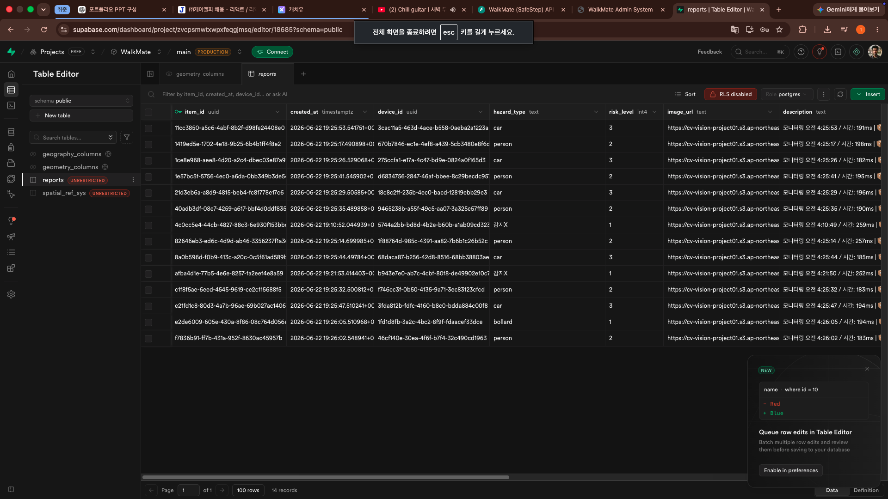
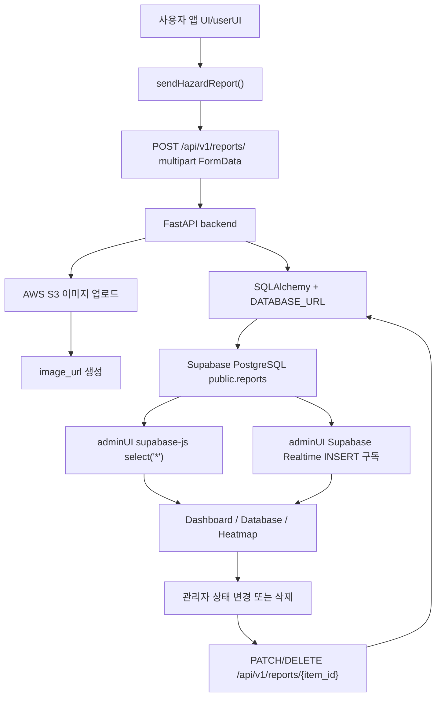
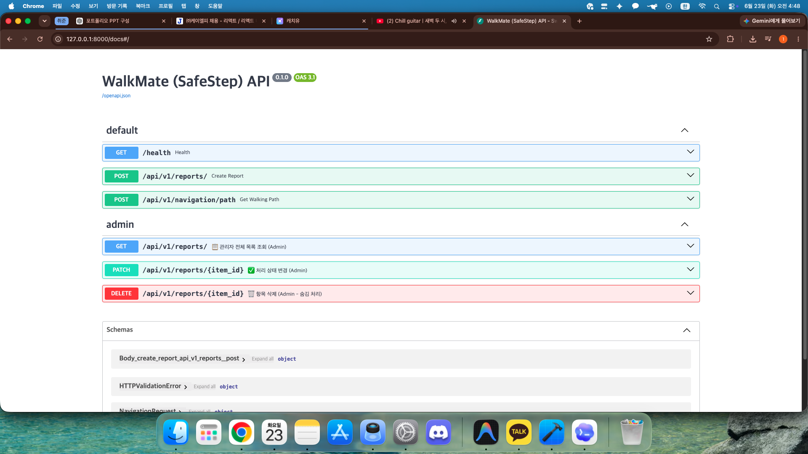
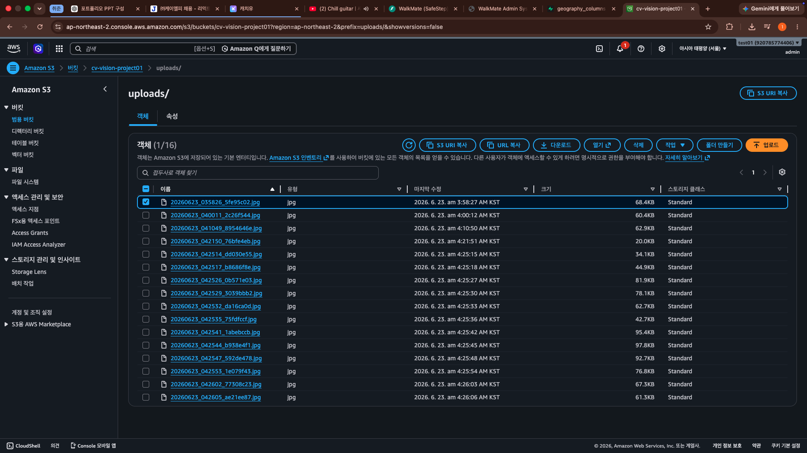
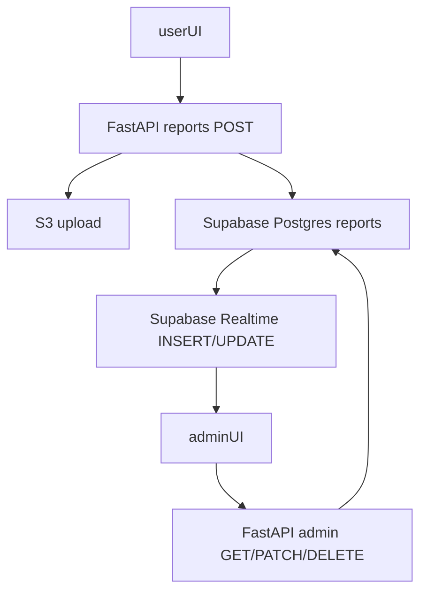

# WalkMate Supabase 및 테이블 상세 보고서

작성일: 2026-06-23  
검증 기준: 현재 저장소의 코드, SQL, 환경 변수 예시 파일 기준  
주의: 실제 Supabase 콘솔이나 운영 DB에 접속해 live schema/data를 조회한 것은 아니며, 이 문서는 저장소에 남아 있는 구현 증거를 기준으로 작성했다.

## 1. 핵심 요약

이 프로젝트에서 Supabase는 주로 `public.reports` 테이블을 저장하는 PostgreSQL DB 역할과 관리자 화면의 실시간 INSERT 감지 역할을 한다.

현재 코드 기준 역할 분담은 다음과 같다.

| 영역 | Supabase 사용 여부 | 실제 역할 |
| --- | --- | --- |
| 사용자 앱 `UI/userUI` | 직접 사용하지 않음 | FastAPI 백엔드로 신고 FormData를 전송한다. |
| 백엔드 `backend` | PostgreSQL로 직접 접속 | `DATABASE_URL`로 Supabase Postgres에 연결하고 SQLAlchemy로 INSERT/SELECT/UPDATE를 수행한다. |
| 관리자 UI `UI/adminUI` | 직접 사용 | `@supabase/supabase-js`로 `reports` 테이블을 조회하고 Realtime INSERT를 구독한다. |
| 이미지 저장소 | Supabase Storage 아님 | AWS S3에 이미지를 업로드하고, DB에는 S3 URL만 저장한다. |
| 인증 | 현재 Supabase Auth 사용 증거 없음 | 관리자 화면은 anon key로 직접 조회한다. |

현재 저장소에서 확인되는 Supabase 테이블 생성 SQL은 `UI/adminUI/Supabase/tables.sql`의 `public.reports` 1개다. 다른 Supabase 테이블 생성 SQL은 확인되지 않았다.

중요한 확인 사항은 다음과 같다.

- `reports` 테이블은 PostGIS `geometry(Point, 4326)` 타입의 `location` 컬럼을 사용한다.
- 백엔드는 `latitude`, `longitude` 컬럼에 값을 넣지 않고, `location` 컬럼에만 `ST_SetSRID(ST_MakePoint(longitude, latitude), 4326)` 형태로 좌표를 저장한다.
- 관리자 UI는 Supabase에서 직접 `select('*')`를 수행하며, `latitude/longitude` 컬럼 또는 `location.coordinates` 형태를 기대한다.
- `status` 값에 대소문자 불일치가 있다. 테이블 기본값과 PATCH는 `new`, `processing`, `done` 같은 소문자 값을 쓰지만, 백엔드 삭제 함수는 `Hidden` 대문자 값을 저장한다.
- SQL 파일에서 RLS가 비활성화되어 있다. 브라우저에 노출되는 anon key로 직접 조회하는 구조이므로 운영 환경에서는 보안 정책을 다시 설계해야 한다.
- Realtime 구독은 INSERT만 처리한다. UPDATE, DELETE 또는 숨김 처리는 다른 브라우저 세션에 즉시 반영되지 않을 수 있다.

### Supabase 콘솔 작업 캡처

아래 이미지는 Supabase 웹 콘솔의 Table Editor에서 `public.reports` 테이블을 확인하며 작업한 화면이다. 캡처에는 신고 행과 `hazard_type`, `risk_level`, `image_url`, `description` 같은 컬럼이 표시되어 있어, 사용자 앱에서 발생한 신고 데이터가 Supabase Postgres 테이블에 저장되는 흐름을 보여준다.



## 2. 전체 데이터 흐름



핵심 흐름은 두 갈래다.

1. 신고 생성 흐름
   - 사용자 앱이 카메라 이미지, 좌표, 위험 유형, 위험도, 설명을 백엔드로 전송한다.
   - 백엔드는 이미지를 S3에 업로드한다.
   - 백엔드는 S3 URL과 신고 메타데이터를 Supabase PostgreSQL의 `public.reports`에 INSERT한다.

2. 관리자 조회/관리 흐름
   - 관리자 UI는 Supabase JS 클라이언트로 `reports` 테이블을 직접 조회한다.
   - 새 신고는 Supabase Realtime의 INSERT 이벤트로 관리자 화면에 추가된다.
   - 상태 변경과 삭제는 관리자 UI가 백엔드 API를 호출하고, 백엔드가 DB를 UPDATE한다.

## 3. Supabase 연결 방식

### 3.1 백엔드 연결: SQLAlchemy + PostgreSQL URL

백엔드는 Supabase SDK를 쓰지 않는다. 일반 PostgreSQL DB처럼 Supabase Postgres에 직접 연결한다.

관련 파일:

- `backend/app/core/config.py`
- `backend/app/core/database.py`
- `backend/.env.example`
- `backend/requirements.txt`

환경 변수:

```env
DATABASE_URL=postgresql://[USER]:[PASSWORD]@[HOST]:[PORT]/[DB_NAME]
```

연결 코드:

```python
engine = create_engine(DATABASE_URL, pool_pre_ping=True)
SessionLocal = sessionmaker(autocommit=False, autoflush=False, bind=engine)
```

백엔드가 이 방식으로 얻는 장점은 다음과 같다.

- PostGIS 함수인 `ST_SetSRID`, `ST_MakePoint`, `ST_X`, `ST_Y`를 직접 SQL에서 사용할 수 있다.
- FastAPI API 요청 단위로 DB 세션을 열고 닫는 구조를 유지할 수 있다.
- Supabase REST API 제한보다 SQL을 직접 제어하기 쉽다.

주의할 점은 다음과 같다.

- `DATABASE_URL`은 DB 사용자명, 비밀번호, 호스트를 포함하므로 프론트엔드에 노출하면 안 된다.
- `DATABASE_URL`이 비어 있으면 백엔드는 시작 단계에서 `RuntimeError("DATABASE_URL is missing")`를 발생시킨다.
- 현재 코드에는 별도 migration 도구가 없다. 테이블 변경은 SQL 파일과 실제 DB 상태가 어긋나기 쉽다.

### 3.2 관리자 UI 연결: supabase-js + anon key

관리자 UI는 브라우저에서 Supabase에 직접 접속한다.

관련 파일:

- `UI/adminUI/App.tsx`
- `UI/adminUI/.env.example`
- `UI/adminUI/package.json`

환경 변수:

```env
VITE_SUPABASE_URL=https://[YOUR_SUPABASE_PROJECT_ID].supabase.co/
VITE_SUPABASE_ANON_KEY=[YOUR_SUPABASE_ANON_KEY_HERE]
VITE_BACKEND_URL=http://localhost:8000
```

연결 코드:

```ts
const supabaseUrl = import.meta.env.VITE_SUPABASE_URL || '';
const supabaseAnonKey = import.meta.env.VITE_SUPABASE_ANON_KEY || '';
const supabase = createClient(supabaseUrl, supabaseAnonKey);
```

현재 관리자 UI의 직접 Supabase 사용처는 두 가지다.

1. 초기 데이터 조회

```ts
const { data, error } = await supabase
  .from('reports')
  .select('*')
  .neq('status', 'hidden')
  .order('created_at', { ascending: false });
```

2. 새 신고 실시간 감지

```ts
supabase
  .channel('app_realtime_reports')
  .on(
    'postgres_changes',
    { event: 'INSERT', schema: 'public', table: 'reports' },
    (payload) => { ... }
  )
  .subscribe();
```

주의할 점은 브라우저에 들어가는 `VITE_SUPABASE_ANON_KEY`는 공개 가능한 anon key여야 한다는 점이다. Supabase service role key를 절대 프론트엔드에 넣으면 안 된다.

또한 현재 SQL 파일은 RLS를 꺼 둔다.

```sql
alter table public.reports disable row level security;
```

RLS가 꺼져 있고 anon key로 직접 조회하는 구조에서는 anon key를 가진 클라이언트가 테이블 데이터를 넓게 읽을 수 있다. 로컬 시연에는 편하지만 운영 서비스에는 위험하다.

### 3.3 사용자 앱 연결: Supabase 직접 연결 없음

사용자 앱은 Supabase URL이나 anon key를 사용하지 않는다.

관련 파일:

- `UI/userUI/src/api/report.ts`
- `UI/userUI/.env.example`

환경 변수:

```env
VITE_BACKEND_URL=http://localhost:8000
VITE_TMAP_API_KEY=[YOUR_TMAP_API_KEY_HERE]
```

사용자 앱은 다음 endpoint로 신고를 전송한다.

```ts
const API_BASE_URL = `${BASE_URL}/api/v1/reports/`;
```

즉 사용자 앱의 DB 접근 권한은 백엔드를 통해 간접적으로만 행사된다. 이 구조는 사용자 앱이 DB 비밀번호나 Supabase anon key를 몰라도 되므로 더 안전하다.

### 3.4 관리자 상태 변경/삭제: Supabase 직접 UPDATE가 아니라 백엔드 API

관리자 UI는 조회와 Realtime은 Supabase에 직접 붙지만, 상태 변경과 삭제는 백엔드 REST API를 호출한다.

관련 파일:

- `UI/adminUI/src/api/adminApi.ts`
- `UI/adminUI/components/ActionReportModal.tsx`
- `UI/adminUI/views/Database.tsx`
- `backend/app/api/v1/endpoints/admin.py`
- `backend/app/crud/report.py`

API:

| 기능 | 메서드 및 경로 | DB 동작 |
| --- | --- | --- |
| 관리자 목록 조회 | `GET /api/v1/reports?skip=0&limit=20` | `SELECT ... FROM public.reports` |
| 상태 변경 | `PATCH /api/v1/reports/{item_id}?status=new` | `UPDATE public.reports SET status = :status` |
| 삭제 처리 | `DELETE /api/v1/reports/{item_id}` | 실제 삭제가 아니라 status를 숨김 값으로 변경 |

### FastAPI Docs 캡처

아래 이미지는 로컬 FastAPI 서버의 `/docs` Swagger UI를 확인한 화면이다. `POST /api/v1/reports/`, `POST /api/v1/navigation/path`, 관리자용 `GET/PATCH/DELETE /api/v1/reports...` endpoint가 문서화되어 있어, Supabase `reports` 테이블에 데이터를 넣고 상태를 변경하는 백엔드 API 경로를 한눈에 확인할 수 있다.



현재 `App.tsx`의 메인 데이터 로딩은 이 관리자 목록 API가 아니라 Supabase 직접 조회를 사용한다. `adminApi.ts`의 `fetchReports()`는 존재하지만, 현재 메인 `App.tsx`의 초기 목록 흐름에서는 직접 사용되지 않는다.

## 4. Supabase 테이블 생성 SQL

테이블 생성 파일은 `UI/adminUI/Supabase/tables.sql`이다.

현재 SQL의 의미는 다음과 같다.

```sql
create extension if not exists postgis;

create table public.reports (
    item_id uuid not null default gen_random_uuid(),
    created_at timestamp with time zone not null default now(),
    device_id uuid null,
    hazard_type text not null,
    risk_level integer not null,
    image_url text not null,
    description text null,
    label text null,
    status text not null default 'new',
    distance double precision null,
    direction text null,
    location geometry(Point, 4326) null,
    latitude double precision null,
    longitude double precision null,
    deleted_at timestamp with time zone null,
    constraint reports_pkey primary key (item_id)
);

alter table public.reports disable row level security;
alter publication supabase_realtime add table public.reports;
```

각 줄의 역할은 다음과 같다.

- `create extension if not exists postgis;`
  - `location geometry(Point, 4326)`와 `ST_MakePoint`, `ST_X`, `ST_Y` 같은 공간 함수를 쓰기 위해 필요하다.

- `create table public.reports`
  - 위험 신고 데이터를 저장하는 핵심 테이블이다.

- `alter table public.reports disable row level security;`
  - RLS를 끈다. 로컬 테스트에서는 간단하지만 운영 환경에서는 anon key 직접 조회와 결합될 때 보안 위험이 크다.

- `alter publication supabase_realtime add table public.reports;`
  - Supabase Realtime이 `reports` 테이블 변경 이벤트를 내보내도록 publication에 테이블을 추가한다.

## 5. `public.reports` 테이블 컬럼별 상세 역할

| 컬럼 | 타입 | 생성/입력 위치 | 사용 위치 | 역할 | 주의점 |
| --- | --- | --- | --- | --- | --- |
| `item_id` | `uuid` | 사용자 앱이 `uuidv4()`로 생성하고 백엔드가 INSERT | 관리자 UI, 백엔드 PATCH/DELETE | 신고 1건의 고유 ID, PK | DB 기본값도 `gen_random_uuid()`지만 현재 흐름은 클라이언트 생성 값을 넣는다. |
| `created_at` | `timestamp with time zone` | DB 기본값 `now()` | Dashboard 시간 통계, 정렬, CSV | 신고 생성 시각 | 백엔드는 직접 넣지 않는다. DB 시간이 기준이다. |
| `device_id` | `uuid` | 백엔드가 `user_id` 값을 `device_id` 컬럼에 저장 | 백엔드 관리자 목록 조회 | 신고를 보낸 사용자/기기 식별값 | 현재 사용자 앱은 매 신고마다 새 `user_id` UUID를 생성한다. 실제 사용자 추적용 고정 ID는 아니다. |
| `hazard_type` | `text` | 사용자 앱 FormData | 관리자 UI의 종류 표시, 테이블, 지도 tooltip | 위험 요소 종류 | 값 목록이나 제약 조건이 없다. 오탈자/다국어/라벨 체계가 섞일 수 있다. |
| `risk_level` | `integer` | 사용자 앱 FormData | 관리자 UI에서 High/Medium/Low 변환 | 위험도 숫자 | 현재 UI는 `>=4`를 High, `3`을 Medium, 나머지를 Low로 해석한다. DB check constraint는 없다. |
| `image_url` | `text` | 백엔드가 S3 업로드 후 URL 저장 | 관리자 UI thumbnail | 위험 상황 이미지 URL | Supabase Storage가 아니라 AWS S3 URL이다. S3 공개 접근/버킷 정책이 맞지 않으면 이미지가 깨질 수 있다. |
| `description` | `text` | 사용자 앱 FormData, 없으면 백엔드에서 빈 문자열 | 관리자 UI 상세 설명, CSV | 신고 설명 | `null` 가능하지만 백엔드 생성 로직은 `None`이면 `""`로 저장한다. |
| `label` | `text` | 사용자 앱 FormData | 백엔드 생성 응답에는 포함 | AI 감지 라벨 또는 보조 분류 | 관리자 UI의 메인 `HazardData` 매핑에서는 현재 직접 표시 근거가 약하다. |
| `status` | `text` | DB 기본값 `new`, 관리자 PATCH, 삭제 함수 | 관리자 필터, Dashboard pending/resolved, 삭제 필터 | 신고 처리 상태 | 현재 대소문자 불일치가 있다. 자세한 내용은 8장 참조. |
| `distance` | `double precision` | 현재 백엔드 INSERT 안 함 | 관리자 UI `coordinates`, `distance` | 장애물까지의 거리 표시용으로 보임 | 현재 값이 null일 가능성이 크다. UI에 `거리: undefinedm` 형태가 나올 수 있다. |
| `direction` | `text` | 현재 백엔드 INSERT 안 함 | 관리자 UI 방향 문자열 변환 | 장애물 방향 코드 `L/R/C` 추정 | 값이 없으면 UI는 기본적으로 `정면`으로 표시한다. |
| `location` | `geometry(Point, 4326)` | 백엔드가 PostGIS 함수로 INSERT | 백엔드 `ST_X/ST_Y`, 관리자 UI의 직접 Supabase 매핑 시도 | 실제 좌표의 핵심 저장소 | 경도, 위도 순서로 `ST_MakePoint(longitude, latitude)`를 호출한다. |
| `latitude` | `double precision` | 현재 백엔드 INSERT 안 함 | 관리자 UI가 먼저 읽으려 함 | 위도 중복 저장용으로 보임 | 현재 구조에서는 null일 가능성이 크다. `location`과 중복 관리할지 결정해야 한다. |
| `longitude` | `double precision` | 현재 백엔드 INSERT 안 함 | 관리자 UI가 먼저 읽으려 함 | 경도 중복 저장용으로 보임 | 현재 구조에서는 null일 가능성이 크다. |
| `deleted_at` | `timestamp with time zone` | 현재 백엔드 UPDATE 안 함 | 사용처 확인 안 됨 | 삭제/숨김 처리 시각 저장용으로 보임 | 삭제 함수가 값을 넣지 않는다. 운영 감사 로그용이면 사용하도록 고쳐야 한다. |

## 6. 신고 생성 흐름 상세

### 6.1 사용자 앱이 보내는 FormData

`UI/userUI/src/api/report.ts`의 `sendHazardReport()`는 다음 값을 백엔드로 보낸다.

| FormData key | 생성 방식 | 백엔드 필수 여부 | DB 반영 |
| --- | --- | --- | --- |
| `item_id` | `uuidv4()` | 필수 | `reports.item_id` |
| `user_id` | `uuidv4()` | 필수 | `reports.device_id` |
| `label` | payload label | 필수로 append됨 | `reports.label` |
| `latitude` | payload latitude | 필수 | `reports.location` 생성에 사용 |
| `longitude` | payload longitude | 필수 | `reports.location` 생성에 사용 |
| `hazard_type` | payload hazard_type | 필수 | `reports.hazard_type` |
| `risk_level` | payload risk_level | 필수 | `reports.risk_level` |
| `description` | payload description 또는 빈 문자열 | 선택 | `reports.description` |
| `file` | base64 이미지를 Blob으로 변환 | 필수 | S3 업로드 후 URL만 DB 저장 |

사용자 앱은 Supabase에 직접 INSERT하지 않는다. 모든 저장은 백엔드를 거친다.

### 6.2 백엔드 POST endpoint

`backend/app/api/v1/endpoints/reports.py`의 endpoint:

```http
POST /api/v1/reports/
```

주요 처리 순서:

1. multipart form 값을 받는다.
2. 업로드 파일명을 생성한다.
3. `S3_BUCKET_NAME` 존재 여부를 확인한다.
4. 파일을 AWS S3에 업로드한다.
5. S3 URL을 `image_url`로 만든다.
6. `crud_report.create_report()`를 호출해 DB에 INSERT한다.

### 6.3 실제 INSERT SQL

`backend/app/crud/report.py`의 `create_report()`는 다음 컬럼만 INSERT한다.

```sql
INSERT INTO public.reports
    (item_id, location, device_id, hazard_type, risk_level, image_url, description, label)
VALUES
    (
        :item_id,
        ST_SetSRID(ST_MakePoint(:longitude, :latitude), 4326),
        :device_id,
        :hazard_type,
        :risk_level,
        :image_url,
        :description,
        :label
    )
```

따라서 현재 생성 흐름에서 자동으로 비거나 기본값을 쓰는 컬럼은 다음과 같다.

| 컬럼 | 현재 생성 시 값 |
| --- | --- |
| `created_at` | DB 기본값 `now()` |
| `status` | DB 기본값 `new` |
| `distance` | null |
| `direction` | null |
| `latitude` | null |
| `longitude` | null |
| `deleted_at` | null |

좌표는 `latitude`, `longitude` 컬럼이 아니라 `location` geometry 컬럼에 저장된다.

## 7. 관리자 조회 및 화면 사용 방식

### 7.1 관리자 UI의 Supabase 직접 조회

`UI/adminUI/App.tsx`는 앱 시작 시 Supabase에서 직접 `reports`를 조회한다.

```ts
supabase
  .from('reports')
  .select('*')
  .neq('status', 'hidden')
  .order('created_at', { ascending: false });
```

조회 결과는 `mapToHazardData()`를 통해 화면용 타입인 `HazardData`로 변환된다.

변환 규칙:

| DB 값 | UI 값 |
| --- | --- |
| `item_id` | `HazardData.id` |
| `hazard_type` | `HazardData.type` |
| `risk_level >= 4` | `High` |
| `risk_level === 3` | `Medium` |
| 그 외 `risk_level` | `Low` |
| `created_at` | 한국어 날짜/시간 문자열과 `rawTimestamp` |
| `status='new'` | `New` |
| `status='processing'` | `Processing` |
| `status='done'` | `Done` |
| `status='hidden'` | `Hidden` |
| `image_url` | thumbnail URL |

### 7.2 좌표 매핑 방식

관리자 UI는 좌표를 다음 순서로 만든다.

1. `dbReport.latitude`, `dbReport.longitude`를 먼저 사용한다.
2. `dbReport.location && dbReport.location.coordinates`가 있으면 geometry에서 좌표를 꺼내 덮어쓴다.
3. 값이 없으면 `0`으로 처리해 `위도: 0.000000, 경도: 0.000000` 형태가 될 수 있다.

현재 백엔드 INSERT는 `latitude`, `longitude` 컬럼에 값을 넣지 않는다. 따라서 관리자 UI가 실제 좌표를 정확히 표시하려면 Supabase REST 응답의 `location`이 코드가 기대하는 `coordinates` 객체 형태로 내려와야 한다.

이 부분은 실제 Supabase 응답 형식을 live로 확인해야 확정할 수 있다. 다만 현재 저장소 코드만 보면 좌표 저장 방식과 프론트 직접 조회 방식 사이에 불안정성이 있다.

안정적인 방식은 둘 중 하나다.

1. 백엔드 INSERT 시 `latitude`, `longitude` 컬럼에도 값을 같이 저장한다.
2. 관리자 UI가 Supabase 직접 `select('*')` 대신 백엔드 관리자 목록 API를 사용한다. 백엔드 API는 `ST_Y(location) as latitude`, `ST_X(location) as longitude`로 좌표를 계산해서 반환한다.

### 7.3 관리자 UI의 Realtime 구독

현재 Realtime은 INSERT 이벤트만 구독한다.

```ts
{ event: 'INSERT', schema: 'public', table: 'reports' }
```

동작:

- 새 신고가 들어오면 화면 목록 맨 앞에 추가한다.
- 중복 ID가 이미 있으면 추가하지 않는다.
- 새 데이터 상태가 `Hidden`이면 무시한다.

제한:

- 상태 변경 UPDATE는 구독하지 않는다.
- 삭제/숨김 처리 UPDATE도 구독하지 않는다.
- 다른 관리자 브라우저에서 상태가 변경된 경우 현재 화면은 자동 동기화되지 않을 수 있다.

### 7.4 Dashboard에서 쓰는 데이터

`UI/adminUI/views/Dashboard.tsx`는 Supabase 데이터를 직접 읽지 않고, `App.tsx`에서 매핑된 `HazardData[]`를 받아 계산한다.

사용 항목:

| 화면 요소 | 사용 필드 |
| --- | --- |
| 오늘 접수된 신고 | `rawTimestamp` 또는 `timestamp` |
| 처리 대기 중 | `status === 'New'` |
| 해결 완료 | `status === 'Done'` |
| 전체 누적 데이터 | `data.length` |
| 위험 레벨 분포 | `riskLevel` |
| 시간대별 접수 횟수 | `rawTimestamp` |
| 최근 접수 내역 | 최근 5개 `HazardData` |

### 7.5 Database 화면에서 쓰는 데이터

`UI/adminUI/views/Database.tsx`도 Supabase를 직접 조회하지 않고, `App.tsx`의 `reports` 상태를 props로 받는다.

사용 기능:

- 상태 필터: `All`, `New`, `Processing`, `Done`
- 위험도 필터: `High`, `Medium`, `Low`
- 날짜 필터
- 최신순/과거순 정렬
- CSV 내보내기
- 선택 항목 삭제

삭제는 `deleteReport()`를 통해 백엔드 `DELETE /api/v1/reports/{item_id}`를 호출한다.

### 7.6 Heatmap 화면에서 쓰는 데이터

`UI/adminUI/views/Heatmap.tsx`도 Supabase를 직접 조회하지 않는다.

좌표 처리:

- `HazardData.location` 문자열에서 `위도: ...`, `경도: ...`를 파싱한다.
- 파싱된 좌표를 Leaflet 지도에 `CircleMarker`로 표시한다.
- 위험도별 색상을 다르게 표시한다.

따라서 `App.tsx`의 좌표 매핑이 잘못되면 Heatmap도 같이 잘못된다.

## 8. `status` 상태값 체계와 현재 불일치

현재 가장 중요한 테이블 관련 문제는 `status` 값의 대소문자 불일치다.

### 8.1 코드별 현재 상태값

| 위치 | 현재 값/로직 |
| --- | --- |
| SQL 기본값 | `status text not null default 'new'` |
| 관리자 PATCH 허용값 | `new`, `processing`, `done` |
| 관리자 UI 표시값 | `New`, `Processing`, `Done`, `Hidden` |
| Supabase 직접 조회 필터 | `.neq('status', 'hidden')` |
| 백엔드 목록 필터 | `WHERE status != 'Hidden'` |
| 백엔드 삭제 함수 | `SET status = 'Hidden'` |

### 8.2 실제로 생길 수 있는 문제

백엔드 삭제 API를 호출하면 DB에는 `Hidden`이 저장된다.

```sql
UPDATE public.reports
SET status = 'Hidden'
WHERE item_id = :item_id
```

하지만 관리자 UI의 Supabase 직접 조회는 소문자 `hidden`만 제외한다.

```ts
.neq('status', 'hidden')
```

따라서 삭제된 행의 상태가 `Hidden`이면, Supabase 직접 조회에서는 제외되지 않을 수 있다. 즉 삭제 처리한 항목이 새로고침 후 다시 관리자 UI에 보일 수 있다.

반대로 백엔드 목록 조회는 대문자 `Hidden`만 제외한다.

```sql
WHERE status != 'Hidden'
```

만약 어떤 경로로 소문자 `hidden`이 저장되면 백엔드 목록 API에서는 제외되지 않는다.

### 8.3 권장 상태값 기준

DB에는 소문자만 저장하고, 화면 표시에서만 대문자로 바꾸는 편이 안전하다.

권장 DB 상태값:

| DB 값 | 화면 표시 | 의미 |
| --- | --- | --- |
| `new` | `New` | 새 신고, 아직 처리 전 |
| `processing` | `Processing` | 처리 중 |
| `done` | `Done` | 처리 완료 |
| `hidden` | `Hidden` | 관리자 삭제/숨김 처리 |

권장 수정 방향:

```sql
update public.reports
set status = 'hidden'
where status = 'Hidden';
```

```sql
alter table public.reports
add constraint reports_status_check
check (status in ('new', 'processing', 'done', 'hidden'));
```

백엔드 삭제 함수는 다음 방향이 맞다.

```sql
UPDATE public.reports
SET status = 'hidden',
    deleted_at = now()
WHERE item_id = :item_id
RETURNING item_id
```

조회 필터도 모두 같은 기준으로 맞춰야 한다.

```sql
WHERE status != 'hidden'
```

## 9. 위치 데이터와 PostGIS 사용 방식

### 9.1 현재 위치 저장 기준

백엔드 INSERT는 다음 방식으로 위치를 저장한다.

```sql
ST_SetSRID(ST_MakePoint(:longitude, :latitude), 4326)
```

중요한 점:

- `ST_MakePoint(x, y)`에서 x는 경도, y는 위도다.
- EPSG 4326은 GPS 좌표계에서 흔히 쓰는 WGS84 좌표계다.
- DB의 진짜 좌표 원본은 현재 `location` 컬럼이다.

### 9.2 백엔드 목록 조회의 좌표 추출

백엔드 관리자 목록 조회는 좌표를 다음처럼 꺼낸다.

```sql
ST_Y(location) as latitude,
ST_X(location) as longitude
```

이 방식은 PostGIS 기준으로 올바른 방향이다.

### 9.3 현재 위험 지점

테이블에는 `latitude`, `longitude` 컬럼도 있지만 생성 로직은 이 컬럼들을 채우지 않는다.

이 상태에서 관리자 UI가 Supabase 직접 `select('*')` 결과를 사용하면 다음 문제가 생길 수 있다.

- `latitude`, `longitude`가 null이다.
- Supabase REST가 `location` geometry를 어떤 형태로 직렬화하는지에 따라 `location.coordinates` 접근이 실패할 수 있다.
- 실패하면 UI 좌표가 `0.000000, 0.000000`으로 표시될 수 있다.

권장 방향은 하나를 선택하는 것이다.

| 선택지 | 장점 | 단점 |
| --- | --- | --- |
| `location`만 진짜 원본으로 유지 | 중복 데이터 불일치가 없다. PostGIS 공간 검색에 유리하다. | 프론트가 직접 Supabase에서 읽기 어렵다면 RPC나 backend API가 필요하다. |
| `latitude`, `longitude`도 같이 저장 | 프론트 매핑이 단순하다. | `location`과 위경도가 어긋날 수 있으므로 동기화 책임이 생긴다. |

현재 코드 구조에서는 관리자 UI가 이미 `latitude`, `longitude`를 우선 읽기 때문에, 단기적으로는 백엔드 INSERT 시 두 컬럼도 같이 채우는 편이 화면 안정성에는 유리하다. 장기적으로는 PostGIS `location`을 원본으로 두고 백엔드 API나 Supabase RPC에서 `ST_X/ST_Y`를 반환하는 방식이 더 일관적이다.

## 10. 이미지 저장 방식

현재 이미지는 Supabase Storage가 아니라 AWS S3에 저장한다.

### AWS S3 콘솔 작업 캡처

아래 이미지는 AWS S3 콘솔에서 `cv-vision-project01` 버킷의 `uploads/` 경로를 확인한 화면이다. 사용자 앱에서 신고 이미지가 업로드되면 백엔드는 S3에 jpg 객체를 저장하고, Supabase `reports.image_url`에는 이미지 파일 자체가 아니라 해당 S3 객체 URL을 저장한다.



관련 파일:

- `backend/app/services/s3_uploader.py`
- `backend/app/api/v1/endpoints/reports.py`
- `backend/.env.example`

환경 변수:

```env
AWS_ACCESS_KEY_ID=[YOUR_AWS_ACCESS_KEY_ID_HERE]
AWS_SECRET_ACCESS_KEY=[YOUR_AWS_SECRET_ACCESS_KEY_HERE]
AWS_REGION=ap-northeast-2
S3_BUCKET_NAME=[YOUR_S3_BUCKET_NAME_HERE]
S3_PUBLIC_BASE_URL=https://[YOUR_S3_BUCKET_NAME_HERE].s3.ap-northeast-2.amazonaws.com
```

업로드 함수는 `s3.put_object()`를 호출한 뒤 URL을 만들어 반환한다.

```python
base = S3_PUBLIC_BASE_URL.rstrip("/") if S3_PUBLIC_BASE_URL else f"https://{S3_BUCKET_NAME}.s3.{AWS_REGION}.amazonaws.com"
return f"{base}/{key}"
```

주의할 점:

- 현재 코드에는 `ACL='public-read'` 설정이 없다.
- S3 버킷 정책이나 CloudFront/공개 접근 설정이 맞지 않으면 `image_url`은 DB에 저장되더라도 브라우저에서 이미지가 403으로 깨질 수 있다.
- Supabase 테이블에는 이미지 바이너리가 아니라 URL 문자열만 저장된다.

## 11. RLS와 보안 관점

현재 SQL은 RLS를 끈다.

```sql
alter table public.reports disable row level security;
```

이 설정은 빠른 로컬 테스트에는 편하지만, 관리자 UI가 브라우저에서 anon key로 직접 Supabase를 조회하는 구조와 결합되면 운영 환경에서 위험하다.

특히 `reports`에는 다음 정보가 들어갈 수 있다.

- 신고 위치 좌표
- 신고 이미지 URL
- 신고 시각
- 위험 유형
- 기기 또는 사용자 식별 UUID로 쓰이는 `device_id`

운영 환경 권장 선택지는 다음 중 하나다.

| 선택지 | 설명 | 적합한 상황 |
| --- | --- | --- |
| 모든 관리자 조회를 백엔드 API로 통일 | 브라우저에서 Supabase anon key 직접 조회를 제거한다. | 빠르게 보안을 강화하고 싶을 때 |
| Supabase Auth + RLS 정책 적용 | 로그인한 관리자만 SELECT/UPDATE 가능하게 한다. | Supabase Auth를 도입할 수 있을 때 |
| 읽기 전용 공개 데모 정책 | 민감 데이터가 없고 공개 시연이 목적일 때만 제한적으로 허용 | 포트폴리오 데모 등 |

절대 하면 안 되는 것:

- Supabase service role key를 `VITE_` 환경 변수에 넣는 것
- DB `DATABASE_URL`을 프론트엔드에 노출하는 것
- RLS를 끈 상태로 민감한 운영 데이터를 넣는 것

## 12. Realtime 사용 방식과 한계

`tables.sql`은 Realtime publication에 `reports`를 추가한다.

```sql
alter publication supabase_realtime add table public.reports;
```

관리자 UI는 INSERT만 구독한다.

현재 장점:

- 사용자 앱에서 새 신고가 들어오면 관리자 화면에 실시간으로 추가할 수 있다.

현재 한계:

- 상태 변경 UPDATE는 실시간 반영 대상이 아니다.
- 삭제/숨김 UPDATE도 실시간 반영 대상이 아니다.
- 현재 브라우저에서 내가 바꾼 상태는 local state로 반영되지만, 다른 관리자 화면에는 바로 반영되지 않을 수 있다.
- 삭제는 `onRefreshData()`로 재조회하지만, 앞서 설명한 `Hidden`/`hidden` 불일치 때문에 재조회 후 다시 보일 수 있다.

개선하려면 다음처럼 UPDATE도 구독해야 한다.

```ts
supabase
  .channel('app_realtime_reports')
  .on('postgres_changes', { event: 'INSERT', schema: 'public', table: 'reports' }, handleInsert)
  .on('postgres_changes', { event: 'UPDATE', schema: 'public', table: 'reports' }, handleUpdate)
  .subscribe();
```

`handleUpdate`에서는 다음 처리가 필요하다.

- status가 `hidden`이면 화면 목록에서 제거한다.
- 그 외 status 변경이면 해당 `item_id`의 row를 새 값으로 교체한다.

## 13. 현재 코드에서 확인되는 Supabase 관련 파일

| 파일 | 역할 |
| --- | --- |
| `UI/adminUI/Supabase/tables.sql` | Supabase Postgres의 `reports` 테이블 생성 SQL, PostGIS 활성화, RLS 비활성화, Realtime publication 등록 |
| `UI/adminUI/App.tsx` | Supabase 클라이언트 생성, `reports` 직접 조회, INSERT Realtime 구독, DB row를 `HazardData`로 변환 |
| `UI/adminUI/.env.example` | 관리자 UI의 Supabase URL, anon key, 백엔드 URL 설정 예시 |
| `UI/adminUI/package.json` | `@supabase/supabase-js` 의존성 포함 |
| `UI/adminUI/src/pages/ReportsPage.tsx` | 별도 ReportsPage에서 Supabase 직접 조회/Realtime 구독 구현이 있으나 현재 메인 App 흐름에서는 핵심 경로로 보이지 않음 |
| `UI/adminUI/src/api/adminApi.ts` | 상태 변경/삭제/목록 조회용 백엔드 API 클라이언트 |
| `backend/app/core/config.py` | `DATABASE_URL`, AWS S3, TMAP, CORS 환경 변수 로드 |
| `backend/app/core/database.py` | SQLAlchemy 엔진 및 세션 생성 |
| `backend/app/api/v1/endpoints/reports.py` | 사용자 앱 신고 생성 endpoint, S3 업로드 후 DB INSERT 호출 |
| `backend/app/api/v1/endpoints/admin.py` | 관리자 목록 조회, 상태 변경, 삭제 endpoint |
| `backend/app/crud/report.py` | Supabase Postgres에 대해 실제 SQL 실행 |
| `backend/.env.example` | 백엔드 DB/S3/TMAP/CORS 환경 변수 예시 |
| `UI/userUI/src/api/report.ts` | 사용자 앱의 신고 FormData 전송 구현 |
| `UI/userUI/.env.example` | 사용자 앱의 백엔드 URL 및 TMAP API key 예시 |

## 14. Supabase 세팅 절차

현재 코드 기준으로 새 Supabase 프로젝트를 세팅한다면 다음 순서가 필요하다.

### 14.1 Supabase 프로젝트 생성

Supabase에서 새 프로젝트를 만들고 DB 비밀번호, project URL, anon key를 확보한다.

필요한 값:

- Project URL: `https://[PROJECT_ID].supabase.co`
- anon public key
- PostgreSQL connection string

### 14.2 SQL Editor에서 테이블 생성

Supabase SQL Editor에서 `UI/adminUI/Supabase/tables.sql`을 실행한다.

확인할 것:

- PostGIS extension 생성 성공 여부
- `public.reports` 테이블 생성 여부
- `supabase_realtime` publication에 `reports` 추가 여부
- RLS를 계속 끌 것인지, 운영 정책에 맞게 켤 것인지

### 14.3 백엔드 `.env` 설정

`backend/.env`에 다음을 설정한다.

```env
DATABASE_URL=postgresql://[USER]:[PASSWORD]@[HOST]:[PORT]/[DB_NAME]
AWS_ACCESS_KEY_ID=[YOUR_AWS_ACCESS_KEY_ID_HERE]
AWS_SECRET_ACCESS_KEY=[YOUR_AWS_SECRET_ACCESS_KEY_HERE]
AWS_REGION=ap-northeast-2
S3_BUCKET_NAME=[YOUR_S3_BUCKET_NAME_HERE]
S3_PUBLIC_BASE_URL=https://[YOUR_S3_BUCKET_NAME_HERE].s3.ap-northeast-2.amazonaws.com
TMAP_API_KEY=[YOUR_TMAP_API_KEY_HERE]
CORS_ORIGINS=http://localhost:5173,http://127.0.0.1:5173,http://localhost:3000,http://127.0.0.1:3000
```

### 14.4 관리자 UI `.env` 설정

`UI/adminUI/.env`에 다음을 설정한다.

```env
VITE_SUPABASE_URL=https://[YOUR_SUPABASE_PROJECT_ID].supabase.co/
VITE_SUPABASE_ANON_KEY=[YOUR_SUPABASE_ANON_KEY_HERE]
VITE_BACKEND_URL=http://localhost:8000
```

관리자 UI는 Supabase 직접 조회와 백엔드 API 호출을 모두 하므로 `VITE_SUPABASE_*`와 `VITE_BACKEND_URL`이 모두 필요하다.

### 14.5 사용자 앱 `.env` 설정

`UI/userUI/.env`에 다음을 설정한다.

```env
VITE_BACKEND_URL=http://localhost:8000
VITE_TMAP_API_KEY=[YOUR_TMAP_API_KEY_HERE]
```

사용자 앱은 Supabase URL이나 anon key를 알 필요가 없다.

### 14.6 CORS 확인

백엔드의 `CORS_ORIGINS`에 실제 관리자 UI와 사용자 UI 주소를 넣어야 한다.

예:

```env
CORS_ORIGINS=http://localhost:5173,http://127.0.0.1:5173
```

현재 `main.py`는 `CORS_ORIGINS`가 비어 있으면 `["*"]`를 허용한다. 개발 중에는 편하지만 운영 환경에서는 허용 origin을 제한하는 편이 좋다.

## 15. 운영 중 확인하면 좋은 SQL

### 15.1 상태값 분포 확인

```sql
select status, count(*)
from public.reports
group by status
order by status;
```

이 쿼리로 `Hidden`과 `hidden`이 섞여 있는지 확인할 수 있다.

### 15.2 좌표 저장 상태 확인

```sql
select
  item_id,
  latitude,
  longitude,
  ST_Y(location) as location_latitude,
  ST_X(location) as location_longitude
from public.reports
order by created_at desc
limit 20;
```

이 쿼리로 `latitude/longitude` 컬럼과 `location` geometry가 어떻게 채워져 있는지 확인할 수 있다.

### 15.3 사용되지 않는 컬럼의 null 비율 확인

```sql
select
  count(*) as total,
  count(distance) as distance_count,
  count(direction) as direction_count,
  count(latitude) as latitude_count,
  count(longitude) as longitude_count,
  count(deleted_at) as deleted_at_count
from public.reports;
```

`distance`, `direction`, `latitude`, `longitude`, `deleted_at`이 계속 null이면 실제 기능에서 쓰지 않는 컬럼이거나 백엔드 저장 누락이다.

### 15.4 대소문자 상태값 정리

운영 DB에서 적용 전 반드시 백업하고, 영향 범위를 확인해야 한다.

```sql
update public.reports
set status = 'hidden'
where status = 'Hidden';
```

### 15.5 상태값 check constraint 추가

기존 데이터에 허용되지 않은 값이 있으면 먼저 정리해야 한다.

```sql
alter table public.reports
add constraint reports_status_check
check (status in ('new', 'processing', 'done', 'hidden'));
```

### 15.6 위험도 check constraint 예시

위험도를 1-5로 제한하려면 다음 제약을 고려할 수 있다.

```sql
alter table public.reports
add constraint reports_risk_level_check
check (risk_level between 1 and 5);
```

현재 코드가 실제로 어떤 범위의 `risk_level`을 보내는지 먼저 확인한 뒤 적용해야 한다.

### 15.7 조회 성능용 index 예시

데이터가 많아지면 다음 index가 도움이 된다.

```sql
create index if not exists reports_created_at_idx
on public.reports (created_at desc);

create index if not exists reports_status_idx
on public.reports (status);

create index if not exists reports_risk_level_idx
on public.reports (risk_level);

create index if not exists reports_location_gix
on public.reports using gist (location);
```

`reports_location_gix`는 PostGIS 공간 검색이나 지도 기반 범위 조회를 추가할 때 특히 중요하다.

## 16. 현재 구조에서 특히 알면 좋은 점

### 16.1 Supabase는 DB와 Realtime에만 쓰인다

현재 저장소 기준 Supabase Auth, Supabase Storage, Edge Functions 사용 증거는 없다. `@supabase/supabase-js` 패키지에는 Auth/Storage 모듈도 포함되지만, 실제 코드에서는 `createClient`, `.from('reports')`, `.channel()` 중심으로 사용한다.

### 16.2 S3와 Supabase 역할을 혼동하면 안 된다

신고 이미지 파일은 S3에 있다. Supabase DB는 이미지 URL만 가진다. 따라서 이미지 문제는 Supabase Storage 문제가 아니라 S3 권한, S3 URL, `S3_PUBLIC_BASE_URL`, 버킷 공개 정책 문제일 가능성이 높다.

### 16.3 `device_id`는 현재 진짜 고정 기기 ID가 아니다

사용자 앱은 신고를 보낼 때마다 `user_id`를 `uuidv4()`로 새로 만든다. 백엔드는 이 값을 `device_id`에 저장한다. 따라서 현재 `device_id`는 같은 기기/사용자를 지속적으로 추적하는 값이라기보다 신고 시점에 생성된 임시 UUID에 가깝다.

### 16.4 `distance`, `direction`은 UI 기대값이지만 저장 경로가 없다

관리자 UI는 다음 형태로 표시하려고 한다.

```ts
coordinates: `거리: ${dbReport.distance}m | 방향: ${directionStr}`
```

하지만 백엔드 POST endpoint와 INSERT SQL에는 `distance`, `direction`을 받거나 저장하는 로직이 없다. 실제 화면에서는 null/undefined가 보일 수 있다.

선택지는 다음과 같다.

- 사용자 앱이 실제 거리/방향을 계산해 보내고 백엔드가 저장한다.
- AI 모델 후처리 결과에서 거리/방향을 계산해 저장한다.
- 기능에서 쓰지 않는다면 테이블과 UI에서 제거한다.

### 16.5 `deleted_at`은 컬럼만 있고 현재 사용되지 않는다

삭제는 실제 DELETE가 아니라 상태 변경이다. 그러나 `deleted_at`에는 시간이 저장되지 않는다.

운영 관점에서는 숨김 처리 시 다음 정보를 남기는 편이 낫다.

- `status = 'hidden'`
- `deleted_at = now()`
- 가능하면 `deleted_by` 같은 관리자 식별 컬럼

현재 테이블에는 `deleted_by`는 없다.

### 16.6 `UI/adminUI/src/pages/ReportsPage.tsx`는 과거/별도 구현으로 보인다

이 파일도 Supabase 직접 조회와 Realtime 구독을 구현한다. 다만 현재 `UI/adminUI/App.tsx`가 Dashboard/Database/Heatmap을 직접 렌더링하는 메인 흐름이며, `ReportsPage`가 현재 앱 라우팅의 핵심 경로로 쓰이는 증거는 약하다.

`ReportsPage.tsx`는 다음 면에서 현재 메인 App과도 다르다.

- status 기본값을 `Pending`으로 처리한다.
- `latitude.toFixed(4)`, `longitude.toFixed(4)`를 직접 호출해 null이면 오류 가능성이 있다.
- thumbnail에 항상 `${API_BASE_URL}/${dbReport.image_url}`를 붙인다.

정리 대상 파일인지 확인하는 것이 좋다.

## 17. 개선 우선순위

### P0: 바로 맞추는 것이 좋은 항목

1. DB status 값을 소문자로 통일한다.
   - `Hidden`을 `hidden`으로 정리한다.
   - 백엔드 삭제 함수도 `hidden`을 저장하게 바꾼다.
   - 모든 조회 필터를 `status != 'hidden'`으로 통일한다.

2. 좌표 반환 방식을 하나로 확정한다.
   - 관리자 UI가 Supabase 직접 조회를 유지한다면 `latitude`, `longitude`도 INSERT한다.
   - 더 안정적으로는 관리자 UI 목록 조회를 백엔드 API 또는 Supabase RPC로 통일해 `ST_X/ST_Y` 결과를 받는다.

3. RLS 정책을 운영 기준으로 다시 설계한다.
   - 로컬 테스트는 RLS disabled로 가능하지만, 운영 데이터에는 위험하다.
   - 백엔드 API만 사용하거나 Supabase Auth + RLS 정책을 적용해야 한다.

### P1: 기능 안정성을 높이는 항목

1. Realtime UPDATE 구독을 추가한다.
   - 상태 변경과 숨김 처리를 다른 관리자 화면에도 즉시 반영한다.

2. `deleted_at`을 실제로 저장한다.
   - 숨김 처리 시각을 남겨 운영 추적성을 높인다.

3. index를 추가한다.
   - `created_at`, `status`, `risk_level`, `location` index를 고려한다.

4. schema migration 방식을 도입한다.
   - SQL 파일 수동 실행만으로는 실제 DB와 저장소 SQL이 어긋나기 쉽다.

### P2: 정리하면 좋은 항목

1. `distance`, `direction`의 실제 필요 여부를 결정한다.
   - 필요하면 사용자 앱/백엔드/DB 저장 경로를 완성한다.
   - 필요 없으면 UI 표시와 컬럼을 정리한다.

2. `device_id` 의미를 명확히 한다.
   - 실제 기기 식별인지, 신고자 식별인지, 임시 UUID인지 정해야 한다.

3. `ReportsPage.tsx` 사용 여부를 정리한다.
   - 현재 메인 App과 중복되는 Supabase 조회 로직이 있다.

## 18. 권장 최종 구조

현재 구현을 크게 바꾸지 않으면서 안정화하려면 다음 구조가 가장 현실적이다.



권장 방향:

- 쓰기 작업은 계속 백엔드로 통일한다.
- 관리자 조회도 가능하면 백엔드 API로 통일한다.
- Realtime은 Supabase를 유지하되 INSERT뿐 아니라 UPDATE도 구독한다.
- DB에는 소문자 status만 저장한다.
- 좌표 원본은 `location`으로 두되, API 응답에서는 `latitude`, `longitude`를 계산해서 내려준다.
- 운영 환경에서는 RLS disabled + anon key 직접 조회 구조를 피한다.

이렇게 정리하면 Supabase는 "PostgreSQL + Realtime" 역할에 집중하고, 보안/권한/데이터 변환은 백엔드가 책임지는 형태가 된다.

## 19. 최종 점검표

| 점검 항목 | 현재 상태 | 권장 조치 |
| --- | --- | --- |
| Supabase 테이블 | `public.reports` 확인 | migration 관리 추가 |
| PostGIS | SQL에서 활성화 | 유지 |
| 백엔드 DB 연결 | `DATABASE_URL` 사용 | 비밀값 관리 주의 |
| 관리자 직접 조회 | supabase-js 사용 | 운영 시 RLS 또는 백엔드 조회로 전환 |
| Realtime | INSERT만 구독 | UPDATE도 구독 |
| status 값 | `hidden`/`Hidden` 혼재 위험 | 소문자 통일 |
| 좌표 저장 | `location`에 저장, lat/lng 컬럼 미사용 | API 반환 또는 컬럼 저장 방식 통일 |
| 이미지 저장 | AWS S3 URL 저장 | S3 공개 접근 정책 확인 |
| `distance`, `direction` | 컬럼/UI 있음, 저장 없음 | 저장 경로 완성 또는 제거 |
| `deleted_at` | 컬럼 있음, 사용 없음 | 숨김 처리 시 `now()` 저장 |
| RLS | disabled | 운영 정책 재설계 |
