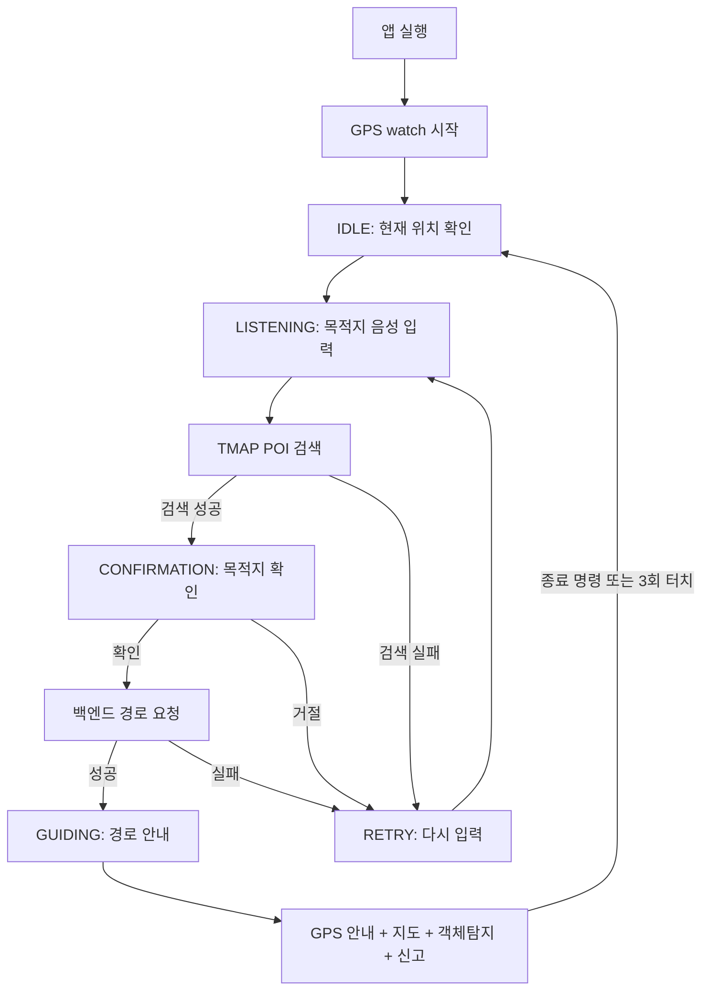

# WalkMate User UI Report

## 1. 결론 요약

WalkMate의 `userUI`는 시각장애인 보행 보조를 목표로 만든 React + Vite + Capacitor 기반 모바일 웹앱이다. 현재 checkout 기준 핵심 경로는 `UI/userUI`이며, 웹 화면은 React로 작성되어 있고 iOS 앱은 Capacitor가 `dist` 빌드 결과를 `ios/App/App/public`으로 복사해 WebView에서 실행하는 구조다.

이 UI는 일반적인 버튼 중심 앱이라기보다 음성, 위치, 카메라, 지도, 객체탐지를 한 흐름으로 묶은 접근성 중심 앱에 가깝다. 사용자는 앱 실행 후 현재 위치를 확보하고, 음성으로 목적지를 말하고, TMAP 장소 검색 결과를 확인한 뒤, 백엔드가 만든 보행 경로를 따라 안내를 받는다. 안내 중에는 지도와 나침반 방향, GPS 경로 체크, 카메라 기반 위험 객체 탐지, 위험 신고 전송이 동시에 작동한다.

현재 userUI의 핵심 특징은 다음과 같다.

- React 19 + Vite 기반 SPA다.
- Capacitor를 통해 iOS WebView 앱으로 실행된다.
- 위치, 카메라, 마이크, 음성 인식, TTS, 모션 센서를 사용한다.
- 목적지 검색은 TMAP POI API를 사용한다.
- 실제 경로 안내 데이터는 FastAPI 백엔드의 `/api/v1/navigation/path/`로 요청한다.
- 객체탐지는 `@tensorflow/tfjs-tflite`로 `best_float32.tflite`를 WebView 안에서 로드해 수행한다.
- 위험 객체가 감지되면 백엔드의 `/api/v1/reports/`로 이미지와 위치를 multipart로 전송한다.
- UI 흐름은 `IDLE -> LISTENING -> CONFIRMATION -> GUIDING` 상태 머신으로 구성되어 있다.

---

## 2. 프로젝트 위치와 주요 파일

`userUI` 관련 파일은 다음 구조로 볼 수 있다.

```text
UI/userUI/
├── App.tsx
├── index.tsx
├── index.html
├── index.css
├── types.ts
├── package.json
├── vite.config.ts
├── capacitor.config.ts
├── .env.example
├── components/
│   ├── IdleScreen.tsx
│   ├── ListeningScreen.tsx
│   ├── RetryScreen.tsx
│   ├── ConfirmationScreen.tsx
│   ├── GuidingScreen.tsx
│   ├── DebugMap.tsx
│   ├── VisionCamera.tsx
│   ├── Waveform.tsx
│   └── utils/audio.ts
├── src/
│   ├── api/
│   │   ├── backend.ts
│   │   ├── report.ts
│   │   └── tmap.ts
│   └── utils/
│       ├── audio.ts
│       ├── josa.ts
│       └── YoloParser.ts
├── public/wasm/
│   ├── best_float32.tflite
│   └── tflite_web_api_*.js, *.wasm, *.worker.js
└── ios/App/
    ├── App/Info.plist
    ├── App/AppDelegate.swift
    ├── Podfile
    └── App.xcodeproj, App.xcworkspace
```

현재 checkout에는 iOS 플랫폼 프로젝트가 포함되어 있다. `package.json`에는 `@capacitor/android` 의존성과 Android 관련 patch 파일도 남아 있지만, `UI/userUI/android` 플랫폼 디렉터리는 현재 파일 트리에서 확인되지 않는다.

---

## 3. 기술 스택

| 영역 | 사용 기술 | 현재 코드상 역할 |
|---|---|---|
| UI 프레임워크 | React 19 | 화면 컴포넌트와 상태 전환 구현 |
| 빌드 도구 | Vite | 개발 서버, production build, React 플러그인 |
| 모바일 래퍼 | Capacitor | React 앱을 iOS WebView 앱으로 패키징 |
| 위치 | `@capacitor/geolocation` | 현재 위치 확보, 경로 안내 중 실시간 위치 추적 |
| 음성 인식 | `@capacitor-community/speech-recognition` | 목적지 입력, 확인/취소, 안내 종료 명령 |
| 음성 출력 | `@capacitor-community/text-to-speech` | 목적지 질문, 경로 안내, 위험 객체 안내 |
| 모션/방향 | DeviceOrientation 이벤트, Capacitor Motion 의존성 | 나침반 방향과 GPS 이동 방향 보정 |
| 지도 | Leaflet, React Leaflet | 현재 위치, 경로 polyline, 도착지 표시 |
| 카메라 | `react-webcam` | WebView 카메라 프레임 캡처 |
| AI 추론 | `@tensorflow/tfjs`, `@tensorflow/tfjs-tflite` | TFLite 객체탐지 모델 로드와 추론 |
| API 통신 | `CapacitorHttp`, `fetch` | TMAP, 백엔드 경로 요청, 신고 업로드 |
| 스타일 | Tailwind CDN, Material Icons | 검정/노랑 중심의 접근성 화면 스타일 |

---

## 4. 앱 진입점과 렌더링 구조

### 4.1 `index.html`

`index.html`은 React가 붙을 `#root`를 제공하고, `index.tsx`를 module script로 로드한다. HTML 문서 언어는 `ko`로 지정되어 있으며 viewport 확대 제한이 들어가 있다.

특이점은 Tailwind를 npm 빌드 플러그인이 아니라 CDN script로 로드한다는 점이다.

```html
<script src="https://cdn.tailwindcss.com"></script>
<link href="https://fonts.googleapis.com/css2?family=Inter..." rel="stylesheet" />
<link href="https://fonts.googleapis.com/icon?family=Material+Icons+Round" rel="stylesheet" />
```

따라서 네트워크가 없는 환경에서는 Tailwind CDN, Google Font, Material Icons 로딩이 실패할 수 있다. production 앱 안정성을 높이려면 Tailwind를 로컬 빌드 파이프라인에 포함시키는 것이 더 안전하다.

### 4.2 `index.tsx`

`index.tsx`는 `ReactDOM.createRoot()`로 `App`을 렌더링한다. `React.StrictMode`는 의도적으로 제거되어 있다. 주석에 따르면 개발 환경에서 `useEffect`가 두 번 실행되며 TTS가 중복 호출되는 문제를 피하기 위한 조치다.

이 결정은 실제 음성 UX 문제를 줄이는 데 도움이 되지만, React Strict Mode가 잡아주는 effect cleanup 문제나 부작용 중복 실행 문제를 개발 중에 놓칠 수 있다는 trade-off가 있다.

---

## 5. 상태 머신과 사용자 흐름

`App.tsx`는 userUI의 상위 상태 머신이다. 화면 상태는 `types.ts`의 `AppScreen` enum으로 정의된다.

```ts
IDLE
LISTENING
RETRY
CONFIRMATION
GUIDING
```

전체 사용자 흐름은 다음과 같다.



### 5.1 앱 시작과 위치 확보

앱이 실행되면 `App.tsx`의 `useEffect`가 `Geolocation.checkPermissions()`와 `requestPermissions()`를 통해 위치 권한을 확인한다. 권한이 있으면 `Geolocation.watchPosition()`을 시작해 현재 위치를 계속 갱신한다.

현재 위치 옵션은 다음과 같다.

```ts
enableHighAccuracy: true
timeout: 30000
maximumAge: 10000
```

GPS 오류가 나도 바로 앱 흐름을 끊지 않고 `console.warn("GPS Watch Retry:", err)`로 남긴 뒤 다음 watch callback을 기다리는 방식이다. 이 처리는 실내나 GPS 신호가 약한 환경에서 앱이 바로 실패 상태로 떨어지는 문제를 줄인다.

### 5.2 목적지 음성 입력

`IdleScreen`은 위치가 준비되면 `"현재 위치를 확인했습니다. 어디로 안내할까요?"`를 TTS로 말하고 2초 뒤 자동으로 `LISTENING` 화면으로 넘어간다. 사용자는 화면 터치로도 시작할 수 있다.

`ListeningScreen`은 다음 순서로 동작한다.

1. `"어디로 가고 싶으신가요?"`를 TTS로 출력한다.
2. 오디오 세션 전환을 위해 500ms 대기한다.
3. `startListening()`으로 STT를 시작한다.
4. partial result를 `latestText`에 저장한다.
5. 1.3초 침묵이 감지되면 현재 인식 문장을 확정한다.
6. 화면 터치 시 현재까지 인식된 텍스트를 수동 확정한다.

`App.tsx`는 인식된 문장에서 `"으로 안내해줘"`, `"로 안내해줘"`, `"안내해줘"`, `"안내"` 같은 표현을 제거해 목적지 키워드를 만든다.

### 5.3 목적지 검색과 확인

목적지 키워드는 `src/api/tmap.ts`의 `searchLocation()`으로 전달된다. 이 함수는 TMAP POI API에 `searchKeyword`, `centerLat`, `centerLon`을 포함해 요청하고 첫 번째 POI를 반환한다.

검색 성공 시 `ConfirmationScreen`으로 넘어가고, 사용자는 음성으로 `"응"`, `"네"`, `"맞아"` 등을 말하거나 화면 상단을 터치해 확인할 수 있다. `"아니"`, `"틀려"` 등은 거절로 처리된다. 화면 하단 터치도 거절 동작으로 연결되어 있어 작은 버튼을 정확히 누르지 않아도 된다.

### 5.4 백엔드 경로 요청

목적지가 확정되면 `App.tsx`는 `requestNavigation()`을 호출한다.

요청 주소:

```text
{VITE_BACKEND_URL}/api/v1/navigation/path/
```

요청 payload:

```ts
{
  start_lat: number;
  start_lon: number;
  end_lat: number;
  end_lon: number;
}
```

응답은 `status === "success"`일 때 성공으로 처리한다. 현재 UI는 응답의 `data`를 안내 단계 `steps`로 사용하고, `path`를 지도 polyline 좌표로 사용한다. 만약 `path`가 없으면 `steps` 좌표를 연결해 임시 path를 만든다.

### 5.5 앱 테스트 GIF 기준 동작 확인

다음 GIF는 실제 앱 테스트 화면을 녹화한 것이다.


GIF는 약 57초 길이의 iPhone 세로 화면 녹화이며, userUI의 핵심 흐름이 한 번에 이어지는 것을 보여준다. 영상에서 확인되는 순서는 다음과 같다.

1. `LISTENING` 화면에서 `"어디로 가고 싶으신가요?"` 문구와 `"듣고 있습니다..."` 상태가 표시된다.  
   마이크 아이콘과 노란색 파형 애니메이션이 함께 보여 사용자가 현재 음성 입력 단계에 있다는 것을 알 수 있다.

2. 음성 인식 이후 `CONFIRMATION` 화면으로 전환된다.  
   테스트에서는 목적지가 `"수원역 [1호선]"`으로 인식되어 크게 표시되고, `"맞으신가요?"` 질문과 함께 `"응"` 또는 `"아니"`로 답하라는 안내가 나온다.

3. 목적지 확인 후 `GUIDING` 화면으로 진입한다.  
   화면 상단에는 OpenStreetMap 기반 지도, 파란색 경로선, 노란색 체크포인트, 현재 위치를 나타내는 빨간 화살표가 표시된다. 이 장면은 `DebugMap.tsx`가 경로와 사용자 heading을 시각화하고 있음을 보여준다.

4. 화면 하단에는 카메라 화면 위로 안내 문구가 겹쳐진다.  
   `"방향 탐색 중"`과 `"금당로를 따라 29m 이동"` 문구가 표시되며, 이는 `GuidingScreen.tsx`가 백엔드에서 받은 route step을 사용자 안내 문장으로 사용하고 있음을 보여준다.

5. 카메라 기반 객체탐지 상태도 함께 표시된다.  
   영상 중간 이후에는 `"모니터링 중..."`, 추론 시간, 객체 수, `car` 감지 결과가 상단 상태 배지에 나타난다. 즉, 안내 화면에 들어간 뒤 `VisionCamera.tsx`가 TFLite 모델을 로드하고 주기적으로 프레임 추론을 수행하는 흐름이 실제 화면에서 확인된다.

6. 테스트 영상에서는 GPS timeout 메시지도 노출된다.  
   하단 debug text에 `Could not obtain location in time` 계열 문구가 보인다. 이는 안내 화면 자체는 유지되지만, 실외/실내 수신 상태나 기기 GPS 응답 속도에 따라 위치 업데이트가 지연될 수 있음을 보여준다. 현재 코드에는 timeout을 늘린 위치 옵션과 위치 확보 실패 시 신고 전송을 생략하는 완충 처리가 들어가 있지만, 현장 테스트에서는 GPS 안정성이 계속 중요한 검증 항목이다.

이 GIF는 userUI가 단순 화면 목업이 아니라 실제 앱 흐름으로 연결되어 있음을 보여주는 자료다. 특히 음성 입력, 목적지 확인, 지도 기반 경로 안내, 카메라 기반 객체탐지가 같은 사용자 세션 안에서 이어진다는 점을 확인할 수 있다. 동시에 GPS timeout, 지도 tile 네트워크 의존성, 실기기 추론 속도처럼 현장 테스트에서만 드러나는 변수도 함께 확인된다.

### 5.6 Xcode 실기기 로그 기준 디버깅

아래 이미지는 Xcode에서 iPhone 12 mini 실기기 앱을 실행하고 콘솔 로그를 확인하며 테스트하던 화면이다. 로그에는 객체탐지 추론 시간, 감지 객체 수, 감지 class, Geolocation 요청, `CapacitorHttp`를 통한 신고 전송 응답이 함께 남아 있어, userUI가 WebView 안에서 카메라 추론과 위치 기반 신고 흐름을 실제 기기에서 수행했음을 보여준다.


---

## 6. 주요 컴포넌트 역할

| 파일 | 역할 |
|---|---|
| `App.tsx` | 전체 앱 상태 머신, GPS watch, 목적지 검색, 백엔드 경로 요청, 화면 전환 |
| `IdleScreen.tsx` | 위치 확인 대기, 앱 시작 화면, 위치 준비 후 자동 음성 안내 |
| `ListeningScreen.tsx` | 목적지 음성 입력, partial result 수집, 침묵 기반 자동 확정 |
| `RetryScreen.tsx` | 검색 실패/오류 후 재입력 화면, 자동 또는 수동 STT 재시작 |
| `ConfirmationScreen.tsx` | 목적지 확인/거절, 음성 명령과 화면 상하단 터치 처리 |
| `GuidingScreen.tsx` | 실제 안내 화면, GPS 추적, 나침반 방향, TTS 큐, 경로 이탈 감지, 카메라 탐지 결합 |
| `DebugMap.tsx` | Leaflet 지도, 경로 선, 체크포인트, 도착지 깃발, 현재 위치 화살표 표시 |
| `VisionCamera.tsx` | 카메라 프레임 캡처, TFLite 객체탐지, 위험도 계산, 신고 업로드 |
| `Waveform.tsx` | 볼륨 기반 파형 표시용 보조 컴포넌트 |

---

## 7. 안내 화면의 핵심 로직

`GuidingScreen.tsx`는 userUI에서 가장 복잡한 화면이다. 단순히 경로 텍스트를 보여주는 화면이 아니라 다음 기능을 동시에 수행한다.

1. 경로 안내 TTS 출력
2. 실시간 GPS 위치 추적
3. 지도 위치 갱신
4. 나침반 방향 계산
5. GPS 이동 방향 기반 센서 보정
6. 다음 안내 지점 도달 판단
7. 경로 이탈 감지
8. `"종료"`, `"그만"`, `"정지"` 음성 명령 처리
9. 하단 카메라 객체탐지 실행

### 7.1 TTS 큐

경로 안내와 객체탐지 경고가 동시에 발생할 수 있기 때문에 `GuidingScreen`은 `ttsQueue`를 사용한다. 큐 메시지는 다음 형태다.

```ts
{
  text: string;
  isObstacle: boolean;
}
```

장애물 메시지는 일반 경로 안내보다 우선 재생된다. 또한 같은 문장이 큐에 중복으로 쌓이지 않도록 검사한다. 이는 보행 중 음성 안내가 과도하게 겹치는 문제를 줄이기 위한 구조다.

### 7.2 나침반과 GPS 방향 보정

`GuidingScreen`은 `deviceorientationabsolute`와 `deviceorientation` 이벤트를 모두 듣는다. iOS에서는 `webkitCompassHeading`을 우선 사용하고, Android 계열에서는 `event.absolute`와 `event.alpha`를 사용한다.

또한 사용자가 1.5m 이상 이동하면 GPS 좌표 변화로 이동 방향을 계산한다. 최근 4초 이내 유효한 GPS 이동 방향이 있으면 나침반 방향을 GPS 이동 방향 쪽으로 강하게 보정한다. 코드 주석상 체스트 하네스 착용 상황을 고려한 판단이다. 즉, 휴대폰 자체의 자이로/자력계 값보다 사용자가 실제 걸어가는 방향을 더 신뢰하려는 설계다.

### 7.3 경로 도달과 경로 이탈 감지

경로 단계는 `routeData` 배열로 들어온다. 현재 위치가 특정 체크포인트 반경 15m 안에 들어오면 해당 지점에 도달했다고 보고 다음 안내를 말한다. 여러 체크포인트를 건너뛰는 경우를 고려해 현재 지점 이후의 가장 먼 도달 지점을 뒤에서부터 찾는다.

경로 이탈은 다음 체크포인트까지의 거리가 이전 최단 거리보다 10m 이상 멀어졌는지를 기준으로 판단한다. 이탈이 감지되면 현재 heading과 목표 bearing의 차이를 시계 방향 표현으로 변환해 `"경로를 벗어났습니다. N시 방향으로 돌아주세요."`라고 안내한다.

---

## 8. 지도 표시

`DebugMap.tsx`는 React Leaflet을 사용한다.

지도에 표시하는 정보는 다음과 같다.

- OpenStreetMap tile
- 백엔드가 반환한 경로 polyline
- 경로 중간 체크포인트 노란 점
- 도착지 빨간 깃발
- 현재 위치 빨간 화살표
- 현재 heading 각도 배지

지도는 사용자가 직접 조작하는 목적보다는 개발/디버깅과 현재 위치 확인 목적이 강하다. `scrollWheelZoom`과 `zoomControl`은 꺼져 있고, 현재 위치가 바뀌면 `map.setView()`로 중심을 이동한다.

주의할 점은 OpenStreetMap tile도 외부 네트워크에 의존한다는 것이다. 네트워크가 불안정하면 지도 배경이 비어 보일 수 있다.

---

## 9. 객체탐지와 신고 흐름

### 9.1 모델 로드

`VisionCamera.tsx`는 `@tensorflow/tfjs`와 `@tensorflow/tfjs-tflite`를 사용한다. TFLite 런타임은 `/wasm/` 아래 파일을 사용하고, 모델 파일은 다음으로 고정되어 있다.

```ts
const MODEL_FILE = "best_float32.tflite";
```

현재 iOS public 경로에도 `best_float32.tflite`와 TFLite WebAssembly 런타임 파일들이 복사되어 있다.

### 9.2 추론 루프

모델 준비 후 다음 흐름이 3초 주기로 실행된다.

1. `react-webcam`에서 JPEG screenshot을 얻는다.
2. 이미지를 640 x 640 canvas에 letterbox 방식으로 그린다.
3. `tf.browser.fromPixels(canvas).toFloat().div(255).expandDims(0)`로 `[1, 640, 640, 3]` 입력 tensor를 만든다.
4. TFLite model의 `predict()`를 호출한다.
5. 출력 tensor를 flat array로 바꾼다.
6. `YoloParser.parse(flat, shape, 0.3, 0.5)`로 bbox를 파싱한다.
7. 감지 결과가 있으면 canvas에 bbox를 그린다.
8. 주요 위험 객체를 선택하고 TTS 안내 및 신고 전송을 수행한다.

현재 confidence threshold는 `0.3`, IoU threshold는 `0.5`다.

### 9.3 클래스와 위험도

`YoloParser.ts`의 클래스 배열은 12개다.

```text
person, bicycle, car, motorcycle, bus, truck,
traffic light, stop sign, bench, dog, bollard, kickboard
```

`VisionCamera.tsx`는 클래스별 한국어 라벨과 위험도를 별도로 관리한다.

| 위험도 | 클래스 |
|---:|---|
| 3 | car, bus, truck, motorcycle, bicycle, kickboard |
| 2 | person, dog |
| 1 | traffic light, bollard, stop sign, bench |

주요 위험 객체는 화면 중앙 하단에 가까운 bbox를 우선 선택한다. 해당 객체가 없으면 score가 가장 높은 bbox를 신고 대상으로 사용한다.

거리 추정은 실제 depth estimation이 아니라 bbox 크기 기반 휴리스틱이다.

```ts
distance ~= 1 / max(box width, box height)
```

따라서 보고서나 포트폴리오에서는 이 값을 정확한 거리 측정으로 설명하면 안 된다. 현재는 위험 안내와 신고 설명에 활용하는 근사치로 보는 것이 맞다.

### 9.4 신고 전송

객체가 감지되면 `sendHazardReport()`가 호출된다. 신고 API는 `fetch`와 `FormData`를 사용한다.

전송 주소:

```text
{VITE_BACKEND_URL}/api/v1/reports/
```

전송 필드:

| 필드 | 의미 |
|---|---|
| `item_id` | 신고마다 새로 생성되는 UUID |
| `user_id` | 현재 코드에서는 신고마다 새로 생성되는 UUID |
| `label` | 감지 클래스명 |
| `latitude` | 신고 위치 위도 |
| `longitude` | 신고 위치 경도 |
| `hazard_type` | 위험 요소 종류 |
| `risk_level` | 위험도 |
| `description` | 추론 시간, 감지 정보 등 |
| `file` | bbox가 그려진 JPEG 이미지 |

위치 확보에 실패하면 신고 전송은 생략하고 상태를 `"위치 대기 중..."`으로 바꾼다. 이 처리는 GPS timeout 때문에 객체탐지 루프 전체가 실패하는 문제를 줄인다.

---

## 10. API 연동 구조

### 10.1 환경 변수

`.env.example` 기준 필요한 환경 변수는 다음과 같다.

```text
VITE_BACKEND_URL=http://localhost:8000
VITE_TMAP_API_KEY=[YOUR_TMAP_API_KEY_HERE]
```

`VITE_BACKEND_URL`이 없으면 코드상 fallback은 `http://172.30.1.80:8000`이다. 이 값은 특정 로컬 네트워크에 묶인 주소이므로 다른 환경에서 바로 깨질 수 있다. 실기기 테스트 때는 Mac과 iPhone이 같은 네트워크에 있고, 백엔드 주소가 `.env`에 정확히 들어가야 한다.

### 10.2 TMAP API

`src/api/tmap.ts`에는 세 가지 함수가 있다.

| 함수 | 역할 | 현재 주요 사용 여부 |
|---|---|---|
| `searchLocation()` | 장소명으로 POI 검색 | `App.tsx`에서 사용 |
| `requestTmapWalkingPath()` | TMAP 보행자 경로 직접 요청 | 현재 App 메인 흐름에서는 백엔드 경로 요청을 사용 |
| `reverseGeoCoding()` | 좌표를 주소로 변환 | 현재 메인 흐름에서는 직접 사용 흔적이 약함 |

즉 현재 앱 흐름은 `TMAP에서 목적지 좌표 검색 -> 백엔드에서 경로 안내 생성`에 가깝다.

### 10.3 백엔드 경로 API

`src/api/backend.ts`는 `CapacitorHttp.post()`를 사용한다. request header에는 ngrok 경고 페이지 우회를 위한 `ngrok-skip-browser-warning`이 들어 있다.

백엔드 응답은 다음 구조를 기대한다.

```ts
{
  status: "success",
  data: NavigationStep[],
  path?: { latitude: number; longitude: number }[]
}
```

여기서 `data`가 음성 안내용 단계이고, `path`가 지도에 그릴 선이다.

---

## 11. 음성 처리 구조

음성 유틸의 실제 구현은 `src/utils/audio.ts`에 있고, `components/utils/audio.ts`는 이를 re-export한다. 일부 컴포넌트가 `./utils/audio`를 import하기 때문에 호환성을 유지하기 위한 파일이다.

### 11.1 TTS

native 환경에서는 `@capacitor-community/text-to-speech`를 사용한다. 호출 전에 `TextToSpeech.stop()`을 먼저 실행해 이전 발화를 끊고, `category: "playback"`으로 말한다. 텍스트 길이에 비례한 timeout fallback도 있다.

웹 환경에서는 `window.speechSynthesis`를 사용한다.

### 11.2 STT

native 환경에서는 `@capacitor-community/speech-recognition`을 사용한다. iOS 플러그인 차이를 고려해 permission key를 `speechRecognition`과 `speech-recognition` 양쪽으로 확인한다.

중요한 특징은 iOS에서 `SpeechRecognition.start()`가 즉시 빈 결과로 resolve될 수 있다는 점을 코드가 인식하고 있다는 것이다. 따라서 최종 결과만 기다리지 않고 `partialResults` listener를 통해 실제 인식 문장을 받아 처리한다.

웹 환경에서는 임시로 2초 뒤 `"수원역"`을 반환하는 simulation 코드가 있다. 따라서 웹 브라우저에서 테스트할 때 실제 STT가 아니라 고정 목적지 흐름이 실행될 수 있다.

---

## 12. iOS / Capacitor 설정

### 12.1 Capacitor 설정

`capacitor.config.ts`의 핵심 설정은 다음과 같다.

```ts
appId: "com.walkmate.app"
appName: "walkmate"
webDir: "dist"
server.androidScheme: "https"
server.cleartext: true
plugins.CapacitorHttp.enabled: true
```

`webDir`이 `dist`이므로 iOS 앱에 최신 웹 코드를 반영하려면 다음 순서가 필요하다.

```bash
cd UI/userUI
npm run build
npx cap copy ios
```

### 12.2 iOS 권한

`Info.plist`에는 다음 권한 설명이 들어 있다.

| 권한 | 용도 |
|---|---|
| `NSCameraUsageDescription` | 실시간 장애물 탐지 및 신고 사진 촬영 |
| `NSLocationWhenInUseUsageDescription` | 경로 안내와 현재 위치 파악 |
| `NSLocationAlwaysAndWhenInUseUsageDescription` | 경로 안내와 실시간 장애물 신고 |
| `NSMicrophoneUsageDescription` | 목적지 음성 입력 |
| `NSSpeechRecognitionUsageDescription` | 음성 명령과 목적지 인식 |
| `NSMotionUsageDescription` | 방향 분석과 센서 측정 |
| `NSLocalNetworkUsageDescription` | 로컬 FastAPI 서버와 통신 |

현재 기능 구성과 권한 설명은 대체로 일치한다.

---

## 13. 스타일과 UX 특성

userUI는 검정 배경과 노란색 primary color를 중심으로 구성되어 있다. 목적은 장식적인 화면보다는 보행 중 알아보기 쉬운 고대비 화면에 가깝다.

주요 UX 특징은 다음과 같다.

- 음성 안내가 기본이다.
- 작은 버튼보다 화면 전체 터치 영역을 많이 사용한다.
- 목적지 확인 화면은 상단 절반 터치로 확인, 하단 절반 터치로 거절한다.
- 안내 화면은 3회 터치로 종료할 수 있다.
- 안내 중 `"종료"`, `"그만"`, `"정지"` 음성 명령을 인식한다.
- 카메라/지도/안내 텍스트를 한 화면에 동시에 배치한다.

접근성 관점에서 방향은 타당하지만, 실제 시각장애인 사용성을 검증하려면 VoiceOver, 이어폰 사용, 야외 소음, 한 손 사용, 화면 잠금, 배터리 발열까지 포함한 실기기 테스트가 필요하다.

---

## 14. 현재 구현의 강점

1. 상태 흐름이 명확하다.  
   `AppScreen` enum을 중심으로 대기, 청취, 재시도, 확인, 안내 화면이 분리되어 있다.

2. 음성 중심 UX가 실제 기능 흐름에 포함되어 있다.  
   단순히 화면에 버튼을 둔 것이 아니라 TTS와 STT를 목적지 입력, 확인, 종료 명령에 연결했다.

3. 실기기 기능을 적극 사용한다.  
   GPS, 카메라, 마이크, 음성 인식, TTS, 방향 센서를 앱 흐름 안에 통합했다.

4. 백엔드와 AI 모델이 UI에 연결되어 있다.  
   경로 안내 API, 신고 API, TFLite 객체탐지가 모두 userUI에서 실제 호출된다.

5. 객체탐지 결과가 신고까지 이어진다.  
   모델 추론이 단순 화면 표시에서 끝나지 않고 위치와 이미지를 포함한 신고 payload로 이어진다.

6. GPS timeout에 대한 완충 처리가 들어갔다.  
   위치 획득 실패가 발생해도 안내/탐지 루프 전체를 바로 죽이지 않고 retry 또는 신고 생략으로 처리한다.

---

## 15. 현재 구현의 한계와 위험

1. Tailwind와 아이콘/폰트가 CDN에 의존한다.  
   iOS 앱 WebView에서 외부 네트워크가 불안정하면 스타일이나 아이콘이 깨질 수 있다.

2. 백엔드 fallback URL이 특정 LAN IP다.  
   `VITE_BACKEND_URL`이 없으면 `172.30.1.80:8000`으로 요청한다. 개발 장소가 바뀌면 바로 실패할 가능성이 높다.

3. TMAP API key 누락 검사가 약하다.  
   `VITE_TMAP_API_KEY`가 없을 때 사용자에게 명확히 안내하는 UI가 없다.

4. 신고의 `user_id`가 매번 새 UUID다.  
   사용자를 식별하거나 동일 사용자의 신고 이력을 묶으려면 persistent user id가 필요하다.

5. 카메라 추론은 WebView CPU 환경에서 느릴 수 있다.  
   현재 구조는 `tfjs-tflite` 기반 JS/WebAssembly 추론이다. iPhone WebView에서 발열, 배터리, 추론 지연이 발생할 수 있다.

6. 거리 추정은 bbox 기반 휴리스틱이다.  
   실제 물리 거리라고 보기 어렵고, 객체 크기와 카메라 화각에 크게 의존한다.

7. 지도는 외부 tile 서버에 의존한다.  
   네트워크가 없으면 경로 선은 있어도 지도 배경이 제대로 나오지 않을 수 있다.

8. 설정/히스토리 버튼은 현재 동작이 없다.  
   `IdleScreen`에는 설정/히스토리 버튼 UI가 있으나 실제 handler는 연결되어 있지 않다.

9. 테스트 코드가 확인되지 않는다.  
    현재 checkout 기준 userUI에 단위 테스트나 E2E 테스트 구성은 보이지 않는다.

---

## 16. 개선 제안

1. 환경 변수 검증 레이어를 추가한다.  
   앱 시작 시 `VITE_BACKEND_URL`, `VITE_TMAP_API_KEY` 누락 여부를 확인하고 사용자/개발자에게 명확한 메시지를 보여주는 것이 좋다.

2. persistent user id를 도입한다.  
   Capacitor Preferences 또는 localStorage에 user id를 저장해 신고 이력을 같은 사용자로 묶을 수 있게 해야 한다.

3. Tailwind CDN 의존성을 제거한다.  
   Tailwind를 npm 기반 PostCSS/Vite 설정으로 넣으면 iOS 앱에서도 스타일 안정성이 좋아진다.

4. 지도 offline/저대역폭 대응을 검토한다.  
   보행 보조 앱에서는 지도 tile 실패 시에도 안내 자체가 유지되어야 하므로, 지도는 디버그 보조 수단으로 분리하거나 fallback UI를 둬야 한다.

5. 객체탐지 성능 측정을 자동화한다.  
   실제 iPhone 프레임을 저장해 `best.pt`와 `best_float32.tflite` 결과를 비교하고, 추론 시간과 감지 성공률을 기록해야 한다.

6. TTS/STT 상태 머신을 별도 hook으로 분리한다.  
   현재 여러 화면이 직접 `speak`, `startListening`, `stopListening`을 다루므로, 장기적으로는 `useVoiceInteraction` 같은 공통 hook이 있으면 중복과 race condition을 줄일 수 있다.

7. 안내 로직을 별도 모듈로 분리한다.  
   `GuidingScreen.tsx` 안에 거리 계산, heading 보정, 경로 이탈 감지가 모두 들어 있다. 순수 함수로 분리하면 테스트와 디버깅이 쉬워진다.

8. 접근성 실사용 검증을 추가한다.  
   VoiceOver, 화면 잠금, 야외 소음, 이어폰 연결, 흔들리는 카메라, GPS 약한 환경을 기준으로 테스트 시나리오를 만들어야 한다.

---

## 17. 최종 평가

현재 `userUI`는 WalkMate 프로젝트의 사용자 경험을 가장 직접적으로 보여주는 파트다. 단순한 React 화면이 아니라 위치 기반 길안내, 음성 인터페이스, 카메라 객체탐지, 위험 신고를 한 흐름으로 연결한다는 점에서 프로젝트 핵심 가치와 가장 가까운 구현물이다.

구조적으로는 `App.tsx`가 전체 상태를 잡고, 각 화면 컴포넌트가 목적지 입력과 안내 단계를 나누며, `GuidingScreen`이 실시간 센서와 카메라 기능을 통합한다. API 계층도 `tmap.ts`, `backend.ts`, `report.ts`로 나뉘어 있어 목적지 검색, 경로 요청, 신고 업로드의 책임이 비교적 명확하다.

다만 현재 구현은 실험성과 현장성이 강한 만큼 안정화 과제도 분명하다. 외부 CDN 의존성, 특정 LAN IP fallback, 실제 사용자 식별 부재, WebView 기반 TFLite 추론 속도, 지도 tile 네트워크 의존성은 앱을 계속 발전시키려면 정리해야 할 지점이다. 특히 시각장애인 보행 보조라는 목적을 생각하면, 화면이 예쁜지보다 음성 흐름이 끊기지 않는지, GPS가 흔들려도 안내가 유지되는지, 위험 객체 안내가 너무 늦거나 자주 울리지 않는지가 더 중요하다.

따라서 userUI의 다음 단계는 기능 추가보다 실기기 안정화와 접근성 검증이다. iPhone에서 실제 보행 프레임과 GPS 로그, TTS/STT 이벤트, 객체탐지 추론 시간을 함께 기록하면 이 UI가 현장에서 어디까지 동작하고 어디서 끊기는지 더 명확히 판단할 수 있다.
